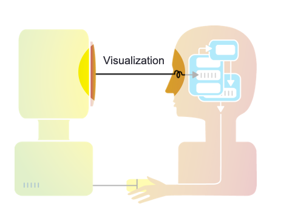
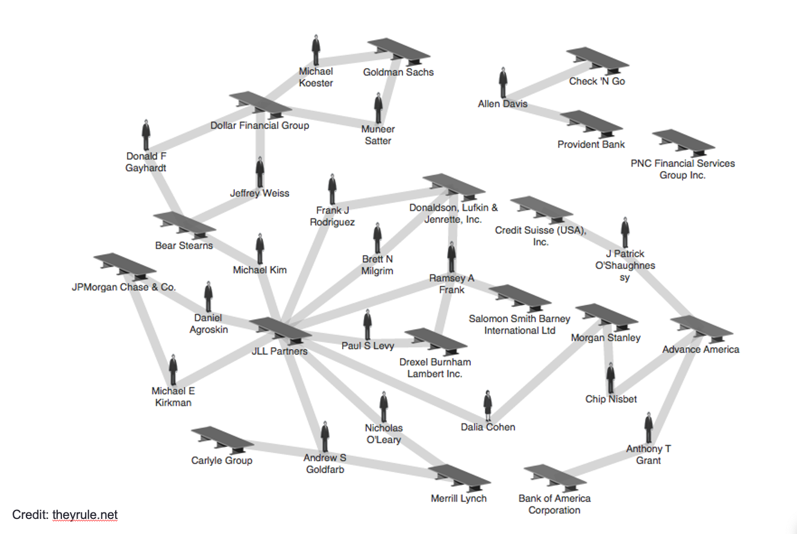
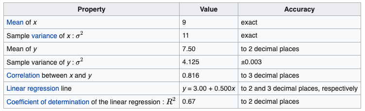
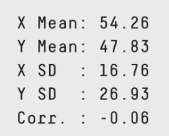

class: inverse, middle, center

# Why we visualize and a _very_ short history of dataviz

---

# Visualization takes advantage of our human capability to understand visual patterns **quickly** and often **intuitively**

---

class: inverse, center, middle

# Reasons for visualizing data

---

# Spotting trends

.footnote[John Snow cholera clusters in London, 1854]

---

# Spotting trends

.footnote[Florence Nightingale, Diagram of the causes of mortality in the army in the East]

---

# Analyzing and exploring

They Rule is a website that allows you to create maps of the interlocking directories of the top 100 companies in the US in 2001.

---

# Telling a story

<iframe width="766" height="431" src="https://www.youtube.com/embed/jbkSRLYSojo" frameborder="0" allow="accelerometer; autoplay; encrypted-media; gyroscope; picture-in-picture" allowfullscreen></iframe>

---

background-image: url("https://media.giphy.com/media/3o85gdhlpxVz8TjsTC/giphy.gif")
background-size: cover

---
class: inverse, center, middle

# Classical data summaries can lie!

---

# Four datasets with identical properties

---

# Anscombe Quartet

---

# Thirteen datasets with identical properties

---

# Datasaurus

---

# Making the Datasaurus

  

---

# Summaries don't differentiate

---

class: inverse, middle, center

# A _very_ short history of data visualization

---

- Astronomical data presentation for navigation
- 1700s: Rene Descartes
- 1800-1900: Graphs and pie charts (WilliamPlayfair)
- 1913: Iowa State University: Introduced some of the first courses in “graphing” data 1. 1977: Princeton University:
- Statistics Professor John Tukey Developed the first exploratory data analysis (EDA) using visualizations.
- 1983: Edward Tufte published “The Visual Display of Quantitative Information” which showed effective visualization methods.
- 1984, Apple Computer introduced the first popular and affordable computer that focused in graphics (GIU) as a mode of interaction and display. This was huge and persists today.
- 1999: The words, “information visualization” were so first named in the book: “Readings in Information Visualization: Using Vision to Think”, Card, Mackinlay, Shneiderman.
- Around 2000ish - : In Few’s opinion, the IBM PC detracted from the value of making graphs by hand as it offers a mouse and computer-application based option. When people made graphs by hand, the took the time to be responsible.

---

# Evolution of computing visualization tools

- Hand drawn
- 1970s: CAD/CAM
- 1980s: Scientific visualization, business visualizations (Harvard Graphics)
- 1990s: Excel, Powerpoint, R
- 2000s: Open source, interactive, web

