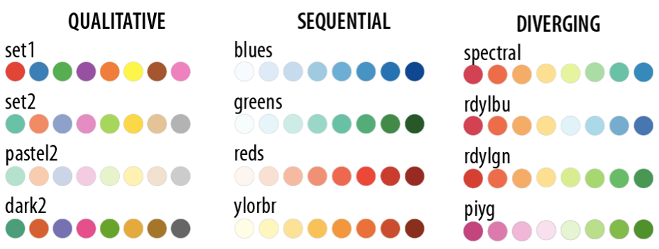
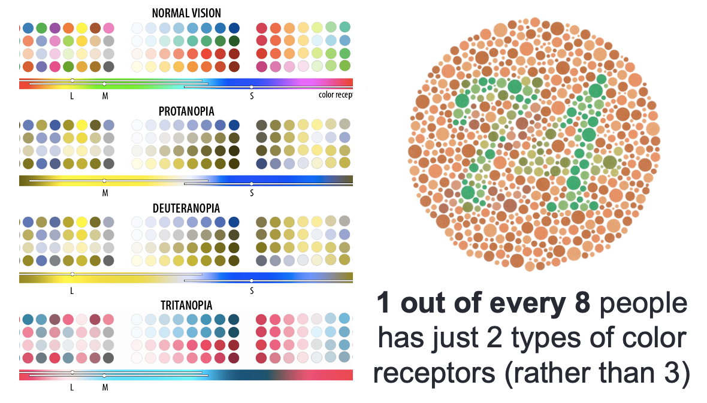
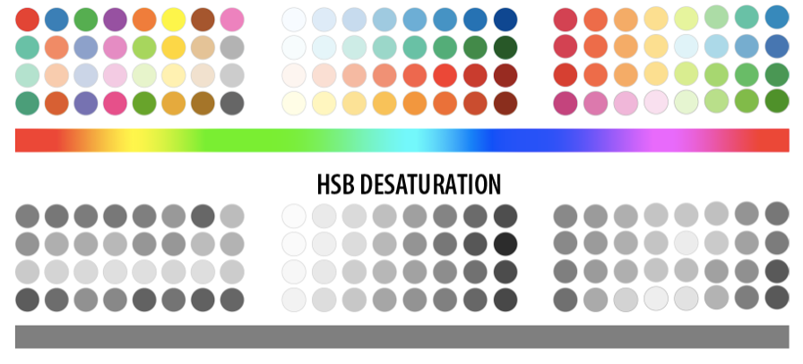

class: inverse, middle, center

# Visual Encodings

---

## Visual encodings can be categorized into the main groups below

.center[]

.small[All visualizations use some combination of these]

---

## Example: a _scatterplot_ uses position on an x-y scale

.center[]

---

## A _bar chart_ uses length to show values

.center[]

---

## Some encodings work better than others

.pull-left[

]

.pull-right[
**Decoding Error**
1. Position along a common scale
1. Length
1. Angle and slope
1. Area
1. Volume, density, and color saturation
1. Color hue
]

---

## Position

_Position_ allows you to compare values based on where they are placed with reference to a coordinate system.

### Considerations

* Avoid overplotting since many points can occupy the same space and obscure one another

### Solutions

* Use _transparency_ so that overlapping points make darker areas
* Use _jitter_ (adding noise that moves points so they are not directly on top of another) 

---

## Length

_Length_ is most commonly used in the context of bar charts. The longer a bar is, the greater the value. 
**Don't truncate bar charts, use length in its entirety!**

--

.left-column70[
.small[**BAD:** FOX News, again!]

]

--
.right-column30[
.small[**GOOD**]

]

.small[FOX news, again...]

---

## Angle

_Angles_ range from 0 to 360 degrees in a circle.

.left-column30[
### Considerations

* Angles are most associated with _pie charts_. Pie chart is made up of parts that make up a whole. 
* Don't use too many categories (bar chart is better)
* **The sum of all percentages should equal 100%!**
]

--

.right-column70[
.small[NOT!]

]

---
## Don't even think about this!

.center[]

---

## Slope

_Slope_ is similar to _angle_. Line charts are the most common use of slope to encode data. 

.left-column30[
### Considerations

* Slope magnitude: steeper = greater change, flatter = lesser change
* The aspect ratio 
* Visual change should match the context of the change

]

--

.right-column70[

]
---

## Area

Like _length_, _area_ can be used to represent data with size, but with two dimensions instead of one.

.left-column30[
### Considerations
* While the encoding might not be as precise from a visual perception perspective, area can provide a more intuitive, less abstract view for some types of data
* Make sure you scale by area, not edge (remember, area gets squared per unit increase)
]

.right-column70[
]

---

## A _treemap_ uses rectangle areas to show hierarchical data

.center[]

---

## Volume

_Volume_ can used in the same way as _area_ but has one more dimension.

.left-column30[
### Considerations
* Make sure you scale by volume, not edge (remember, volume gets cubed per unit increase)
* 
]

.right-column70[

]

---

## The volume, or 3D perspective representation can make tangible data more relatable

.center[]

---

## Color

_Color_ as a visual encoding can be split into two categories: **hue** and **saturation**. **Hue** is what most people refer to as color (red, green, blue, etc.) **Saturation** is the amount of **hue** in a color.

.left-column30[

* Qualitative: every color represents a distinct attribute (category)
* Sequential: color represents a range (**saturation**) from low to high (or vice-versa)
* Diverging: multiple hues represent a point of inflection of the data

]

.right-column70[

]

---

## Sequential example

.center[]

---

## Another sequential example

.center[]

---

## Divergent example

.center[]

---

## Consider color blindness

.pull-left[]

.pull-right[]
---

## Consider printing

.center[]

---

## Color can provide context

.center[]

.small[Where Christmas trees come from]

---

## In summary, work with the following attributes to encode your data

.pull-left[

* Position
* Length
* Angle
* Slope
* Area

]

.pull-right[

* Volume
* Color
* Density \*
* Shape \*

]

Or any combination thereof!

.small[\* not discussed today]

