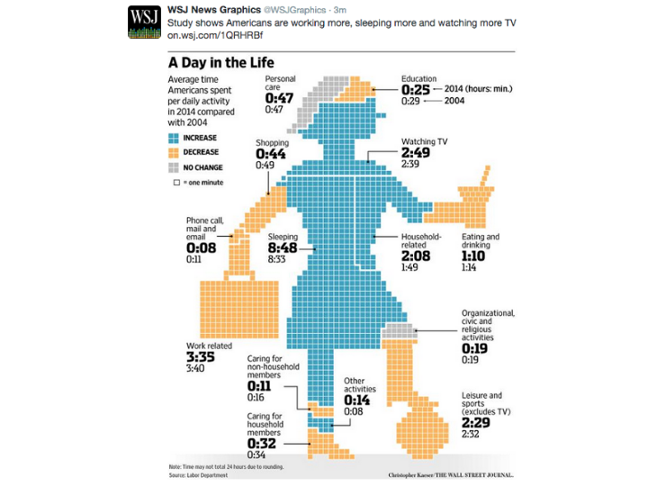
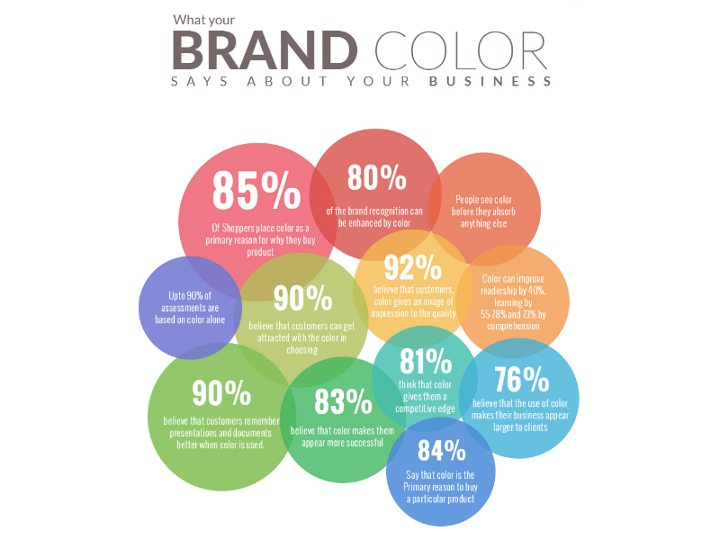
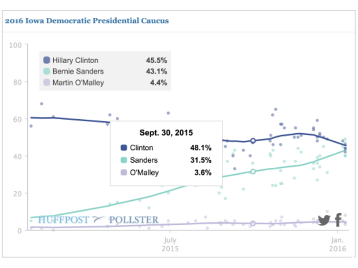
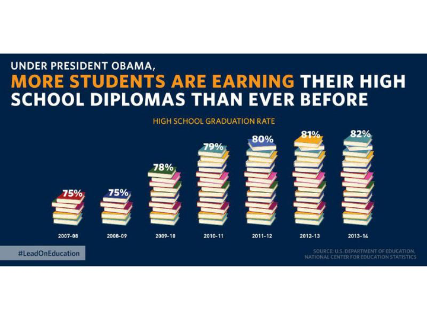
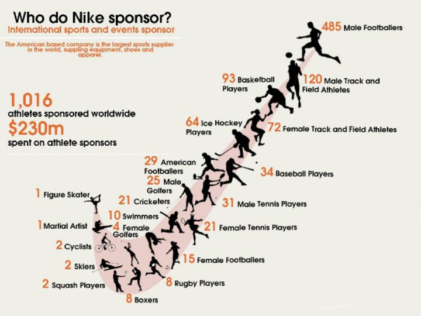

```{r setup, include=FALSE, message=FALSE, warning=FALSE}

library(pacman)
p_load(char = c('tidyverse', 'knitr', 'htmlwidgets', 'kableExtra'))
knitr::opts_chunk$set(
  echo = FALSE,
  message = FALSE,
  warning = FALSE,
  comment = NA,
  cache = FALSE,
  dpi = 300,
  fig.align = "center",
  out.width = "80%"
)
```

layout: true

<div class="my-header">
<span>ANLY 503, Data Visualization</span>
</div>

---

## Last week

Designing for an audience vs. designing for you

.pull-left[
**Tufte**
1. Show data variation, not design variation
1. Do not use graphics to quote data out of context
1. Use clear, detailed, thorough labelling.
1. Representation of numbers should be directly proportional to numerical quantities
1. Don't use more dimensions than the data require
]


.pull-right[
**Nathan Yau**
1. Check the data
1. Explain encodings
1. Label axes
1. Include units
1. Keep your geometry in check
1. Include your sources
1. Consider your audience
]


---

## Today

1. Choosing the right visualization
  * All about asking questions
  * Decomposing your chart
  * Understanding encodings
1. Visualization critique discussion
1. Activity: introduction to RMarkdown and building a website


---

```{r child='02-selecting-a-chart.Rmd'}
```

---

```{r child='02-breaking-it-up.Rmd'}
```

---

```{r child='02-visual-encodings.Rmd'}
```


---

class: inverse

# Visualization critiques: what is wrong with this picture?

* What is the first thing you notice about this visualization?
* What point is the visualization trying to make?
* Who is the intended audience?
* What is the visualization doing well?
* What problems do you see with the visualization design?


---

## Bad example 1

.center[]

---

## Bad example 2

.center[]

---

## Bad example 3

.center[]

---

## Bad example 4

.center[]

---

## Bad example 5

.center[]

---

## Some cool visualization links

[Visual Capitalist](https://multithreaded.stitchfix.com/blog/2020/09/02/what-color-is-this/)

[Scientific American: The Pulsar Chart That Became a Pop Icon Turns 50: Joy Division’s Unknown Pleasures](https://www.scientificamerican.com/article/the-pulsar-chart-that-became-a-pop-icon-turns-50-joy-division-rsquo-s-unknown-pleasures/)

[Stitch Fix: What Color is This?](https://multithreaded.stitchfix.com/blog/2020/09/02/what-color-is-this/)

[Reddit (yes, Reddit) r/dataisbeautiful](https://www.reddit.com/r/dataisbeautiful/)

