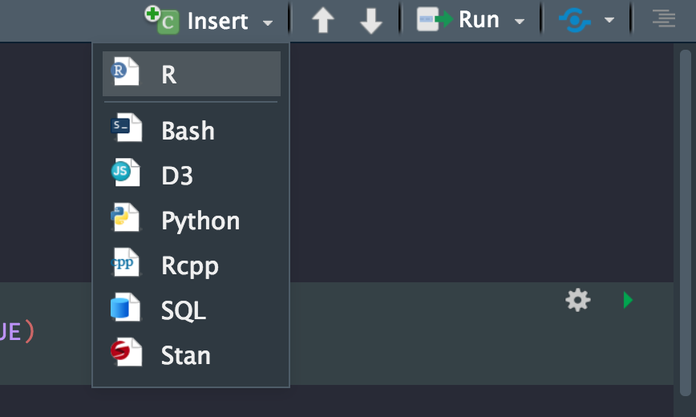
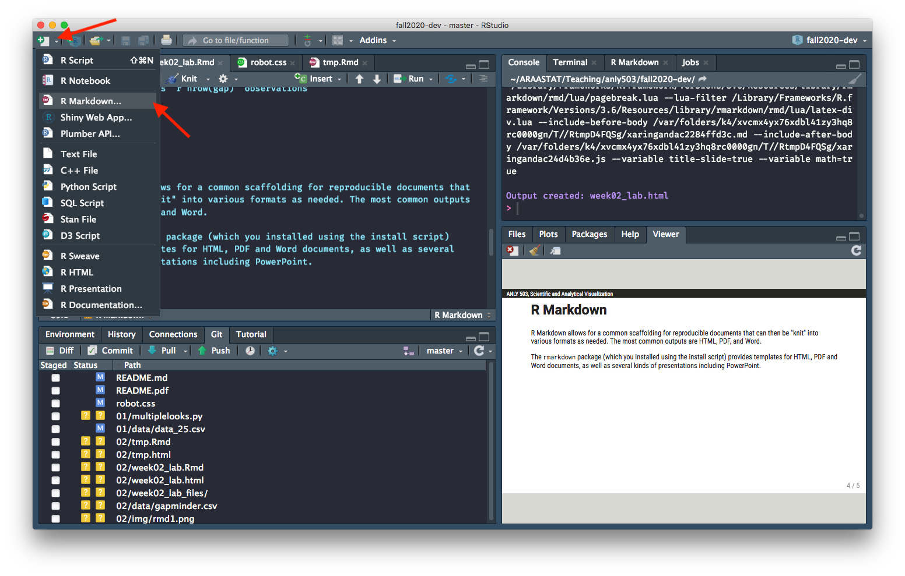
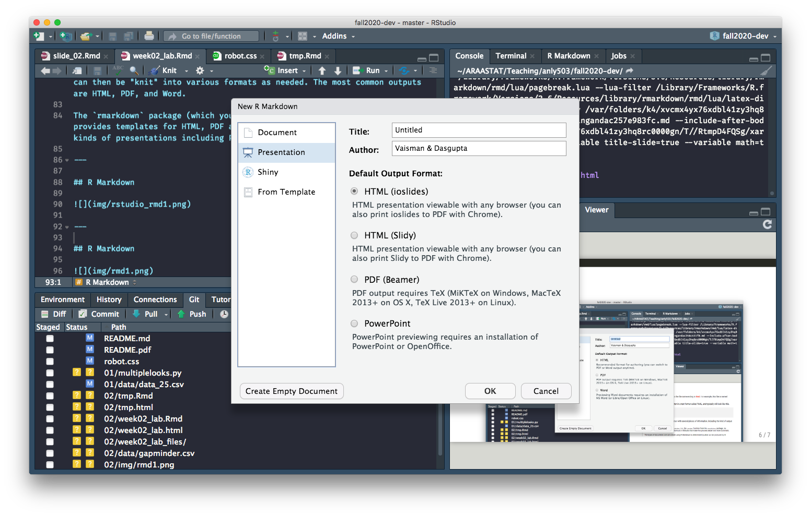
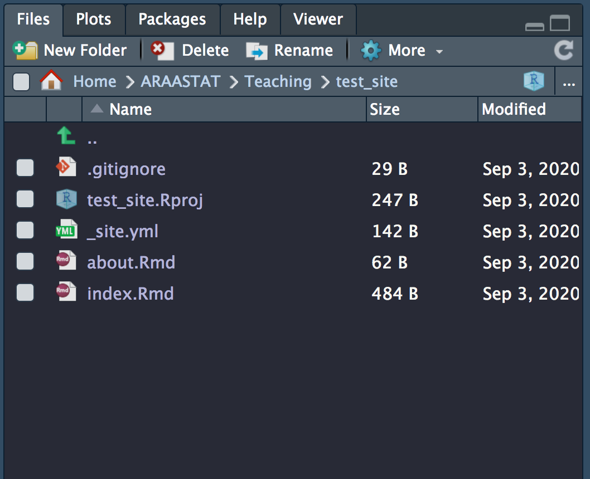
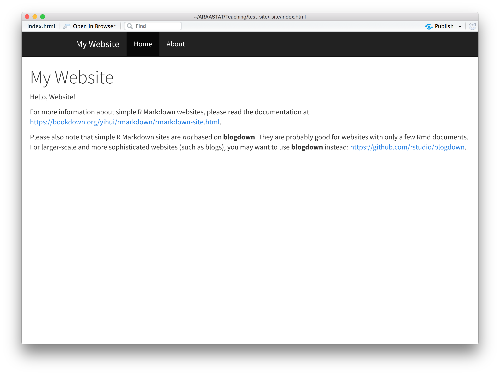

layout: true

<div class="my-header">
<span>ANLY 503, Scientific and Analytical Visualization</span>
</div>

---
background-image: url(img/rmarkdown_wizards.png)
background-size: cover

```{r setup, include=FALSE, message=FALSE, warning=FALSE}
library(pacman)
p_load(char = c('tidyverse','knitr', 'htmlwidgets', 'kableExtra'))
opts_chunk$set(echo=FALSE, message=FALSE, warning=FALSE, comment="", 
               cache=FALSE)
```

.footnote[Artwork by @allison_horst]
---
background-image: url(img/rmdflow.png)
background-size: contain

---

## R Markdown


```{r,  echo=F,include=F}
b = c('`r nrow(gap)`', '`r nrow(py$gap)`')
```

.pull-left[
R Markdown
````markdown
## Loading data

Load the gapminder dataset

`r ''````{r, echo=TRUE, eval = TRUE}
library(tidyverse)
gap <- read_csv('data/gapminder.csv')

```
The data set has `r b[1]` observations
````

Note that there are evaluated code in both the chunk and in an inline chunk
]
.pull-right[
"Knitted" document
.border[
## Loading data

Load the gapminder dataset

```{r, echo=TRUE, eval=TRUE}
library(tidyverse)
gap <- read_csv('data/gapminder.csv')
```

The data set has `r nrow(gap)` observations
] 
]

---

## Markdown

Markdown is a lightweight text-based format that allows for easy translation into HTML (originally)

It has a pretty easy syntax for writing formatted documents

`r fontawesome::fa('info-circle')` RStudio Markdown Quick Reference  
`r fontawesome::fa('info-circle')` https://www.markdownguide.org/basic-syntax  

--

.footnote[.fatinline[If you've used Jupyter notebooks before, you're familiar with Markdown]]
---

## Code

Code is embedded in an R Markdown (RMD) document using .heatinline[code chunks]

Code chunks can be standalone...

````markdown
`r ''````{[language] <chunk name>, <options>}

Code here

```
````

.pull-left[
`[language]` = {`r`, `python`, `bash`, `sql`, `css`,... }  
`<chunk name>` = optional name for chunk  
`<options>` = [chunk options](https://yihui.org/knitr/options/)
]
.pull-right[

]

---

## Code

Code is embedded in an R Markdown (RMD) document using .heatinline[code chunks]

Code chunks can be standalone...

````markdown
`r ''````{[language] <chunk name>, <options>}

Code here

```
````

or inline (only using R)

```{r, include=F}
b2 = '`r mean(mtcars$mpg)`'
```

```markdown
The *average fuel efficiency* is `r b2[1]`
```

---

## Getting started



---

## Getting started


---

## Getting started



---

```{r child='lab/rmd_template.Rmd'}

```

---

## The header section

The header section is written in a text markup language called YAML

```{yaml, echo=TRUE, eval=FALSE}
---
title: "My document"
author: "Abhijit Dasgupta"
date: "September 3, 2020"
output: html_document
---
```

--

The `output` entry tells `rmarkdown::render` what sort of output we want. 

> You can put multiple output options, and `rmarkdown::render` will do the first one
by default. You can also add options that will be passed on to `rmarkdown::render`
```{yaml, echo=TRUE, eval=FALSE}
output:
    html_document: 
        toc: true
        theme: journal
        highlight: docco
    word_document: default
```

---
class: center,middle,inverse

# Rendering R Markdown documents

### .fatinline[This is where the magic happens]
---
background-image: url(img/knit1.png)
background-size: 75%

---
background-image: url(img/knit2.png)
background-size: 75%

---

## Render from the console

The .fatinline[Knit] button really calls `rmarkdown::render`, so you can actually
add a bit more control, and potentially automate rendering many documents, using 
an R script

```{r, echo=TRUE, eval=FALSE}
rmarkdown::render('page1.Rmd', output=html_document())
```

You can replace `html_document` with any of the following with the **rmarkdown** package:

|                     |                         |                       |
|---------------------|-------------------------|-----------------------|
| github_document     | md_document             | pdf_document          |
| word_document       | odt_document            | rtf_document          |
| pdf_document        | latex_document          | context_document      |
| beamer_presentation | powerpoint_presentation | ioslides_presentation |
| slidy_presentation  |                         |                       |
---
class: center,middle,inverse

# Building websites using R Markdown

---


## Creating scaffolding using RStudio Projects

RStudio Projects are a way to encapsulate particular projects in RStudio, so that 
you can maintain separation between different projects and run separate 
R processes for each project. 

+ Quickly get to the folder(s) where you are keeping project material
+ Improve reproducibility through encapsulation
+ Keep different projects separate and independent
+ Use available templates to create basic folder structure for different purposes

----

`r fontawesome::fa('info-circle')` https://support.rstudio.com/hc/en-us/articles/200526207-Using-Projects  
`r fontawesome::fa('info-circle')` https://www.tidyverse.org/blog/2017/12/workflow-vs-script/  
`r fontawesome::fa('info-circle')` https://towardsdatascience.com/the-gold-standard-of-data-science-project-management-13d68c9e85d6

---
class: middle, center

# Starting from GitHub

---

## Setting up a repository in GitHub

+ In your GitHub, create a repository called .heatinline[ANLY503_Portfolio]
+ Add a README (makes cloning easier)
+ Clone this to your computer

---
class: middle, center

# Making this repo a RStudio project

---
background-image: url(img/web1.png)
background-size: 80%

---
background-image: url(img/ghp1_1.png)
background-size: 80%

---
background-image: url(img/ghp1_2.png)
background-size: 80%


---

## Bringing in a template

Run the following code in your RStudio Console

.pull-left[
```{r, eval=F, echo=TRUE}
d <- dir(system.file('rmd/site', 
                  package='rmarkdown'), 
        full.names=TRUE)
for(f in d){
  file.copy(f, '.')
}
```

You should see these files  
(with a different .Rproj file)
]
.pull-right[

]

---
class: middle, center

# Starting with RStudio

---
background-image: url(img/web1.png)
background-size: 75%


---
background-image: url(img/web2.png)
background-size: 75%

---
background-image: url(img/web3.png)
background-size: 75%

---
background-image: url(img/web4.png)
background-size: 75%

---
background-image: url(img/web5.png)
background-size: 75%

---

## R Markdown website
.left-column30[
```{r, cache=TRUE}
fs::dir_tree('~/ARAASTAT/Teaching/ANLY503_Portfolio', recurse=FALSE)
```
]
.right-column70[
This default template has 

1. Two pages (generated from the two Rmd files)
1. A `_site.yml` file, which will give the structure of the website
1. A `.Rproj` file, that you don't really need to touch
]

---

## R Markdown website

.left-column30[
_site.yml

```
name: "my-website"
navbar:
  title: "My Website"
  left:
    - text: "Home"
      href: index.html
    - text: "About"
      href: about.html
```
]
.right-column70[
This structure provides a navigation bar at the top. 

You can have a `left` and `right` navigation bar

The `_site.yml` determines the components of the navigation bar

]

---
class: middle, center, inverse

# Creating the website

---
background-image: url(img/build_site1.png)
background-size: 75%

---
background-image: url(img/build_site2.png)
background-size: 75%

---
background-image: url(img/build_site3.png)
background-size: 75%

---
class: middle, center, inverse

# Customization

---

## Adding to the `_site.yml`

You can specify the format of each page globally

```{yaml, echo=TRUE, eval=FALSE}
output:
  html_document:
    theme: cosmo         # https://bookdown.org/yihui/rmarkdown/
    highlight: textmate  #   html-document.html#appearance-and-style
    css: styles.css      # Create your own custom CSS file
```



---

## Resources

+ https://rmarkdown.rstudio.com/lesson-13.html
+ https://bookdown.org/yihui/rmarkdown/rmarkdown-site.html
+ https://www.emilyzabor.com/tutorials/rmarkdown_websites_tutorial.html `r fontawesome::fa('check-double')`
---
class: middle,center

# Deploying on Github

---

## Git/Github setup (if you started from RStudio)

+ Open the RStudio project for the website we created
+ Install the package **usethis** in R (`install.packages("usethis")`)
+ Run `usethis::use_git()` to initialize a git repository and make an initial commit
+ Run `usethis::use_github()` to create a remote on Github
+ You can push your current repo state using the RStudio Git pane. 
    + If the Push button is greyed out, open a terminal in RStudio and type `git push -u origin master`, and then restart RStudio

---
class: middle, center, inverse

# Setting up Github Pages

---
## Setup for deploying to Github Pages

+ Create a new folder called .heatinline[`docs`]
+ Add the following line to your `_site.yml`

```{yaml, echo=T, eval=F}
output_dir: "docs"
```
+ Build your website again
+ Commit and Push to Github

---
background-image: url(img/ghp1.png)
background-size: 80%
class: bottom, center

### On Github

---
background-image: url(img/ghp2.png)
background-size: 80%
class: bottom, center

### On Github

---
background-image: url(img/ghp3.png)
background-size: 80%
class: bottom, center

### On Github

---
background-image: url(img/ghp4.png)
background-size: 80%
class: bottom, center

### On Github

---
background-image: url(img/ghp5.png)
background-size: 80%
class: bottom, center

### On Github

---
background-image: url(img/ghp6.png)
background-size: cover


