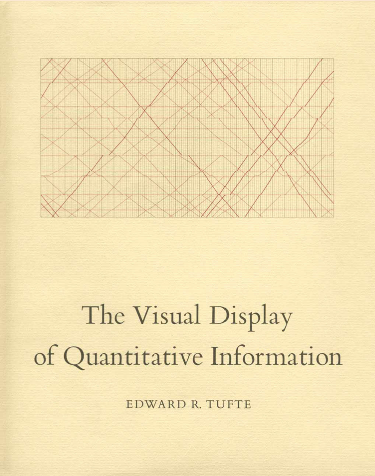
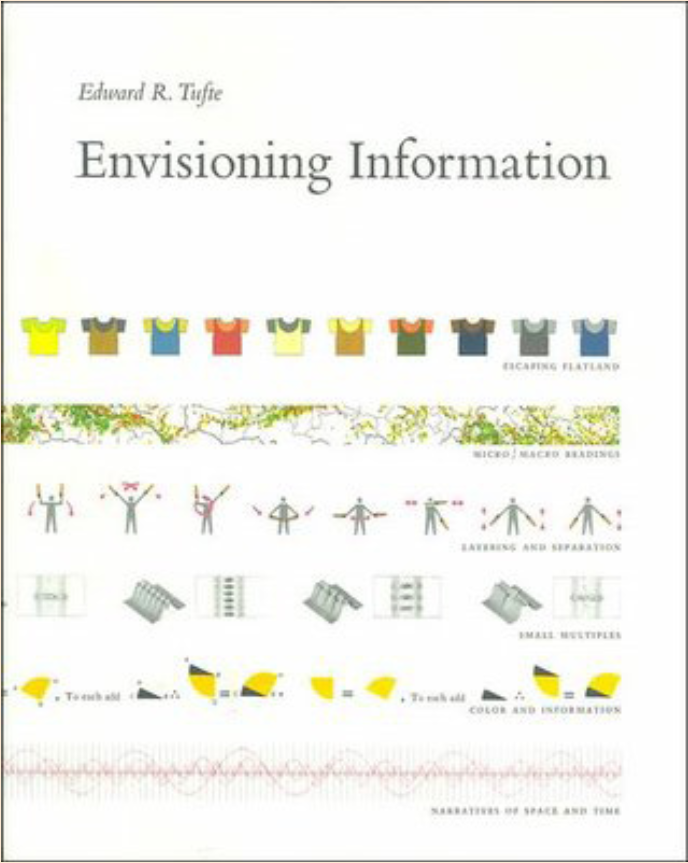
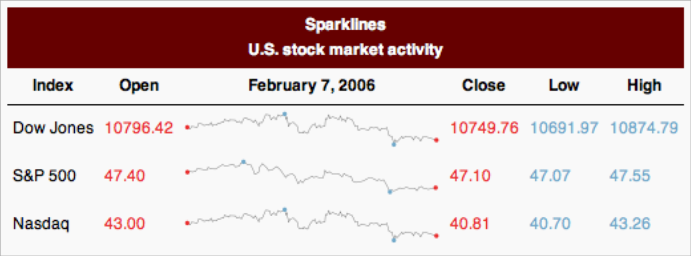
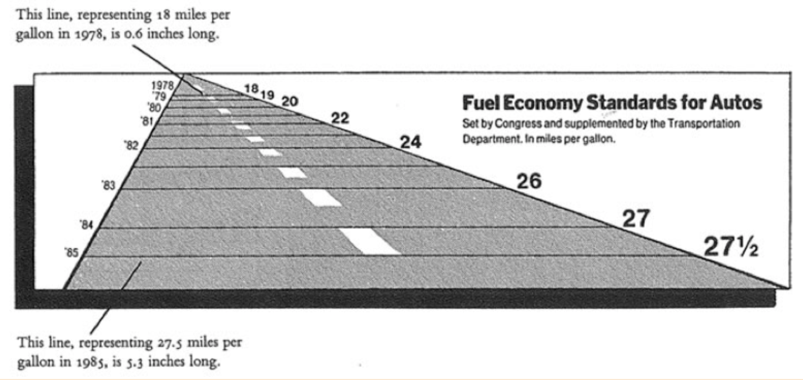
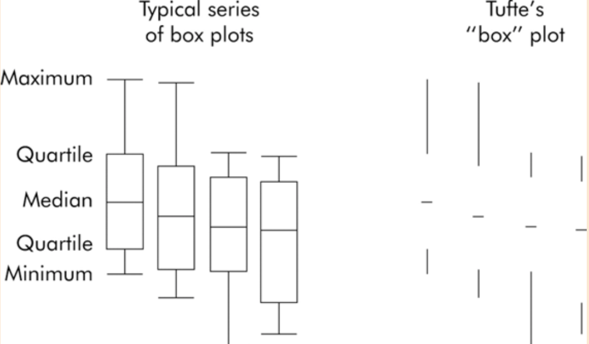
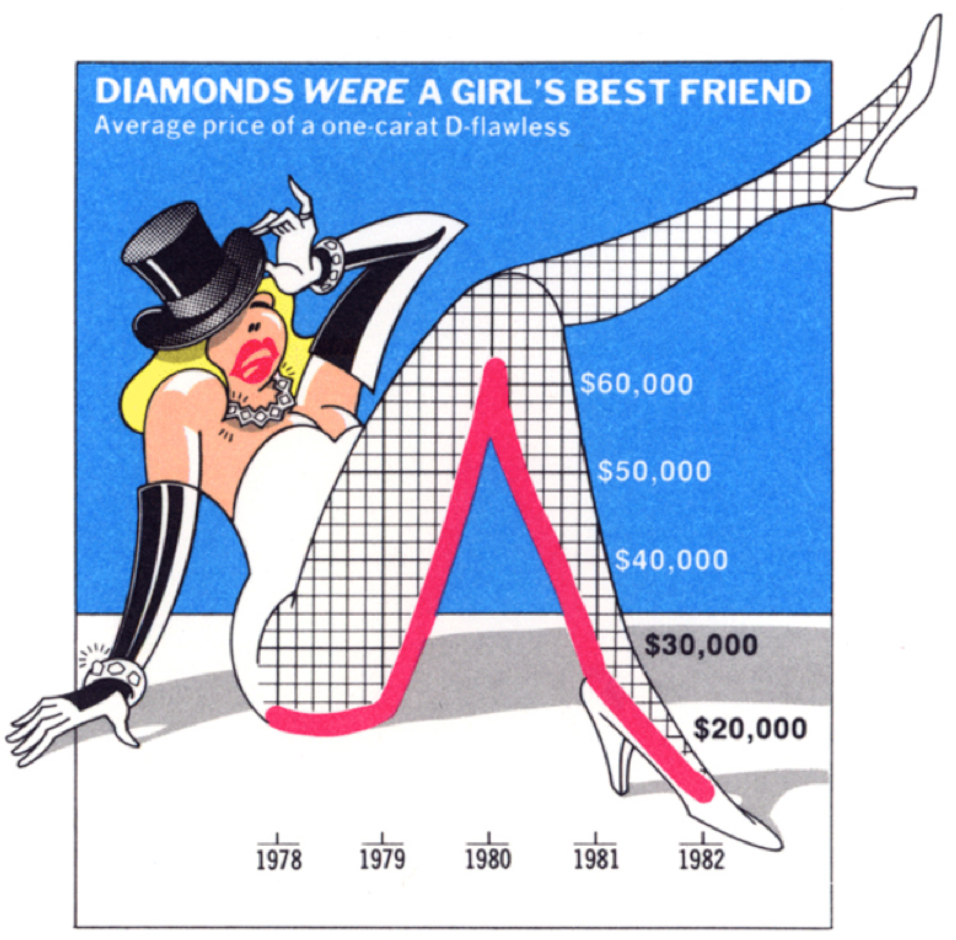
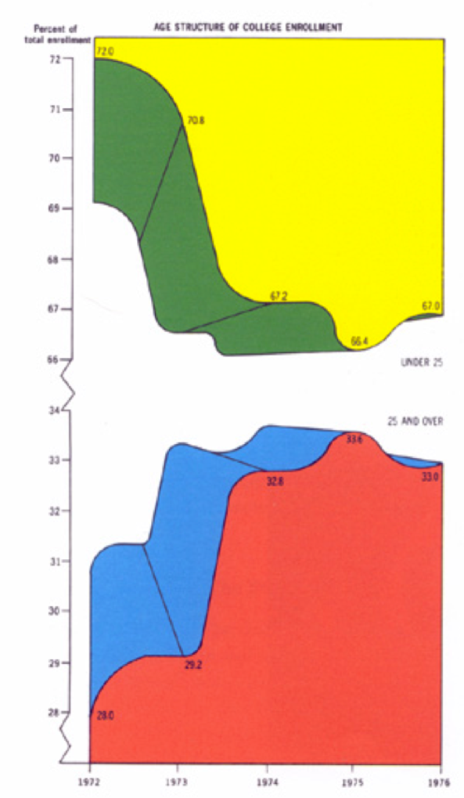
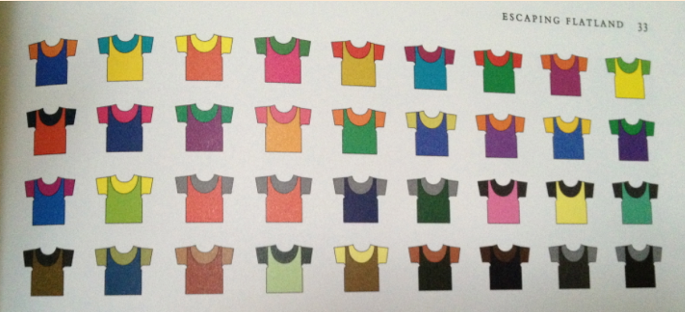
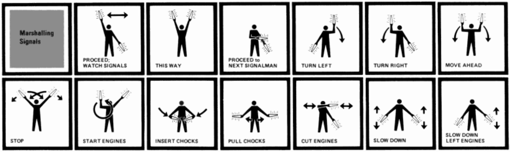
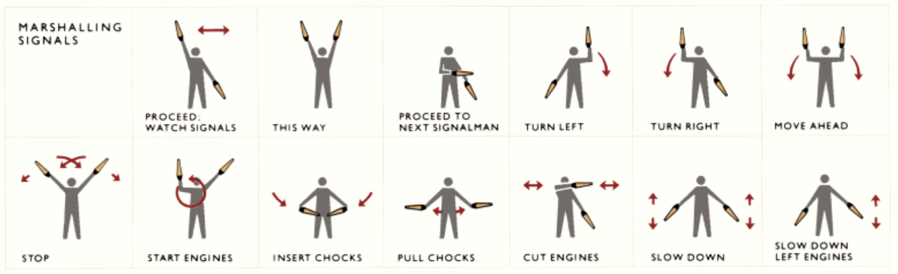

class: inverse, middle, center

# Tufte's Principles

[Tufte's Rules (requires Adobe Flash)](http://sealthreinhold.com/school/tuftes-rules/rule_five.php)

---

## The Visual Display of Quantitative Information

.pull-left[]

.pull-right[This book discusses **statistical graphics**, **charts and tables**, as well as the theory behind the **design of information graphics or data graphics**.

The book goes into a **detailed analysis of successful ways in which to display complex,** statistical information with quick, easy and **effective design techniques.**

The first edition was published in 1983.
]

---

## Envisioning Information

.pull-left[
]

.pull-right[
This book tackles the problem of **conveying multiple variable information on a 2-d space.**

It teaches us ways in which we can **communicate more information per unit to make good**, clear and smart presentations.

This book won 17 awards, and was published in 1990.
]

---

## Tufte's Principles of Graphical Integrity

1. Show data variation, not design variation
    - Don't get fancy, let the data speak
1. Do not use graphics to quote data out of context
    - Maintain accuracy
1. Use clear, detailed, thorough labelling. 
    - Use annotations to make your point
1. Representation of numbers should be directly proportional to numerical quantities
    - This is essential for fair representation
1. Don't use more dimensions than the data require
    - Be appropriate in use of 3D graphics, for example

---

## Tufte's Fundamental Principles of Design

1. Show comparisons
1. Show causality
1. Use multivariate data
1. Completely integrate modes (like text, images, numbers)
1. Establish credibility
1. Focus on content

---

## Sparklines

Invention of the **sparkline**, most commonly used in stock activity.

> A sparkline is a small intense, simple, word-sized graphic with typographic resolution. Sparklines mean that graphics are no longer cartoonish special occasions with captions and boxes, but rather sparkline graphic can be everywhere a word or number can be: embedded in a sentence, table, headline, map, spreadsheet, graphic.

.tiny[Tufte, May 27, 2004]

.center[]

---

## Small Multiples

.pull-left[
The **small multiples** method is one that Tufte uses often to portray multiple graphs of information.

>At the heart of quantitative reasoning is a single question: Compared to what? Small multiple designs, multivariate and data bountiful, answer directly by visually enforcing comparisons of changes, of the differences among objects, of the scope of alternatives. For a wide range of problems in data presentation, small multiples are the best design solution.

.tiny[Tufte, Envision Information, page 67]
]

.pull-right[

]

---

## Graphical Integrity

.small[
* The representation of numbers, as physically measured on the surface of the graphic itself, should be directly proportional to the numerical quantities represented
* Clear, detailed, and thorough labeling should be used to defeat graphical distortion and ambiguity. Write out explanations of the data on the graphic itself. Label important events in the data.
* Graphics must not quote data out of context
]

.center[]

---

## Data-Ink

.pull-left[
A large share of ink on a graphic should present data-information, the ink changing as the data change. **Data-ink is the non-erasable core of a graphic**, the non-redundant ink arranged in response to variation in the numbers represented.

How to maximize the data-ink ratio, within reason:

1. Erase non-data-ink, within reason
2. Erase redundant data-ink
3. Revise and edit]
]

.pull-right[]

---

## Chartjunk

.pull-left[
* Forgo chartjunk, including moiré vibration, the grid and the duck
* The interior decoration of graphics generates a lot of ink that does not tell the viewer anything new.
* The purpose of decoration varies — to make the graphic appear more scientific and precise, to enliven the display, to give the designer an opportunity to exercise artistic skills.
* **All non-data- ink or redundant data-ink is often chartjunk.**
]

.pull-right[

]

---

## Multifunctioning Graphical Elements

.pull-left[
* **Mobilize every graphical element**, perhaps several times over, to show the data.
* The graphical element that actually locates or plots the data is the data measure.
* The complexity of multifunctioning elements can sometimes **turn data graphics into visual puzzles**, crypto- graphical mysteries **for the viewer to decode**.
]

.pull-right[

]

---

## Escaping Flatland

.small[
* Introduce **multiple dimensions on a two-space surface**
* Focus more on the point than on the presentation, good design strategies are transparent.
* Find **pattern**
* Words may not be the most appealing to everyone but symbols are universal and understood by all
* **More small images in sequence** allow more comparison with your eyes and a better understanding
]

.center[]

---

## Layering and Separation

Would Tufte approve of this diagram?

.center[]

---

## Layering and Separation

No! He would not. To make the visual depictions more effective, reduce them down, by using:
* Macro annotation, which can help explain micro detail
* Use light, color and space effectively
* Remove the weight, avoid vibration

.center[]

