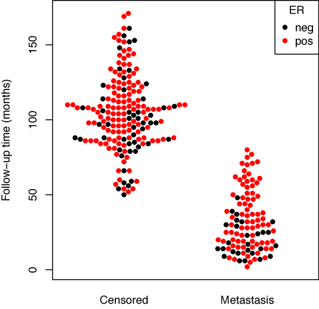
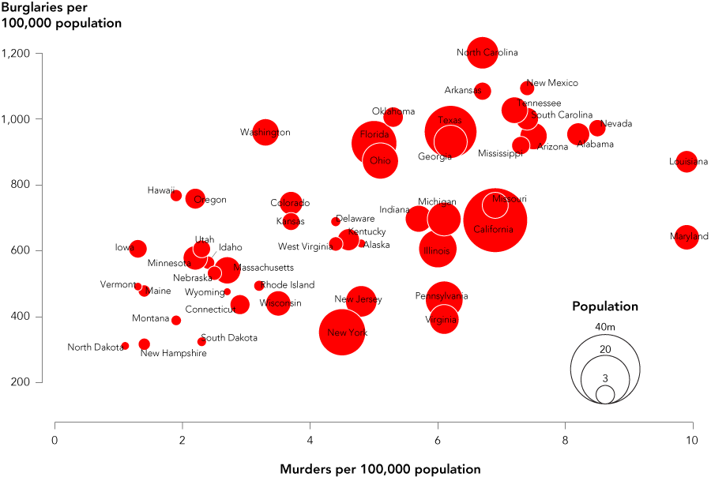

layout: true

<div class="my-header">
<span>ANLY 503, Scientific and Analytical Visualization</span>
</div>

---
class: center, middle, inverse

```{r setup, include=FALSE, message=FALSE, warning=FALSE}
library(pacman)
p_load(char = c('tidyverse','knitr', 'htmlwidgets', 'kableExtra'))
opts_chunk$set(echo=FALSE, message=FALSE, warning=FALSE, comment="", 
               cache=FALSE)
```

# Area plots

> The space between the data and the baseline is filled with a color or a pattern, usually emphasizing counts or percentages for a single variable

---
background-image: url(img/NBA_NYT.png)
background-size: 60%,60%

.left-column30[
Proportion of players from different countries in the NBA
]
---
class: middle, center, inverse

# Bar charts


---
background-image: url(img/bar-chart-type.png)
background-size: contain

---
class: center, middle, inverse

# Bar chart races

>The standard bar chart is animated to show rankings and change over time. The alternative is a multi-line chart.
---

<iframe src="https://bamatracker.com/race" width="90%" height="100%"></iframe>
.footnote[Alabama COVID-19 cases over time]

[link](https://bamatracker.com/race)
---
class: center, middle, inverse

# Barcode Chart

>A compact way to show a distribution, line segments represent individual points along a single axis.

---
background-image: url(img/12-Small-multiples-with-barcode-chart-and-axes-720x671.png)
background-size: contain

.right-column30[
.small[Percent of people switching away from a job]
]

---
class: middle, center, inverse

# Beeswarm

> It emphasizes individual points in a distribution instead of binning them like a histogram. It's akin to a stripplot but with more structure

---

## 

.left-column70[

]
.right-column30[
This plot works like a strip plot or violin plot in that it shows the distribution of the data along an axis, but 
doesn't overdraw multiple points
]
---
class: middle, center, inverse

# Box Plot

> The classic chart of quartiles, median, minimum, and maximum shows a basic view of distributions.

---
background-image: url(img/boxplot.png)
background-size: contain

---
class: middle, center, inverse

# Bubble Chart

> Points are placed like in a scatter plot, but they are sized based on the radius being the  square root of data values.

---

<h2></h2>



---
class: middle, center, inverse

# Bump Chart

> It looks like a line chart. However, the focus is specifically on ranks, usually over time.

---
background-image: url(img/bump.png)
background-size: contain

<h1></h1>
.left-column20[
See how ranking changes over time for a set of choices
]


---
class: middle, inverse, center

# Chord Diagram

> A chord diagram represents flows or connections between several entities (called nodes). Each entity is represented by a fragment on the outer part of the circular layout. Then, arcs are drawn between each entities. The size of the arc is proportional to the importance of the flow.

---
background-image: url(img/chord.png)
background-size: 40%,40%

<h1></h1>
.left-column20[Migration patterns between countries]

---
class: middle, inverse, center

# Connected Scatter Plot

> A cross between a scatterplot and a time series. Show two variables over time.

---
background-image: url(img/connected.png)
background-size: contain

---
class: middle, inverse, center

# Density plot

> 
A density plot shows the distribution of a numeric variable. It takes only numeric variables as input and is very close from an histogram. It can be use in the same exact condition.

---
background-image: url(img/density.png)
background-size: 60%,60%

---
class: middle, inverse, center

# Difference Chart

> Fill the space between lines to highlight the greater-than and less-than differences over time.

---
background-image: url(img/excess_deaths.jpeg)
background-size: contain

.right[.footnote[Financial Times]]

---
class: middle, inverse, center

# Donut Chart

> It is like a pie chart. But with a hole. It looks like a donut. That’s why it’s called a donut chart.

---
background-image: url(img/donut.jpeg)
background-size: contain

---
class: middle, inverse, center

# Dot Plot

> A generalized form of the scatter plot, the dots can be placed in various coordinate systems.

---
background-image: url(img/dotplot.png)
background-size: 50%,50%

<h1></h1>
.left-column20[
There are a variety of ways to use coordinates and 
combinations to create a dotplot
]

---
class: middle, inverse, center

# Frequency Trails

> Area or line chart value axes overlap to fit more in a space and add another visual aspect to the magnitude of peaks. Also known as: ridgeline chart, joyplot.

---
background-image: url(img/ridge.png)
background-size: contain

---
class: middle, inverse, center

# Heatmap

> Cells or bins are colored based on data. As with all visualization types that use color as the main visual encoding, choose shades carefully.

---
background-image: url(img/heatmap.png)
background-size: contain

<h1></h1>
.left-column20[
Color choice is a big issue!!!
]

---
class: middle, inverse, center

# Histogram
> It looks like a bar chart, but it reads differently. The baseline is continuous instead of discrete categories, which allows one to see distributions.

---
background-image: url(img/hist.png)
background-size: contain

---
class: middle, inverse, center

# Line Chart

> Typically used to show trends over time, the slope of the line between two points shows patterns of change.

---
background-image: url(img/lineplot.png)
background-size: contain

---
class: middle, inverse, center

# Mosaic Plot

> Also known as a Marimekko diagram, this chart uses the width and height of rectangles to represent separate variables. It can be useful to represent multidimensional data.

---
background-image: url(img/mosaic.png)
background-size: contain

---
class: middle, inverse, center

# Network Graph
> Nodes and edges show connections, typically positioned to show strength of relationships.

---
background-image: url(img/network.jpg)
background-size: 55%,55%

### Network of patents at Apple and Google

---
class: middle, inverse, center

# Parallel coordinates plot

> This type of visualisation is used for plotting multivariate, numerical data. Parallel Coordinates Plots are ideal for comparing many variables together and seeing the relationships between them

---
background-image: url(img/parallel_coordinates.png)
background-size: contain

---
class: middle, inverse, center

# Pyramid Chart

> Typically used to show the age distributions for population of male and females.

---
background-image: url(img/pyramid.png)
background-size: contain

---
class: middle, inverse, center

# Sankey Diagram
> Show flows from one state to the next.

---
background-image: url(img/sankey.png)
background-size: contain

---
class: middle, inverse, center

# Scatter Plot

> Dots are placed in an x-y coordinate system, based on two variables. The plot is often used when it is thought that the variables are correlated.

---
background-image: url(img/scatter.png)
background-size: contain


---
class: middle, inverse, center

# Slope Chart

> A specialized line chart, this chart type highlights the change in rank or metric over two time periods.

---
background-image: url(img/slope.png)
background-size: 40%,40%

---
class: middle, inverse, center

# Stacked Area Chart

> Place multiple categories on top of each other for a sense of distribution and overall change. Watch out for large counts eclipsing the small ones.

---
background-image: url(img/stacked_area.jpg)
background-size: 50%,50%

---
class: middle, inverse, center

# Stacked Bar Chart
> With the stacked version of the bar, compare subcategories across groups. Try not to show too many subcategories though, or it’ll clutter quick.

---
background-image: url(img/stacked_bar.png)
background-size: contain

---
class: middle, inverse, center

# Step Chart
> It works like a line chart, but the values change immediately at the x-coordinate instead of with a slope.

---
background-image: url(img/step.png)
background-size: 50%, 50%

---
class: middle, inverse, center

# Streamgraph
> It’s like a stacked area chart but with a zero-offset to optimize centrality.

---
background-image: url(img/stream.png)
background-size: contain

.left-column30[
Visualizing Olympic medals
]

---
class: middle, inverse, center

# Strip Plot

> Dots are placed along a single continuous scale to show distribution along the corresponding variable.

---
background-image: url(img/strip.png)
background-size: contain

---
class: middle, inverse, center

# Timeline

>Place a focus on events over time.

---
background-image: url(img/timeline.png)
background-size: contain

---
class: middle, inverse, center

# Treemap

> It shows the individual values as they compare to the whole. Rectangles are arranged to maintain hierarchy.

---
background-image: url(img/treemap.png)
background-size: contain

---
class: middle, inverse, center

# Voronoi Diagram

> Each polygon, or Voronoi cell, contains an original point and all areas that are closer to that point than any other.

---
background-image: url(img/voronoi.png)
background-size: contain
