layout: true

<div class="my-header">
<span>ANLY 503, Scientific and Analytical Visualization</span>
</div>

---
class: middle, inverse, center

```{r setup, include=FALSE, message=FALSE, warning=FALSE}
library(pacman)
p_load(char = c('tidyverse','knitr', 'htmlwidgets', 'kableExtra', 'fontawesome'))
opts_chunk$set(echo=FALSE, message=FALSE, warning=FALSE, comment="", 
               cache=FALSE)
reticulate::use_condaenv('ds', required = T)
```

# Tools of the trade

---

## What is the trade?

+ Data storage and ingestion
+ Data processing
+ Data visualization
+ Refine visualization

You actually need tools for all of these to get a good data visualization done

---

## Two broad classes of tools

.pull-left[

]
.pull-right[

]

---

## Two broad classes of tools

.pull-left[
### Point and click

+ Excel / Google Sheets
+ SPSS
+ GraphPad Prism
+ Many more
]
.pull-right[
### Scripting 

+ R
+ Python
+ SAS
+ Stata
+ Javascript
+ Java
+ C/C++/.NET
]
---

## Two broad classes of tools

### Point-and-click tools
.pull-left[

#### Pros
+ Easy and convenient
+ Widely available
+ Can gain reasonable expertise quickly
]
.pull-right[
#### Cons 
+ Easier to make, harder to catch mistakes
+ Difficult to capture processes
+ Harder to automate
+ Harder to reproduce analyses
]
---

## Two broad classes of tools

### Scripting tools
.pull-left[

#### Pros
+ Flexibility and power
+ Customizability
+ Reproducibility 
+ Automation
+ Debugging/Version control
]
.pull-right[
#### Cons 
+ Takes longer to become expert
+ Developer time
+ Have to think more about what you want to do
    - Less cookie-cutter

]

---

## A third class

### Visual analytic tools

.pull-left[
This class of tools uses a graphical interface to create pipelines for analyses. 

There is usually code underlying each pipeline that can be extracted and logged

Exchange flexibility for convenience

Can drop down to code to maintain some flexibility

]
.pull-right[
+ Tableau
+ SAS Enterprise Guide
+ Orange (Python)
+ KNIME
+ Weka
+ RapidMiner
]
---

layout: true

<div class="my-header">
<span>ANLY 503, Scientific and Analytical Visualization</span>
</div>

## Data storage and ingestion

---

You learned some of this in 501 and 502

.pull-left[
+ AWS, Azure, GCP
+ SQL-based databases
+ JSON-based storage (like NoSQL databases)
+ Excel or other spreadsheets
+ Text files
]
.pull-right[
How do you get data out of these?

How do you process the data?
]
---

### Tools for ingestion

+ SQL-type databases can be accessed through ODBC pipes into various front ends or programming platforms
    + DBI and related packages in R
    + SQLAlchemy and related packages in Python
+ Spreadsheets hold the data themselves, or the data can be pretty easily ingested into programming environments
    + **readxl** in R
    + **xlrd** in Python
+ Text files can be pretty much universally read
    + Have to be careful about formatting and unintended errors in conversion
    
---

layout: true

<div class="my-header">
<span>ANLY 503, Scientific and Analytical Visualization</span>
</div>

## Data processing 

---

### A pre-requisite for data visualization

Data processing is an essential piece of the data visualization puzzle

It is rare that raw data is in the right condition to be visualized properly or well

--

.pull-left[
.acid[Data cleaning]
]
.pull-right[
.acid[Data munging]
]


---

### Data conversions

+ It is not uncommon for data from the cloud or databases to be converted into spreadsheets or text files for further processing
+ Conversions can be beset with issues
    + Conversion of dates 
    + Auto-correct makes things worse 
    + Conversion of data types with unintended consequences (_stringsAsFactors_ in R)

-----

Generally scripts work better at making sure things are correct through reproducibility and validation tools

---

### A note on Excel `r fa('file-excel', fill='steelblue')`

.pull-left[
   

Excel is omnipresent, so it becomes the default data medium (specially in corporate)

It is great for many things, including _quick-and-dirty_ analyses

.heatinline[It can be error-prone]

It needs to be backed up

It has size limitations

Takes a lot of effort to do complex analyses

Known mathematical issues (division of numbers)
]

--

.pull-right[
+ No way to reproduce analyses without macros
+ No way to document what you are doing
+ Excel has some nasty default behavior
  - Guess what the `MAR1` gene gets recorded as?
+ Very hard to recover from errors
  - Shift of one error (off by one row or column)
  - Google _Duke Potti_ or _Reinhart Rogoff Herndon_
]

---

layout: true

<div class="my-header">
<span>ANLY 503, Scientific and Analytical Visualization</span>
</div>

---
## Workflows

You want to start with data, and create a path to a final data set that can be used for visualization

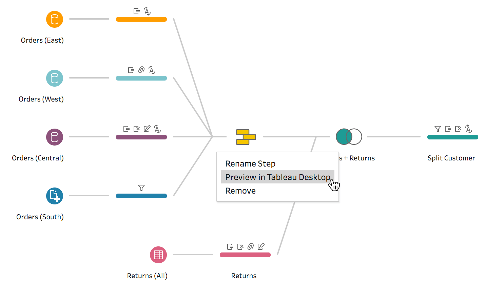
---

## Workflows

You want to start with data, and create a path to a final data set that can be used for visualization

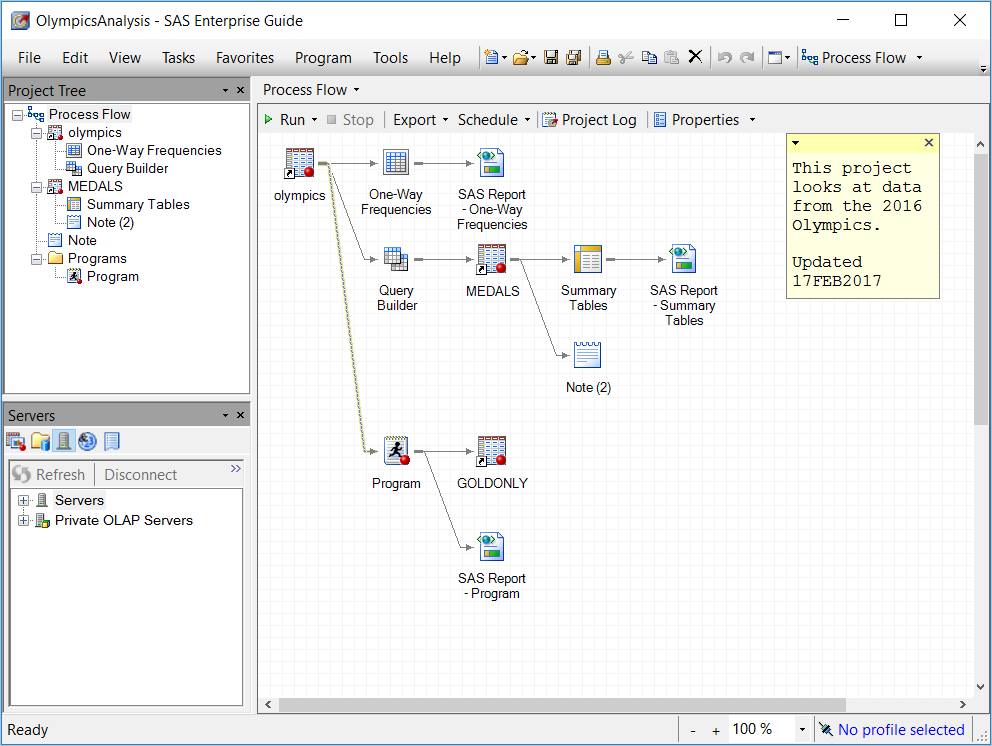

---

## Workflows

You want to start with data, and create a path to a final data set that can be used for visualization


---

## Workflows

You want to start with data, and create a path to a final data set that can be used for visualization

.center[]


---

## Workflows

You want to start with data, and create a path to a final data set that can be used for visualization

```{r, eval=F, echo=TRUE}
baseline_rec <- recipe(~., data = baseline) %>%
    update_role(ends_with('response'), new_role='outcome') %>%
    update_role(ends_with('w12'), new_role='outcome') %>%
    update_role(ends_with('w24'), new_role = 'outcome') %>%
    step_nzv(all_predictors()) %>%
    step_rm(basdai) %>%
    step_log(crp_mg_dl) %>%
    step_dummy(all_nominal(), -all_outcomes()) %>%
    step_knnimpute(all_predictors()) %>%
    step_center(age, bmi, crp_mg_dl, tjc, sjc) %>%
    step_scale(age, bmi, crp_mg_dl, tjc, sjc) %>%
    check_missing(all_predictors()) %>%
    prep(training = baseline)
```

---

## Workflows

You want to start with data, and create a path to a final data set that can be used for visualization

+ You can also create shell scripts that involve `awk`, `sed`, `cut`, `grep`, and other UNIX tools
+ These pipes can includes pieces of scripting languages like R, Python or Perl
+ You can make sure the workflows are reproducible using `make` and similar workflow management tools

.pull-left[
```{makefile, eval=F, echo=T}
SUBDIRS := $(wildcard slides/lectures/week*)
OUTDIR=docs


lectures: $(SUBDIRS) ## Compile lecture slides
$(SUBDIRS):
        cp make_subdirs $@/Makefile; $(MAKE) -C $@


slides_web: FORCE ## Create website for slides
        Rscript -e "rmarkdown::render_site('slides')"
        cp -r docs/slides_top/* docs/slides


toplevel: FORCE ## Create top level website
        Rscript -e "rmarkdown::render_site('.')"
        cp -r docs/toplevel/* docs

all: lectures slides_web toplevel
```
]
.pull-right[
```{makefile, echo=T, eval=F}
OUTDIR = $(shell Rscript -e "fs::path(here::here('docs', fs::path_rel(getwd(), start=here::here())))")
SLIDES := $(wildcard *.Rmd)
SLIDES_OUT = $(patsubst %.Rmd, $(OUTDIR)/%.html, $(SLIDES))

.PHONY: all
all: $(SLIDES_OUT)

$(OUTDIR)/%.html: %.Rmd _output.yml
        Rscript -e "rmarkdown::render('$(*F).Rmd', output_dir='$(OUTDIR)')"
```
]
---
class: center, middle, inverse

# Data visualization tools

---

## Scripting tools

We have a bias towards scripting tools
.pull-left[
+ Fits into data science workflow
+ Customizable
+ Reproducible
+ Can have good control over visual encodings

-----

+ We do need some help so that the programming isn't too granular and tedious
]
.pull-right[
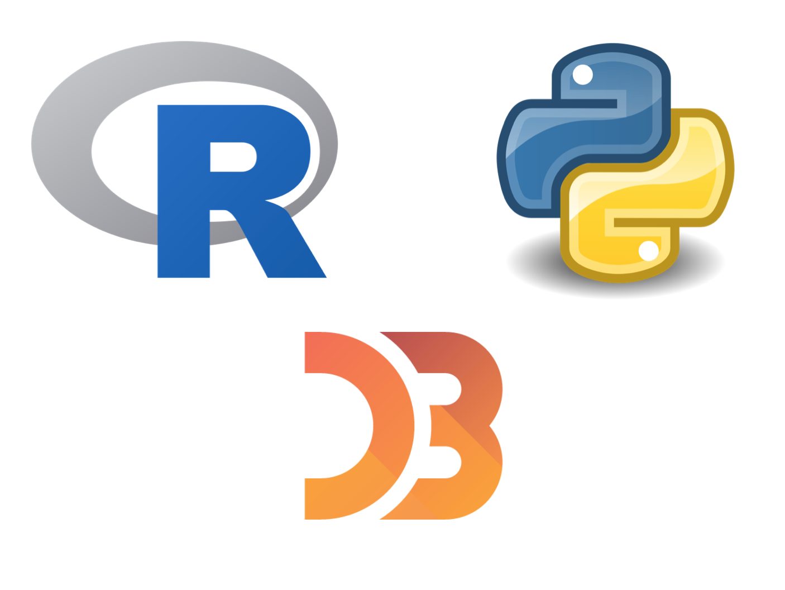
]

---

## `r fa('r-project', fill='steelblue')` Tools

The main engine for data visualization in R is **ggplot2**

.pull-left[
+ Based on visual encodings and layering based on the Grammar of Graphics (Wilkinson)
+ Can pretty much translate everything we've learned so far in terms of encodings into a **ggplot2** pipe.

]
.pull-right[
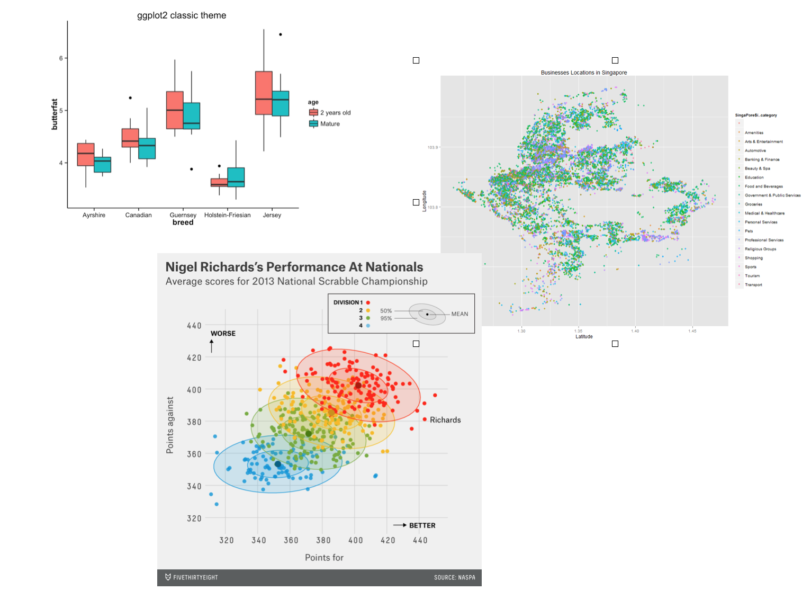
]

---

## `r fa('r-project', fill='steelblue')` Tools

There is an [entire ecosystem](https://exts.ggplot2.tidyverse.org/gallery/) around **ggplot2**

<iframe src="https://exts.ggplot2.tidyverse.org/gallery/" width="80%" height="500"></iframe>

---

## `r fa('r-project', fill='steelblue')` Tools

.pull-left[
```{r p1, eval = F, echo = T}
library(datasauRus)
ggplot(datasaurus_dozen, 
       aes(x=x, y=y, colour=dataset))+
    geom_point()+
    theme_void()+
    theme(legend.position = "none")+
    facet_wrap(~dataset, ncol=3)+
  labs(caption="Matejka & Fitzmaurice, 2017")
```

You see the approach of encoding each element of data into particular aspects of the visualization, then adding geometries and themes
]
.pull-right[
```{r, eval=T, echo = F, ref.label="p1"}
```
]

---

## `r fa('r-project', fill='steelblue')` Tools

There are other families of tools for static visualization in R

.pull-left[
```{r p2, eval = F, echo = T}
x <- runif(300,  min=-10, max=10) 
y <- 0.1*x^3 - 0.5 * x^2 - x + 10 + rnorm(length(x),0,8) 
 
# plot of x and y :
plot(x,y,col=rgb(0.4,0.4,0.8,0.6),pch=16 , cex=1.3) 
```
Base graphics gives you a lot more granular control at the expense of a poorer mental model and eventually a lot more code
]
.pull-right[
```{r, eval=T, echo = F, ref.label="p2"}
```
]

---

## `r fa('r-project', fill='steelblue')` Tools

There are other families of tools for static visualization in R

.pull-left[
```{r p3, eval = F, echo = T}
library(lattice)
xyplot(Sepal.Length ~ Petal.Length,
       data = iris,
       type = c("p", "g", "smooth"),
       xlab = "Miles/(US) gallons",
       ylab = "Weight (1000lbs)")
```
The **lattice** package is a cousin of the **ggplot2** package in that it is also based on the Grammar of Graphics, but more loosely.

It is often faster than **ggplot2**, but with a far less rich ecosystem
]
.pull-right[
```{r, eval=T, echo = F, ref.label="p3"}
```
]

---

## `r fa('r-project', fill='steelblue')` Tools

### Dynamic graphics

The main toolbox for dynamic graphics in R is [**htmlwidgets**](https://www.htmlwidgets.org/showcase_leaflet.html). This includes several R packages that wrap Javascript visualization packages.

<iframe src="https://www.htmlwidgets.org/showcase_leaflet.html" width='80%' height=500></iframe>

---

## `r fa('r-project', fill='steelblue')` Tools

### Dynamic graphics

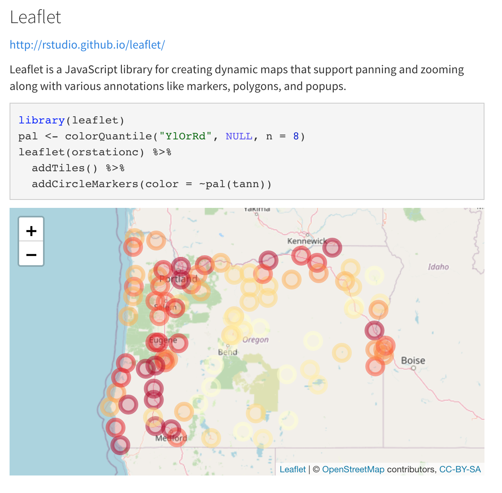

---

## `r fa('r-project', fill='steelblue')` Tools

### Dynamic graphics

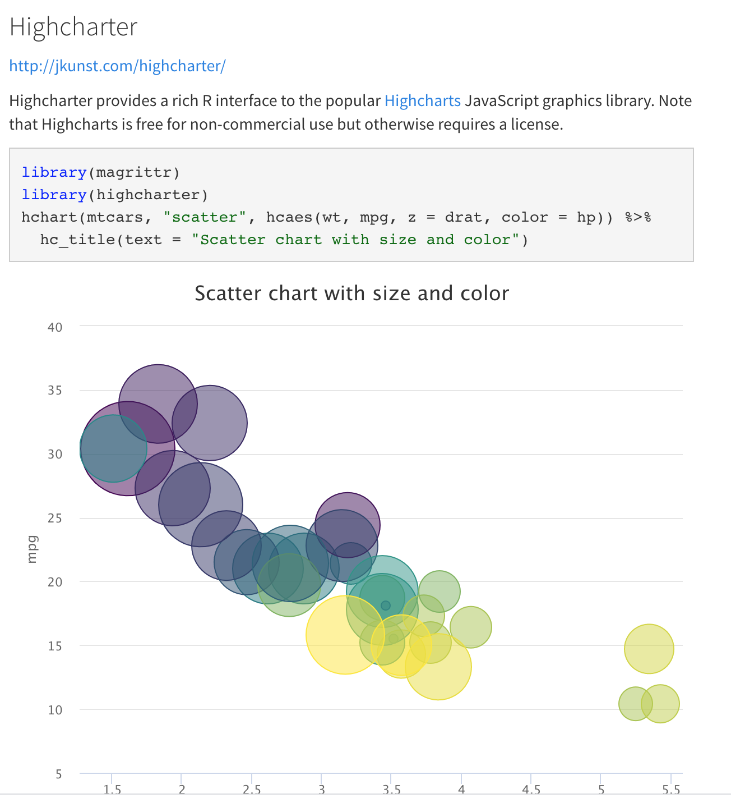

---

## `r fa('r-project', fill='steelblue')` Tools

### Dynamic graphics

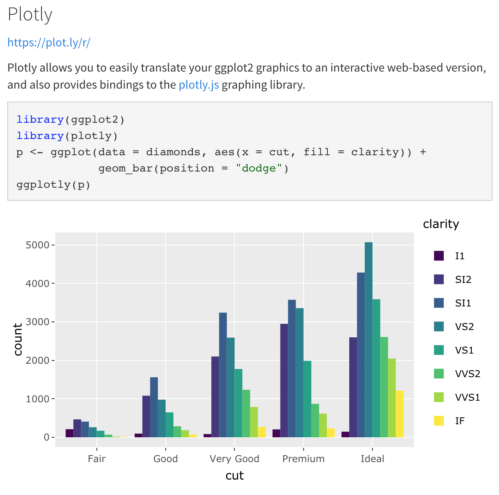
---

## `r fa('r-project', fill='steelblue')` Tools

### Dynamic graphics

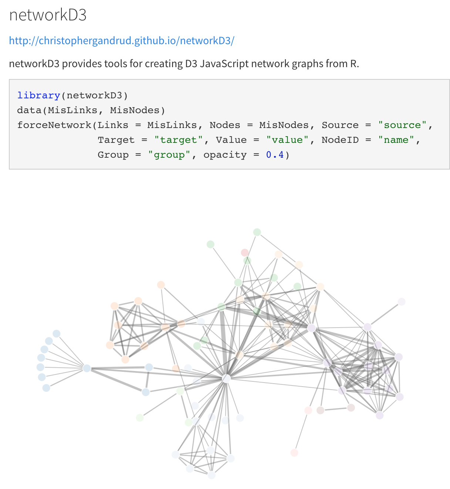

---

## `r fa('python', fill='steelblue')` Tools

The main toolbox for static visualizations in Python is **matplotlib**. This was developed to be an open-source clone of the graphical capabilities of Matlab

.pull-left[
```{python q1, eval = F, echo = T}
import matplotlib.pyplot as plt
import numpy as np
import pandas as pd
 
# Create a dataset:
df=pd.DataFrame({'x': range(1,101), 'y': np.random.randn(100)*15+range(1,101) })
 
# plot
plt.plot( 'x', 'y', data=df, linestyle='none', marker='o')
plt.show()

```

**matplotlib** is like base R in that it provides granular control over your graphics, but that can make it tedious to program
]
.pull-right[
```{python, eval=T, echo = F, ref.label="q1"}
```
]


---

## `r fa('python', fill='steelblue')` Tools

A better choice is **seaborn**, which builds on top of **matplotlib**.

.pull-left[
```{python q2, eval = F, echo = T}
import seaborn as sns
df = sns.load_dataset('iris')
 
# use the function regplot to make a scatterplot
sns.regplot(x=df["sepal_length"], y=df["sepal_width"])
plt.show()
```
]
.pull-right[

]

---

## `r fa('python', fill='steelblue')` Tools

You can also plot directly using **pandas**, which also provides a wrapper around **matplotlib**

.pull-left[
```{python, eval=F, echo=T}
df.plot(x = 'sepal_length',y='sepal_width', 
  kind='scatter')
```
]
.pull-right[
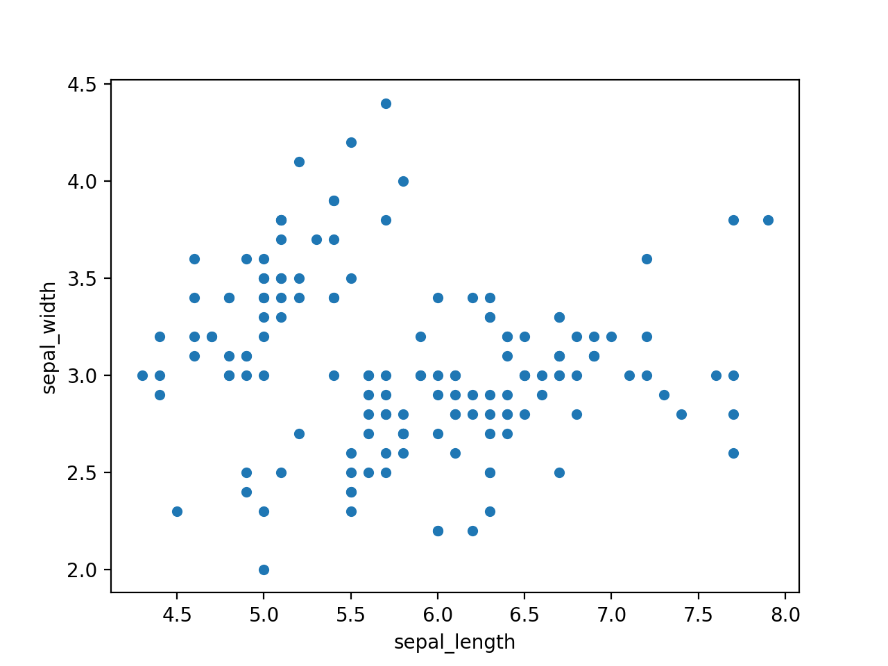
]

---

## `r fa('python', fill='steelblue')` Tools

### Dynamic graphics

We will mainly work with **plotly** in this class

**plotly** works with both `r fa('r-project')` and `r fa('python')` to create dynamic graphics

.pull-left[
```{python, echo=T, eval=F}
import plotly.express as px
df = px.data.iris()
fig = px.scatter(df, x="sepal_width", y="sepal_length", color="species")
fig.show()
```
]
.pull-right[
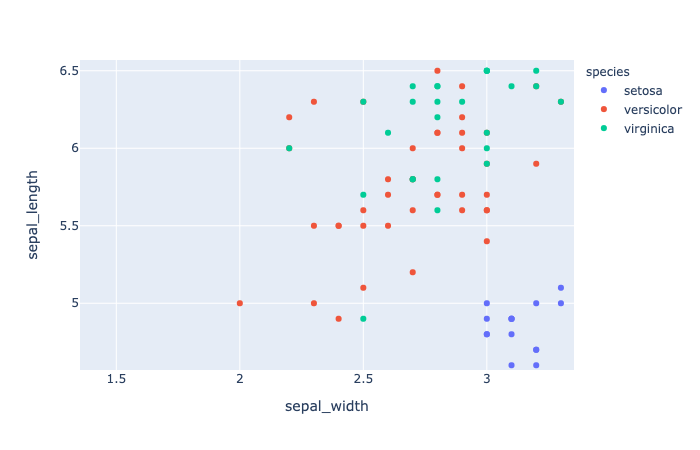
]
.footnote[ [link](https://plotly.com/python/plotly-express/)]

---

## `r fa('python', fill='steelblue')` Tools

### Dynamic graphics

Python also has other dynamic graphics libraries that have their own Javascript packages.

+ [bokeh](https://demo.bokeh.org/)
+ [Altair](https://altair-viz.github.io/gallery/index.html)
+ [Vega](https://vega.github.io/vega/examples/)

---
class: center, middle, inverse

# Javascript graphics

---

## Javascript graphics

Javascript graphics have become increasingly popular in the internet age

+ Client-side computations
+ Fast and light
+ Impressive quality
+ Interactivity

---

## D3.js

[D3.js](https://d3js.org) was developed by Mike Bostock to visualize data. It stands for "Data-Driven Documents".

<iframe src="https://observablehq.com/@d3/gallery" width="80%" height=400></iframe>

---

## D3.js

D3.js is the basis of most data journalism graphics you see on the web. 

It has also been brilliantly used for tutorials of difficult concepts ([link](http://www.r2d3.us/visual-intro-to-machine-learning-part-1/))

However, it is very granular and requires complete specification of every encoding
of data to visual geometry. So you have a job as as D3 programmer

---

## Other Javascript libraries 

There are several other libraries that try to use the power of D3.js, but with an 
easier user experience. 

These include

+ [Chart.js](https://www.chartjs.org/)
+ [NVD3](https://nvd3.org/) (built on D3.js)
+ [Vega-Lite](https://vega.github.io/vega-lite/), which is wrapped in Python by Altair

---
class: center, middle, inverse

# GUI-based tools

---

## Graphpad Prism

Graphpad Prism is a menu-driven statistical program widely used in the life sciences for 
data graphics

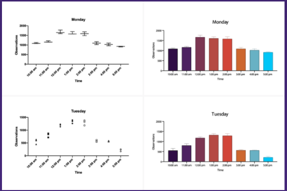


---

## Gephi

Gephi is a powerful program that is used for network visualization


---
class: middle, center, inverse

# Cleaning things up

---

## Cleaning things up

You can get pretty close to a final graphic using R and Python

Sometimes, however, you do need to tweak things to make it perfect

The strategy of scripting graphics and then finishing them in another software is common practice at NY Time, Guardian and other data journalism practices

---

## The tools

+ GIMP/ Adobe Photoshop: [GIMP](https://www.gimp.org) is a very powerful open-source alternative to Photoshop
+ Inkscape / Adobe Illustrator: [Inkscape](https://inkscape.org/) is an open-source alternative to Adobe illustrator for editing vector graphics like SVG

