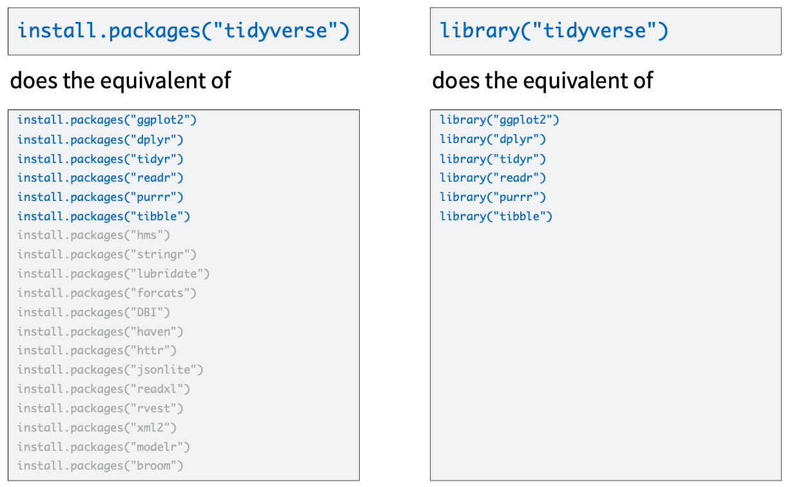

```{r setup, include=FALSE, message=FALSE, warning=FALSE}

library(pacman)
p_load(char = c('tidyverse', 'knitr', 'htmlwidgets', 'kableExtra'))
knitr::opts_chunk$set(
  echo = FALSE,
  message = FALSE,
  warning = FALSE,
  comment = NA,
  cache = FALSE
  )
```

```{r xaringan-themer, include=FALSE, warning=FALSE}
library(xaringanthemer)
style_duo_accent(
  primary_color = "#035AA6", 
  secondary_color = "#03A696"#,
  #header_font_google = google_font("Josefin Sans"),
  #text_font_google   = google_font("Montserrat"),
  #code_font_google   = google_font("Fira Mono")
)
xaringanExtra::use_tachyons()
xaringanExtra::use_extra_styles(hover_code_line=TRUE,
                                mute_unhighlighted_code = TRUE)
```

## Case study in genomics

The [Gene Expression Dataset](http://www.molbiolcell.org/content/19/1/352.abstract)

* This exercise is based on [David Robinson's blog post](http://varianceexplained.org/r/tidy-genomics/)  and updated with current code because it was written about five years ago when many of the `tidyverse` packages were still in early development
* It uses a very interesting dataset that communicates both the concepts of tidy data and tells a biological story (today we focus on the data piece only.)

---

## Background

* Through the process of gene regulation, a cell can control which genes are transcribed from DNA to RNA- what we call being _expressed_. 
* A _gene expression microarray_ measures how much of each gene is expressed in a particular condition. This can used to figure out the function of a specific gene (based on when it turns on and off), or to get an overall picture of the cell’s activity.
* Brauer 2008 used microarrays to test the effect of starvation and growth rate on baker’s yeast (S. cerevisiae). Basically, if you give yeast plenty of nutrients (a rich media), except that you sharply restrict its supply of one nutrient, you can control the growth rate to whatever level you desire (we do this with a tool called a chemostat). 
    * For example, you could limit the yeast’s supply of glucose (sugar, which the cell metabolizes to get energy and carbon), of leucine (an essential amino acid), or of ammonium (a source of nitrogen).
* _Starving_ the yeast of these nutrients lets us find genes that:
  * Raise or lower their activity in response to growth rate. Growth-rate dependent expression patterns can tell us a lot about cell cycle control, and how the cell responds to stress.
  * Respond differently when different nutrients are being limited. These genes may be involved in the transport or metabolism of those nutrients.


---

.bg-washed-green.b--dark-green.ba.bw2.br3.shadow-5.ph4.mt5[
The more effort you put up front into tidying your data, the easier it will be to explore interactively. Since the analysis [and visualization] steps are where you will actually be answering questions about your data, _it's worth putting up this effort_!

.tr[
— David Robinson
]]

---

## Load the dataset

Read the dataset from a _tab-delmited_ file into a _tibble_.
--
```{r echo=T, eval=T}
library(readr)
original <- read_delim("data/dataset1.tds", 
                       delim = "\t")
```
--
Print the tibble to screen (shows only the first 10 lines).
```{r echo=T, eval=T}
original
```

---

Use the `glimpse` function to see the contents of the tibble, one line by column

```{r echo=T, eval=T}
original %>% glimpse()
```

---
## Let's examine the fields

The details of each field name are not annotated in the paper, but they are relatively straightforward to figure out. **Pay close attention to the `NAME` column, as it contains a lot of information.**

```{r echo=F, eval = T}
tibble::tribble(
  ~"Field Name", ~"Description",
"GID", "Seems to be some kind of unique identifier per gene.",
"YORF", "Seems to be another kind of identifier per gene."    ,
"NAME"    , "There is a lot of information contained in this field. The first row has this value: SFB2       || ER to Golgi transport || molecular function unknown || YNL049C || 1082129 where SBF2 is the name of a gene, ER to Golgi transport is a biological process, molecular function unknown indicates some kind of categorical value for molecular function, YNL049C is the a systematic identifier, and 1082129 seems to be yet another kind of identifier.",
"GWEIGHT" ,"Unknow quantity, but the value in all rows is 1.",
"G0.05..."  , "Each of those columns like G0.05, N0.3, etc., represents gene expression values for that sample, as measured by the microarray. The column titles show the condition: G0.05, for instance, means the limiting nutrient was glucose and the _growth rate_ was .05. A higher value means the gene was more expressed in that sample, lower means the gene was less expressed. In total the yeast was grown with six limiting nutrients and six growth rates, which makes 36 samples, and therefore 36 columns, of gene expression data.") %>% 
  knitr::kable(format = "html")
```

---

## Is our dataset tidy?

--
.pull-left[
Is every variable in it's own, single column?
]
--
.pull-right[
No. The column `NAME` contains many variables in a single field. Each of these variables should be in their own column.
]
--
.pull-left[
Is each observation in it's own row?
]
--
.pull-right[
No. There are columns for every combination of limiting nutrient and growth rate (`G0.05`, `N0.3`, etc.). Each of these should be in a single row. 
]
--
.pull-left[
Is every type of observational unit in a single table?
]
--
.pull-right[
Yes. 
]

---

## Step 1: split the `NAME` column into multiple columns

Task: Use `separate` to split the `NAME`
--
```{r echo=T}
library(dplyr)
tidy_gene <- original %>% 
  separate(NAME, # the field to split
          into = c("name", "bp", "mf", "systematic_name", "number"),
          # the names of the new columns
          sep = "\\|\\|" # the separator
  )
```

--
```{r echo=T}
tidy_gene %>% glimpse()
```

---

## Step 2: Remove the _whitespace_ from the new fields.

You have several columns to change at once, what do you do?

--

Use `across`.

--
```{r echo=T}
tidy_gene <- tidy_gene %>% 
  mutate(across(name:systematic_name, trimws)) 
  # trim whitespace for these columns
```

--
```{r echo=T}
tidy_gene %>% glimpse()
```

???

name: gene name
bp: biological process
mf: molecular function


---

## Step 3: Keep the fields of interest

Use `select`.

--
```{r echo=T}
tidy_gene <- tidy_gene %>% 
  select(-number, -GID, -YORF, -GWEIGHT) 
  # select all columns except these. Note the - (negative) notation
```

--
```{r echo=T}
tidy_gene %>% glimpse()
```


---

## Step 4: Pivot the nutrient and growth rate columns and make them rows

Use `pivot_longer`.

--
```{r echo=T}
tidy_gene <- tidy_gene %>% 
  pivot_longer(G0.05:U0.3, names_to = "sample") 
```

The syntax above:
- Pivots the `G0.05` through `U0.3` columns
- Takes the column names and creates a column called `sample` where the value of that column is the name of the column. 
- Takes the value of the "cell" being pivoted and places it into the corresponding row in the _value_ column that is created 

--
```{r echo=T}
tidy_gene %>% glimpse()
```

---

## Step 5: Split the _sample_ column into two: _nutrient_ and _rate_

Use `separate` again.

--
```{r echo=T}
tidy_gene <- tidy_gene %>% 
  separate(sample, c("nutrient", "rate"), sep = 1, convert = T)
```

--
```{r echo=T}
tidy_gene %>% glimpse()
```

---

# The code in a single pipeline

```{r echo = T, eval = F}
tidy_data <- original %>% 
  separate(NAME, 
           c("name", "bp", "mf", "systematic_name", "number"),
           sep = "\\|\\|") %>% 
  mutate(across(name:systematic_name, trimws)) %>% 
  select(-number, -GID, -YORF, -GWEIGHT) %>% 
  pivot_longer(G0.05:U0.3, names_to = "sample") %>% 
  separate(sample, c("nutrient", "rate"), sep = 1, convert = T)
```


---

## Is our dataset tidy now?

--
.pull-left[
Is every variable in it's own, single column?
]
--
.pull-right[
**Yes**
]
--
.pull-left[
Is each observation in it's own row?
]
--
.pull-right[
**Yes**
]
--
.pull-left[
Is every type of observational unit in a single table?
]
--
.pull-right[
**Yes** 
]


---

# SUCCESS!

.center[]

---

## Tidyverse vs individual packages

.center[]


---

## OK, so what about Python?

[Blog post](https://stmorse.github.io/journal/tidyverse-style-pandas.html)

```{r echo=F, eval = T}
tibble::tribble(
  ~dplyr, ~pandas,
  "mutate", "assign",
  "select", "filter",
  "rename", "rename",
  "filter", "query",
  "arrange", "sort_values",
  "group_by", "groupby",
  "summarize", "agg"
) %>% 
  knitr::kable(format = "html")
```


