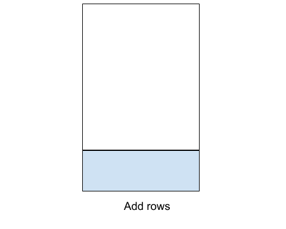

```{r setup, include=FALSE, message=FALSE, warning=FALSE}
library(pacman)
p_load(char = c('tidyverse','knitr', 'htmlwidgets', 'kableExtra', 
                'here', 'reticulate', 'xaringanExtra'))

opts_chunk$set(echo=TRUE, message=FALSE, warning=FALSE, comment="", 
               cache=FALSE)
use_condaenv('ds', required=TRUE)
source(here('lib/R/update_header.R'))
use_panelset()
use_tachyons()
use_extra_styles(hover_code_line=TRUE, mute_unhighlighted_code = TRUE)
```


```{r, echo=FALSE, results='asis'}
update_header('## Data preparation')
```

---


Raw data is rarely amenable to good graphics

It's often messy, with missing data and errors in encoding

> The only clean data out there is in textbooks

---

Data munging is best done using scripts

+ Reproducible
+ Debuggable
+ Shareable

We'll be using R and Python in parallel today

---

```{r, echo=F, results='asis'}
update_header('## R vs Python')
```

---

This is not a blood feud, nothing like Emacs vs Vim

Both languages are reasonably similar, with strengths and weaknesses that can be complementary

We'd like you to learn both

---

.pull-left[

### R

+ Large ecosystem focused on statistical and data scientific goals
+ Large community of developers
+ Wide ranging capabilities for data science

]
.pull-right[

### Python

+ Large ecosystem around various goals
+ Moderately large sub-ecosystem devoted to data science (PyData)
+ Smaller community of data science developers
+ General programming language, so easier to connect PyData to production
]

---

.pull-left[

### R

+ Many smaller, goal-focused packages
+ The idea of pipes makes programs cognitively easier
+ The `tidyverse` puts emphasis on easier coding semantics for the developer while maintaining functionality
+ Connects to many data sources and other programs
+ Trivial to implement parallel programs
]
.pull-right[

### Python

+ Fewer monolithic, all-encompassing packages
+ Some improvements in coding semantics.
+ Connects to many data sources and other programs
+ Parallel programming needs some effort (GIL)
]

---

Both languages are extensible using a package/module ecosystem

.pull-left[
### R

+ Packages stored in CRAN or Github (or Bioconductor)
+ Most packages are stored in binary form for Windows, compiled from source in Mac/Linux
+ Installation does dependency checking

]
.pull-right[
### Python

+ Packages are stored on PyPi and (increasingly) conda-forge
+ Packages can be installed from source, but are typically packages using Python's packaging system
+ Through `conda`, similar installations across operating system (for Anaconda/Miniconda distributions)
+ `conda` installations do dependency checking

]

---

.pull-left[
### R
```{r, eval=F}
install.packages('tidyverse')
remotes::install('tidyverse/dplyr') # dev version
```

(within R)

+ Sandboxing and package version fixing are not easy, so most work is done on centrally installed packages
    - Some progress using `packrat` and `renv` packages
]
.pull-right[
### Python
```{bash, eval=FALSE}
conda install pandas
conda install -c conda-forge xgboost
```

(within a shell)

+ A strong methodology for sandboxing and package version fixing on a per-project basis
    - `virtualenv`
    - `conda env`
]

---
```{r, echo=FALSE, results='asis'}
update_header('## Running scripts')
```

---

.pull-left[
### R

Start by loading packages into active session

```{r, eval=F}
library(tidyverse) # No aliases
```

Can use functions from packages using `<package>::<function>`, e.g.

```{r, eval=F}
janitor::clean_names(dat)
```

or by themselves once package is loaded

```{r, eval=F}
library(janitor)
clean_names(dat)
```
]
.pull-right[
### Python

Start by loading packages into active  session

```{python, eval=F}
import pandas as pd # (optional alias)
```

Functions must be called with reference to package

```{python, eval=F}
pd.read_csv('datafile.csv')
```

You can use a function from a package by importing it separately

```{python, eval=F}
from pandas import read_csv
read_csv('datafile.csv')
```

]

---

```{r, echo=FALSE, results='asis'}
update_header('## A typical beginning')
```

---

.pull-left[
### R

```{r}
library(readr)   # Data ingestion
library(tidyr)   # Data reshaping
library(dplyr)   # Data manipulation
library(ggplot2) # Graphs

```

These packages are all part of the **tidyverse** meta-package, so the following suffices

```{r}
library(tidyverse)
```

]
.pull-right[
### Python

```{python}
import pandas as pd             # Data read/manipulate
import matplotlib.pyplot as plt # Graphs
import seaborn as sns           # Graphs
```
]

---
```{r, echo=FALSE, results='asis'}
update_header('## A note on the tidyverse')
```   

---

<div style="display:flex;font-size:20pt;font-family:'Roboto Slab',serif;width:100%;height:150px;background-color:wheat;text-align:left; border: 1px solid red; position: relative;">
<blockquote>
The tidyverse is an opinionated collection of R packages designed for data science. All packages share an underlying design philosophy, grammar, and data structures
</blockquote>

</div>

.pull-left[
A set of R packages that:

<ul>
  <li> help make data more computer-friendly
  <li>while making your code more human-friendly
</ul>
]
.pull-right[
** Packages**

```{r, echo=FALSE, results='asis'}
x <- c('readr','tidyr','dplyr','purrr','ggplot2','forcats','stringr','tibble')
cat(paste( x, collapse=', '))
```

]
---

```{r, echo=FALSE, results='asis'}
update_header('## A note on tidy data')
```

---


.right[R for Data Science (Wickham and Grolemund)]

The basic rules are

1. Each variable must have its own column
1. Each observation must have its own row
1. Each value must have its own cell

---

**Tidy data** is a conceptual framework to structure data in a consistent, analyses-friendly manner

It helps identify ways in which data are __not__ tidy. 

The crucial question for a particular study is: what is a variable and what is an observational unit

> Your data consists of hospitalizations across a healthcare network. If you're interested in comparing hospitals, the hospital is the observational unit. If you're interested in readmissions, then the patient is the unit of observation. If you're interested in treatment and care, then the hospital visit is the unit of observation

--

-------

This does not mean that the data set you create or get must be in tidy form. 

Non-tidy structures are often useful for data collection, but are hard for data analyses

This framework will be our guide as we move forward.


---

### WHy are we emphasizing tidy data?

**Because graphical software generally demands it**

**ggplot2**, **seaborn**, Tableau and Plotly all demand data be in tidy format. How do I know this?

They all ask for particular columns for groups/colors/shapes/sizes. 

This means that values in a column determine those visual attributes, not across multiple columns

---

```{r, echo=FALSE, results='asis'}
update_header()
```

---
class: center, middle, inverse

# Getting our hands dirty

---

```{r, echo=FALSE, results='asis'}
update_header('## Ingesting data')
```

---

Most data comes to us as rectangular tables, either as CSV or Excel files  

The following table gives functions that result in rectangular data structures  
(`tibble` in R and `DataFrame` in Python)


| Format type | Description | pandas reader | R (tidyverse) |
| ----------- | ----------- | ------------  | ------------- |
| text        | CSV         | `read_csv`      | `readr::read_csv` |
|             | Excel       | `read_excel`    | `readxl::read_excel` |
| binary      | Feather     | `read_feather`  | `feather::read_feather` |
| binary      | SAS         | `read_sas`      | `haven::read_sas` |


> There are several ways of directly querying SQL databases in both R and Python. The main packages are **SQLAlchemy** in Python and 
**DBI** in R, with **dbplyr** providing a nicer, tidyverse-friendly interface

> Note the difference in philosophy: One Python package covers 5 R packages for this narrow purpose

---

.panelset[
.panel[
  .panel-name[R]
  
```{r}
library(tidyverse)

pew <- read_csv('data/pew.csv')
head(pew)
```
]
.panel[.panel-name[Python]

```{python}
import pandas as pd

pew = pd.read_csv('data/pew.csv')
pew.head()
```
]
]

> Both create rectangular data objects where each column can be of a different data type (numeric, character/string, categorical, boolean)

---

Most API calls come as JSON

There are several ways each of the languages addresses JSON files. Typically they are read into nested structures like nested dicts (Python) and nested lists (R). JSON data can be "fun" to normalize

.panelset[
.panel[.panel-name[R]
```{r}
mis <- rjson::fromJSON(file='data/miserables.json')
class(mis)
mis
```

]
.panel[.panel-name[Python]
```{python}
import json
with open('data/miserables.json','r') as f:
    d = f.read()  # Typical way of reading a text file into Python
mis = json.loads(d)
type(mis)
mis
```
]
]

---

Most API calls come as JSON

There are several ways each of the languages addresses JSON files. Typically they are read into nested structures like nested dicts (Python) and nested lists (R). JSON data can be "fun" to normalize

.panelset[
.panel[.panel-name[R]
```{r}
mis <- jsonlite::fromJSON('data/miserables.json')
class(mis)
head(mis$links)
```

]
.panel[.panel-name[Python]
```{python}
import json
with open('data/miserables.json','r') as f:
    d = f.read()  # Typical way of reading a text file into Python
mis = json.loads(d)
type(mis)
mis
```
]
]

---

Both languages come with other options as well, but these are the most straightforward.

.pull-left[
#### R
The function `data.table::fread` is probably the fastest way to read rectangular data into R. However it creates a `data.table` object, which can be treated as a data frame, but had different semantics. It is a faster structure for bigger data.

There are Java-based packages for reading XLSX files, like **xlsx** and **XLConnect**. The R-Java interface is problematic

The **rio** package wraps a whole slew of R packages for reading and writing. It simplifies things with `rio::import()`. See [here](https://www.rdocumentation.org/packages/rio/versions/0.5.16) for the kinds of files it imports


]
.pull-right[
#### Python
**pandas** tries to unify imports by wrapping several packages. 

Finer control of Excel imports is available in the **xlrd** package

Finer control of CSV imports is available using the **csv** package

You can generally import any text file using the `open(<filename>, 'r')` method and 
post-process it in Python
]

---

```{r, echo=FALSE, results='asis'}
update_header()
```

---
class: middle, inverse, center

# Tidying data

---

```{r, echo=FALSE, results='asis'}
update_header('## Tidying data')
```

---

There are some typical problems in data sets that need to be tidied.

+ Column headers are values, not variable names.
+ Multiple variables are stored in one column.
+ Variables are stored in both rows and columns.
+ Multiple types of observational units are stored in the same table.
+ A single observational unit is stored in multiple tables.

---

There are three main operations you need for tidying data:

1. Melting/unpivoting data (addresses data in column names)
1. Widening/pivoting data (addresses multiple rows per observation)
1. Separating or uniting columns of data (addresses compound columns)

---

.left-column70[
1. `tidyr::pivot_longer`/`tidyr::gather`/`pd.melt` collects multiple columns into 2, and only 2 columns
    - One column represents the data in the column headers
    - One column represents the values in the column
    - All other columns are repeated to keep all the data properly associated
1. `tidyr::pivot_wider`/`tidyr::spread`/`pd.pivot` takes two columns and makes them multiple columns
    - The values in one column form the headers to different new columns
    - The values in the other column represent the values in the corresponding cells
    - The other columns are repeated to start with, but reduce repetitions to make all associated data stay together
]
.right-column30[

]

---

The pew dataset, below, has issues...

.panelset[
.panel[
  .panel-name[R]
  
```{r}
library(tidyverse)

pew <- read_csv('data/pew.csv')
head(pew)
```
]
.panel[.panel-name[Python]

```{python}
import pandas as pd

pew = pd.read_csv('data/pew.csv')
pew.head()
```
]
]

---

We need to melt this dataset to make it tidy

.panelset[
.panel[.panel-name[R]
```{r}
pew1 <- pew %>% 
  pivot_longer(cols = c(-religion), names_to = 'income_groups', values_to = 'counts')
head(pew1)
```

]
.panel[.panel-name[Python]
```{python}
pew1 = pew.melt(id_vars=["religion"], var_name = 'income_groups', value_name='counts')
pew1.head()
```
]
]

> There is a difference in row-order between the R and Python solutions. R sorts by the id variable(s), Python sorts on the column containing the old column headers. Analytically, this can be fixed, and is often not important for visualization.

---

We reverse this process by pivoting the data set

.panelset[
.panel[.panel-name[R]
```{r}
pew2 <- pew1 %>% 
  pivot_wider(id_cols = c(religion), names_from = 'income_groups', values_from = 'counts')
head(pew2,2)
```

]
.panel[.panel-name[Python]
```{python}
pew2 = (pew1.pivot_table(index="religion", columns = "income_groups", values="counts")
    .reset_index()
    .rename_axis(None, axis=1))

pew2.head(2)
```
]
]

> The `reset_index` bit is needed since **pandas** `DataFrame` objects have an `index` property, like row-names in R. The pivot operation makes the id columns into the index, which is usually not desirable. It also gives a name to the column headers, which we also don't want. `reset_index` makes the index values just the row numbers, and makes the index columns just normal columns in the dataset

---

Let's look at the issue of separating columns (the more common issue)

We'll start with  a TB dataset

.panelset[
.panel[.panel-name[R]
```{r}
tb <- read_csv('data/tb.csv')
head(tb, 3)
```

]
.panel[.panel-name[Python]
```{python}
tb = pd.read_csv('data/tb.csv')
tb.head(3)

```
]
]

> We need to melt this data, and then separate gender and ages

---

.panelset[
.panel[.panel-name[R]
```{r}
tb1 <- tb %>% pivot_longer(cols=m014:f65, names_to='demo', values_to='counts')
head(tb1, 3)
```

]
.panel[.panel-name[Python]
```{python}
tb1 = tb.melt(id_vars = ['iso2','year'], var_name = 'demo', value_name='counts')
tb1.head(3)
```
]
]

---

.panelset[
.panel[.panel-name[R]
```{r}
tb2 <- tb1 %>% separate(demo, c('gender','age'), sep = 1)
head(tb2, 3)
```

]
.panel[.panel-name[Python]
```{python}
tb2 = (tb1.assign(                               # create new columns
  gender = lambda x: x.demo.str[0].astype(str),
  age = lambda x: x.demo.str[1:].astype(str))
  .drop('demo', axis=1)                           # Remove old column
)
tb2.head(3)
```
]
]

---

Something a bit more complex

.panelset[
.panel[.panel-name[R]
```{r}
TB <-  read_csv('data/tb1.csv') %>% 
  pivot_longer(cols = starts_with('new'),names_to='demo', values_to='counts')
head(TB, 3)
```

]
.panel[.panel-name[Python]
```{python}
TB = pd.read_csv('data/tb1.csv').melt(id_vars=['country','iso2','iso3','year'], var_name='demo', value_name='counts')
TB.head(3)
```
]
]

---

.panelset[
.panel[.panel-name[R]
```{r}
TB1 <- TB %>% extract(demo, c('type','gender','age'),  regex = 'new[_]*([a-z]+)_([mf])([0-9]+$)')
head(TB1)
```

]
.panel[.panel-name[Python]
```{python}
tmp=TB.demo.str.split('new[_]*([a-z]+)_([mf])([0-9]+)', expand=True)
tmp.columns = ['id','type','gender','age','v5']
TB1 = pd.concat([TB.drop('demo', axis=1),tmp.iloc[:,1:4]], axis=1)
TB1.head()
```
]
]

---

```{r, echo=FALSE, results='asis'}
update_header()
```


---
class: middle, center, inverse

# Data transformations

---

```{r, echo=FALSE, results='asis'}
update_header('## Data transformations')

```

---

We'll consider four main transformations

```{r Rintro-24, echo=F}
my_tbl <- tribble(
  ~"Verb (tidyverse)", ~"Functionality",
  'mutate','Transform a column with some function',
  'select', 'Select some columns in the data',
  'filter','Keep only rows that meet some data criterion',
  'arrange', 'Order the data frame by values of a column(s)')
knitr::kable(my_tbl, align = 'l', format='html')
```

These aren't explicity verbs in Python, but operationally they are similar to base R (non-tidyverse) manipulations

---

.panelset[
.panel[.panel-name[R]
```{r}
mpg <- read_csv('data/mpg.csv')
head(mpg)
```

]
.panel[.panel-name[Python]
```{python}
mpg = pd.read_csv('data/mpg.csv')
mpg.head()
```
]
]

---

**mutate:** Convert the city and highway fuel efficiency to kn/l, and find average fuel efficiency

.panelset[
.panel[.panel-name[R]
```{r}
mpg <- mpg %>% 
  mutate(cty = cty * 1.6/3.8,
         hwy = hwy * 1.6/3.8, 
         avg = (cty + hwy)/2)
head(mpg)
```

]
.panel[.panel-name[Python]
```{python}
mpg['cty'] = mpg['cty'] * 1.6/3.8
mpg['hwy'] = mpg['hwy'] * 1.6/3.8
mpg['avg'] = (mpg.cty + mpg.hwy)/2
mpg.head()
```
]
]

---

**select:** Extract the _columns_ for year, manufacturer, and average fuel efficiency

.panelset[
.panel[.panel-name[R]
```{r}
mpg %>% select(year, manufacturer, avg)
```

]
.panel[.panel-name[Python]
```{python}
mpg[['year','manufacturer','avg']]
```
]
]

---

A bit more complicated: Extract columns starting with some character expression

.panelset[
.panel[.panel-name[R]
```{r}
weather <- read_csv('data/weather.csv')
weather %>% select(starts_with('d'))
```

]
.panel[.panel-name[Python]
```{python}
weather = pd.read_csv('data/weather.csv')
weather.filter(regex='^d', axis=1) # Using regular expressions is fast
```
]
]

---

**filter:** Extract only cars made by Audi

.panelset[
.panel[.panel-name[R]
```{r}
mpg %>% filter(manufacturer=='audi')
```

]
.panel[.panel-name[Python]
```{python}
mpg[mpg.manufacturer=='audi']
```
]
]

---

**arrange:** Arrange cars from highest to lowest fuel efficiency

.panelset[
.panel[.panel-name[R]
```{r}
mpg %>% arrange(-avg)
```

]
.panel[.panel-name[Python]
```{python}
mpg.sort_values(by=['avg'], ascending=False)
```
]
]

---

```{r, echo=FALSE, results='asis'}
update_header()
```

---
class: middle, center, inverse

# Putting different data sets together

---

```{r, echo=FALSE, results='asis'}
update_header('## Joining datasets')
```

---

+ Quite often, data on individuals lie in different tables

    - Clinical, demographic and bioinformatic data
--
    - Drug, procedure, and payment data (think Medicare)
--
    - Personal health data across different healthcare entities

---

The simplest case is when we just need to add more data to existing data 

- New patients in study, with same protocol (add rows)
- Adding pathology, imaging data for existing patients (add columns)

---

.pull-left[
`cbind(x,y)` / `pd.concat(x,y, axis=1)`


]
.pull-right[
`rbind(x,y)` / `pd.concat(x, y, axis = 0)`


]

---
class: middle, center

# Joins

---

.pull-left[
We will talk about more general ways of joining two datasets

We will assume:

1. We have two rectangular data sets (so `data.frame` or `tibble`)
1. There is at least one variable (column) in common, even if they have different names
    - Patient ID number
    - SSN (Social Security number)
    - Identifiable information
]

.pull-right[

]

---


--

<table width="100%">
<tr>
<td style="text-align:center;">inner_join</td>
<td style="text-align:center;">left_join</td>
<td style="text-align:center;">right_join</td>
<td style="text-align:center;">outer_join</td>
</tr></table>

--

The "join condition" are the common variables in the two datasets, i.e. rows are selected if the values of the common variables in the left dataset matches the values of the common variables in the right dataset

---

There are basically four kinds of joins:

| pandas | R          | SQL         | Description                     |
| ------ | ---------- | ----------- | ------------------------------- |
| left   | left_join  | left outer  | keep all rows on left           |
| right  | right_join | right outer | keep all rows on right          |
| outer  | full_join | full outer  | keep all rows from both         |
| inner  | inner_join | inner       | keep only rows with common keys |


---

.pull-left[

.panelset[
.panel[.panel-name[R]
```{r}
clinical <- readxl::read_excel('data/BreastCancer_Clinical.xlsx')
head(clinical)
```

]
.panel[.panel-name[Python]
```{python}
clinical=pd.read_excel('data/BreastCancer_Clinical.xlsx')
clinical.head()
```
]
]

]
.pull-right[

.panelset[
.panel[.panel-name[R]
```{r}
proteome <- readxl::read_excel('data/BreastCancer_Expression.xlsx')
head(proteome)
```

]
.panel[.panel-name[Python]
```{python}
proteome = pd.read_excel('data/BreastCancer_Expression.xlsx')
proteome.head()
```
]
]
]

---

### Inner join


---

.panelset[
.panel[.panel-name[R]
```{r}
clinical %>% inner_join(proteome, by = c('Complete TCGA ID' = 'TCGA_ID')) %>% head()
```

]
.panel[.panel-name[Python]
```{python}
clinical.merge(proteome, how='inner', left_on='Complete TCGA ID', right_on='TCGA_ID').head()
```
]
]

---

### left join


---

.panelset[
.panel[.panel-name[R]
```{r}
clinical %>% left_join(proteome, by = c('Complete TCGA ID' = 'TCGA_ID')) %>% head()
```

]
.panel[.panel-name[Python]
```{python}
clinical.merge(proteome, how='left', left_on='Complete TCGA ID', right_on='TCGA_ID').head()
```
]
]

---

### Full/outer join


---

.panelset[
.panel[.panel-name[R]
```{r}
clinical %>% full_join(proteome, by = c('Complete TCGA ID' = 'TCGA_ID')) %>% head()
```

]
.panel[.panel-name[Python]
```{python}
clinical.merge(proteome, how='outer', left_on='Complete TCGA ID', right_on='TCGA_ID').head()
```
]
]

---

```{r, echo=FALSE, results='asis'}
update_header()
```

---
class: middle, center, inverse

# Split-apply-combine (a.k.a. MapReduce)

---

```{r, echo=FALSE, results='asis'}
update_header('## Split-apply-combine')
```

---


---

We'll play with the gapminder data set for this exercise

.panelset[
.panel[.panel-name[R]
```{r}
gap <- read_csv('data/gapminder.csv')
head(gap)
```

]
.panel[.panel-name[Python]
```{python}
gap = pd.read_csv('data/gapminder.csv')
gap.head()
```
]
]

---

**Question** Find the average life expectancy by country

.panelset[
.panel[.panel-name[R]
```{r}
gap %>% group_by(country) %>% summarize(avgLifeExp = mean(lifeExp))
```

]
.panel[.panel-name[Python]
```{python}
gap.groupby('country')['lifeExp'].mean()
```
]

---

**Question** Find the average life expectancy by continent and year

.panelset[
.panel[.panel-name[R]
```{r}
gap %>% group_by(continent, year) %>% summarize(mean(lifeExp))
```

]
.panel[.panel-name[Python]
```{python}
gap.groupby(['continent','year'])['lifeExp'].mean()
```
]
]
]

---

### Computing multiple aggregates

.panelset[
.panel[.panel-name[R]
```{r}
gap %>% group_by(year) %>% summarize(means = mean(lifeExp), medians = median(lifeExp))
```

]
.panel[.panel-name[Python]
```{python}
import numpy as np

gap.groupby('year')['lifeExp'].agg([np.mean,np.median])
```
]
]

---

```{r, echo=FALSE, results='asis'}
update_header()
```

---
class: middle, inverse, center

# Transforming data types

---

```{r, echo=FALSE, results='asis'}
update_header('## Data types')
```

---

Both R and Python have the same data types. The `Categorical` type below is unique to **pandas**

```{r, echo=F}
tribble(~R, ~Python,
        'numeric','float',
        'integer','int',
        'character','str',
        'factor','category') %>% 
  knitr::kable(format='html')
```
---
  
The basic conversion functions in R are of the form `as.*`.

For Python, you use the method `astype` that is linked to the pandas `Series` or `DataFrame` object.

.panelset[
.panel[.panel-name[R]
```{r}
as.factor(gap$country)
```

]
.panel[.panel-name[Python]
```{python}
gap.country.astype('category')
```
]
]

---

```{r, echo=FALSE, results='asis'}
update_header()
```

---
class: center, middle

# We'll continue discussing data munging and exploratory analyses next week.

