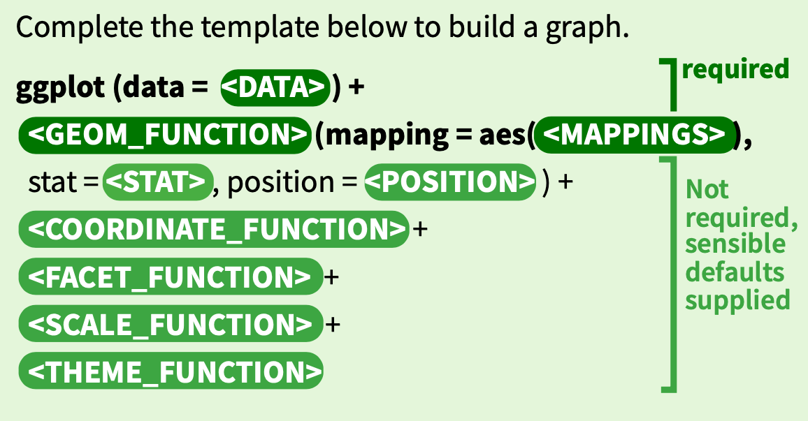

```{r setup, include=FALSE, message=FALSE, warning=FALSE}

library(pacman)
p_load(char = c('tidyverse', 'knitr', 'htmlwidgets', 'kableExtra'))
knitr::opts_chunk$set(fig.retina=2, out.width="100%")
#knitr::opts_chunk$set(
#  echo = FALSE,
#  message = FALSE,
#  warning = FALSE,
#  comment = NA,
#  cache = FALSE
#  )
```

```{r xaringan-themer, include=FALSE, warning=FALSE}
library(xaringanthemer)
style_duo_accent(
  primary_color = "#035AA6", 
  secondary_color = "#03A696"#,
  #header_font_google = google_font("Josefin Sans"),
  #text_font_google   = google_font("Montserrat"),
  #code_font_google   = google_font("Fira Mono")
)
xaringanExtra::use_tachyons()
xaringanExtra::use_extra_styles(hover_code_line=TRUE, mute_unhighlighted_code = TRUE)
```

class: center, middle, inverse

# `ggplot`

---

## `ggplot` syntax

.center[]


---

Load this file

```{r}
unit_square <- read_csv("data/unit_square_10k.csv")
```

Examine the dataset

```{r}
unit_square %>% glimpse()
```

---

.left-code[
```{r unit-square-1, eval=FALSE}
ggplot(unit_square) +
  geom_point(aes(x = x, y = y))
```
]

--

.right-plot[
```{r ref.label="unit-square-1", echo=FALSE}
```
]

---

.left-code[
```{r unit-square-2, eval=FALSE}
ggplot(unit_square) +
  geom_point(aes(x = x, y = y)) +
  coord_equal()
```
]

--

.right-plot[
```{r ref.label="unit-square-2", echo=FALSE}
```
]


---

.left-code[
```{r unit-square-3, eval=FALSE}
unit_square %>% 
  mutate(in_circle = dist <= 1) %>% 
  ggplot() +
  geom_point(aes(x = x, y = y)) +
  coord_equal()
```
]

--

.right-plot[
```{r ref.label="unit-square-3", echo=FALSE}
```
]


---

.left-code[
```{r unit-square-4, eval=FALSE}
unit_square %>% 
  mutate(in_circle = dist <= 1) %>% 
  ggplot() +
  geom_point(aes(x = x, 
                 y = y,
                 color = in_circle)) +
  coord_equal()
```
]

--

.right-plot[
```{r ref.label="unit-square-4", echo=FALSE}
```
]

---

.left-code[
```{r unit-square-5, eval=FALSE}
unit_square %>% 
  mutate(in_circle = dist <= 1) %>% 
  ggplot() +
  geom_point(aes(x = x, 
                 y = y,
                 color = y)) +
  coord_equal()
```
]

--

.right-plot[
```{r ref.label="unit-square-5", echo=FALSE}
```
]


---

.left-code[
```{r unit-square-6, eval=FALSE}
unit_square %>% 
  mutate(in_circle = dist <= 1) %>% 
  ggplot() +
  geom_point(aes(x = x, 
                 y = y),
             color = "orange") +
  coord_equal()
```
]

--

.right-plot[
```{r ref.label="unit-square-6", echo=FALSE}
```
]


---

.left-code[
```{r unit-square-8, eval=FALSE}
unit_square %>% 
  mutate(in_circle = dist <= 1) %>% 
  ggplot() +
  geom_point(aes(x = x, 
                 y = y,
                 color = in_circle)) +
  coord_equal()
```
]

--

.right-plot[
```{r ref.label="unit-square-8", echo=FALSE}
```
]


---

.left-code[
```{r unit-square-9, eval=FALSE}
unit_square %>% 
  mutate(in_circle = dist <= 1) %>% 
  ggplot() +
  geom_point(aes(x = x, 
                 y = y,
                 color = in_circle)) +
  coord_equal() +
  scale_colour_viridis_d()
```
]

--

.right-plot[
```{r ref.label="unit-square-9", echo=FALSE}
```
]


---

.left-code[
```{r unit-square-10, eval=FALSE}
unit_square %>% 
  mutate(in_circle = dist <= 1) %>% 
  ggplot() +
  geom_point(aes(x = x, 
                 y = y,
                 color = ifelse(!in_circle,
                                "outside", 
                                quadrant))) +
  coord_equal() +
  scale_colour_brewer(palette = "Set1")
```
]

--

.right-plot[
```{r ref.label="unit-square-10", echo=FALSE}
```
]


---

.left-code[
```{r unit-square-11, eval=FALSE}
unit_square %>% 
  mutate(in_circle = dist <= 1) %>% 
  ggplot() +
  geom_point(aes(x = x, 
                 y = y,
                 color = ifelse(!in_circle, 
                                "outside",
                                quadrant))) +
  coord_equal() +
  scale_colour_brewer(palette = "Set1", name = "Point Location") +
  theme_bw() +
  labs(x = 'X', 
       y = 'Y',
       title = 'Unit Circle')
```
]

--

.right-plot[
```{r ref.label="unit-square-11", echo=FALSE}
```
]


---

.left-code[
```{r unit-square-12, eval=FALSE}
unit_square %>% 
  filter(dist <= 1, angle >=30, angle <= 330) %>% 
  ggplot() +
  geom_point(aes(x = x, 
                 y = y),
             color = "#FFBF00"
             ) +
  geom_point(aes(x = 0.25, y = 0.6),
             color = "black",
             size = 15) +
  coord_equal() +
  theme_minimal() +
  theme(axis.ticks = element_blank(),
        axis.title = element_blank(),
        axis.text = element_blank(),
        panel.grid = element_blank())
```
]

--

.right-plot[
```{r ref.label="unit-square-12", echo=FALSE}
```
]

---

## _ggplot_ things to remember

* You have great flexibility with _ggplot_. You can create your plot attributes before you plot, or define them within the layers
* For a single dataset and/or group, having your data in wide format is fine. For facetting and/or comparing multuple datasets, your datasets must be in tidy (long) format
* Layers usually inherit properties from the base graph
* Geoms have default stats (and vice-versa!)
* Geoms and stats have parameters.
* Coordinates affect display of axes
* Scales affect data mapping
* Color mapping can be sometimes trick
* [The online reference for ggplot]( is excellent, as is the book.

Once you get the hang of it, you can do many things!


---

class: center, middle, inverse

# EDA - Exploratory Data Analysis

---

## US Accident Dataset

**Learn to love this dataset!**

[https://smoosavi.org/datasets/us_accidents](https://smoosavi.org/datasets/us_accidents)

[Associated paper](https://arxiv.org/abs/1906.05409)

* Quantitative variables
* Qualitative variables
* Date/Time variables
* Geolocation variables
* Many subgroups
* Relatively large (even though it fits on a single machine)

Unzipped file here: [https://bigdatateaching.blob.core.windows.net/public/us-traffic-accidents/US_Accidents_June20.csv](https://bigdatateaching.blob.core.windows.net/public/us-traffic-accidents/US_Accidents_June20.csv)

It's not in the repo because it's 1.33GB! You can download if you want, or you can read straight into R using `read_csv`.

---

Read in the file
```{r eval=F}
data_url <- "https://bigdatateaching.blob.core.windows.net/public/us-traffic-accidents/US_Accidents_June20.csv"
raw <- read_csv(data_url)
# data_url can be a local file
```


```{r eval=F}
Parsed with column specification:
cols(
...
)
See spec(...) for full column specifications.
|============================================================| 100% 1265 MB
Warning: 2069844 parsing failures.
    row     col           expected    actual                                  file
2478819 End_Lat 1/0/T/F/TRUE/FALSE 40.11206  '~/Downloads/US_Accidents_June20.csv'
2478819 End_Lng 1/0/T/F/TRUE/FALSE -83.03187 '~/Downloads/US_Accidents_June20.csv'
2478820 End_Lat 1/0/T/F/TRUE/FALSE 39.86501  '~/Downloads/US_Accidents_June20.csv'
2478820 End_Lng 1/0/T/F/TRUE/FALSE -84.04873 '~/Downloads/US_Accidents_June20.csv'
2478821 End_Lat 1/0/T/F/TRUE/FALSE 39.10209  '~/Downloads/US_Accidents_June20.csv'
....... ....... .................. ......... .....................................
See problems(...) for more details.
```

---

Set the column mapping (cut the `cols` object from the `read_csv` output)
```{r eval = F}
col_mapping <- cols(
  ...
  Severity = col_double(),
  ...
  End_Lat = col_double(),
  End_Lng = col_double(),
)

raw <- read_csv(data_url, # or local file
                col_types = col_mapping)
```


---

Take a peek at the data
```{r eval=F}
> raw %>% glimpse()
Rows: 3,513,740
Columns: 49
$ ID                    <chr> "A-1", "A-2", "A-3", "A-4", "A-5", "A-6", …
$ Source                <chr> "MapQuest", "MapQuest", "MapQuest", "MapQu…
$ TMC                   <dbl> 201, 201, 201, 201, 201, 201, 201, 201, 20…
$ Severity              <dbl> 3, 2, 2, 3, 2, 3, 2, 3, 2, 3, 3, 3, 2, 2, …
$ Start_Time            <dttm> 2016-02-08 05:46:00, 2016-02-08 06:07:59,…
$ End_Time              <dttm> 2016-02-08 11:00:00, 2016-02-08 06:37:59,…
$ Start_Lat             <dbl> 39.86515, 39.92806, 39.06315, 39.74775, 39…
$ Start_Lng             <dbl> -84.05872, -82.83118, -84.03261, -84.20558…
$ End_Lat               <lgl> NA, NA, NA, NA, NA, NA, NA, NA, NA, NA, NA…
$ End_Lng               <lgl> NA, NA, NA, NA, NA, NA, NA, NA, NA, NA, NA…
$ `Distance(mi)`        <dbl> 0.01, 0.01, 0.01, 0.01, 0.01, 0.01, 0.00, …
$ Description           <chr> "Right lane blocked due to accident on I-7…
$ Number                <dbl> NA, 2584, NA, NA, NA, NA, 376, NA, 99, NA,…
$ Street                <chr> "I-70 E", "Brice Rd", "State Route 32", "I…
$ Side                  <chr> "R", "L", "R", "R", "R", "R", "R", "R", "L…
$ City                  <chr> "Dayton", "Reynoldsburg", "Williamsburg", …
$ County                <chr> "Montgomery", "Franklin", "Clermont", "Mon…
$ State                 <chr> "OH", "OH", "OH", "OH", "OH", "OH", "OH", …
$ Zipcode               <chr> "45424", "43068-3402", "45176", "45417", "…
$ Country               <chr> "US", "US", "US", "US", "US", "US", "US", …
$ Timezone              <chr> "US/Eastern", "US/Eastern", "US/Eastern", …
$ Airport_Code          <chr> "KFFO", "KCMH", "KI69", "KDAY", "KMGY", "K…
$ Weather_Timestamp     <dttm> 2016-02-08 05:58:00, 2016-02-08 05:51:00,…
$ `Temperature(F)`      <dbl> 36.9, 37.9, 36.0, 35.1, 36.0, 37.9, 34.0, …
$ `Wind_Chill(F)`       <dbl> NA, NA, 33.3, 31.0, 33.3, 35.5, 31.0, 31.0…
$ `Humidity(%)`         <dbl> 91, 100, 100, 96, 89, 97, 100, 100, 99, 10…
$ `Pressure(in)`        <dbl> 29.68, 29.65, 29.67, 29.64, 29.65, 29.63, …
$ `Visibility(mi)`      <dbl> 10, 10, 10, 9, 6, 7, 7, 7, 5, 3, 5, 3, 3, …
$ Wind_Direction        <chr> "Calm", "Calm", "SW", "SW", "SW", "SSW", "…
$ `Wind_Speed(mph)`     <dbl> NA, NA, 3.5, 4.6, 3.5, 3.5, 3.5, 3.5, 1.2,…
$ `Precipitation(in)`   <dbl> 0.02, 0.00, NA, NA, NA, 0.03, NA, NA, NA, …
$ Weather_Condition     <chr> "Light Rain", "Light Rain", "Overcast", "M…
$ Amenity               <lgl> FALSE, FALSE, FALSE, FALSE, FALSE, FALSE, …
$ Bump                  <lgl> FALSE, FALSE, FALSE, FALSE, FALSE, FALSE, …
$ Crossing              <lgl> FALSE, FALSE, FALSE, FALSE, FALSE, FALSE, …
$ Give_Way              <lgl> FALSE, FALSE, FALSE, FALSE, FALSE, FALSE, …
$ Junction              <lgl> FALSE, FALSE, FALSE, FALSE, FALSE, FALSE, …
$ No_Exit               <lgl> FALSE, FALSE, FALSE, FALSE, FALSE, FALSE, …
$ Railway               <lgl> FALSE, FALSE, FALSE, FALSE, FALSE, FALSE, …
$ Roundabout            <lgl> FALSE, FALSE, FALSE, FALSE, FALSE, FALSE, …
$ Station               <lgl> FALSE, FALSE, FALSE, FALSE, FALSE, FALSE, …
$ Stop                  <lgl> FALSE, FALSE, FALSE, FALSE, FALSE, FALSE, …
$ Traffic_Calming       <lgl> FALSE, FALSE, FALSE, FALSE, FALSE, FALSE, …
$ Traffic_Signal        <lgl> FALSE, FALSE, TRUE, FALSE, TRUE, FALSE, FA…
$ Turning_Loop          <lgl> FALSE, FALSE, FALSE, FALSE, FALSE, FALSE, …
$ Sunrise_Sunset        <chr> "Night", "Night", "Night", "Night", "Day",…
$ Civil_Twilight        <chr> "Night", "Night", "Night", "Day", "Day", "…
$ Nautical_Twilight     <chr> "Night", "Night", "Day", "Day", "Day", "Da…
$ Astronomical_Twilight <chr> "Night", "Day", "Day", "Day", "Day", "Day"…
```

---

Use the `clean_names` function from the `janitor` package to clean up the names
```{r eval = F}
library(janitor)
acc <- raw %>% clean_names()   
```

* Read the raw data once, then create copy that you can manipulate

---

Use the `skim` function from the `skimr` package to profile the dataset
```{r eval = F}
library(skimr)
skim_summary <- skim(raw)
```

This creates a `skim_df` which is also a `tibble`, `data.frame`, etc.

Print the output
```{r eval = F}
skim_summary
```

---

After looking at the output of the `skimr`, we should change some variable types (tmc and severity should be categorical) and remove some variables from the summary that we know are not adding any value.
```{r eval=F}
acc <- acc %>% 
  mutate(tmc = as.character(tmc),
         severity = as.character(severity))

skim_summary <- acc %>% 
  select(-id, -tmc, -country, -turning_loop) %>% 
  skim()
```

---

Since this is large-ish dataset the `naniar` and `visdat` functions are not too effective. 

Lets build a bar plot ourselves to show the values of n_missing for all variables.

```{r eval = F}
skim_summary %>% 
  ggplot() +
  geom_bar(aes(x = skim_variable,
               y = n_missing))
```

--

**ugh! an error... why?**

---

`geom_bar` has a default `stat` that tries to count stuff. Each record (variable) already has the data, so no need to aggregate.
```{r eval=F}
skim_summary %>% 
  arrange(desc(n_missing)) %>% 
  ggplot() +
  geom_bar(aes(x = skim_variable, 
               y = n_missing), 
           stat = "identity")
```


