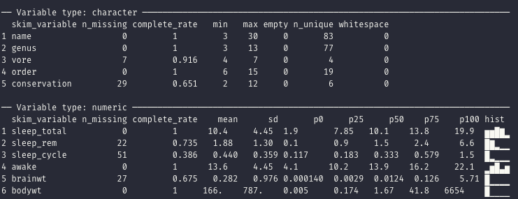
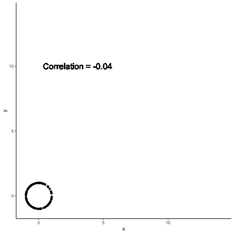

```{r setup, include=FALSE, message=FALSE, warning=FALSE}
library(pacman)
p_load(char = c('tidyverse','knitr', 'htmlwidgets', 'kableExtra', 
                'here', 'reticulate', 'xaringanExtra'))

opts_chunk$set(echo=TRUE, message=FALSE, warning=FALSE, comment="", 
               cache=TRUE)

source(here('lib/R/update_header.R'))
use_panelset()
use_tachyons()
use_extra_styles(hover_code_line=TRUE, mute_unhighlighted_code = TRUE)
```


```{r, echo=FALSE, results='asis'}
update_header()
```

---

## Where we've been

1. Understanding concepts and principles of data visualization
1. Starting to get hands dirty
  - Data ingestion
  - Data munging
  - R and Python
  - Tableau

--

Recall the concepts of layering and visual encodings that we learned in week 2 & 3. 


#### They're baaaaack!

---
class: middle,center

.bg-light-blue.b--blue.tl.ba.bw2.br3.shadow-5.ph4.mt5.f2.avenir[
.i[An approach/philosophy for data analysis that employs a variety of techniques (mostly graphical) to maximize insight into a data set, uncover underlying structure, extract important variables, detect outliers and anomalies, test underlying assumptions, develop parsimonious models and determine optimal factor settings.]

.right[U.S. National Institute of Standards and Technology]
]

---
class: middle, center

.bg-light-blue.b--blue.tl.ba.bw2.br3.shadow-5.ph4.mt5.f2.avenir[
 .i[Exploratory data analysis can never be the whole story, but nothing else can serve as the foundation stone –- as the first step]
 
 .right[John Tukey, 1977]
 ]

---
 
## Main ideas
 
1. Data structure
1. Missing data and remedies
1. Univariate distributions and summaries
1. Data transformations
1. Bivariate relationships

---

## Main ideas

EDA requires a lot of data exploration.

Visualizations make this process easier

Today, we'll get a running start into **ggplot2**, with more details next week.
---
class: middle, center

# A ggplot2 primer

#### We'll deep-dive into various aspects of static graphics in R and Python next week

---
## What is ggplot2?

- A second (and final) iteration of the ggplot
- Implementation of Wilkerson's Grammar of Graphics in R
- Conceptually, a way to layer different elements onto a canvas to create a data visualization
- Started as Dr. Hadley Wickham's PhD thesis (with Dr. Dianne Cook)
- Won the John M. Chambers Statistical Software Award in 2006

- Mimicked in other software platforms
  - `ggplot` and `seaborn` in Python
  - Translated in `plotly`

---

## ggplot2 uses the __grammar__ of __graphics__

.pull-left[
### A grammar ...

- compose and re-use small parts
- build complex structures from simpler units

]

--

.pull-right[
### of graphics ...

- Think of yourself as a painter
- Build a visualization  using layers on a canvas
- Draw layers on top of each other
]

---

```{css, echo=FALSE}
.remark-code-line-highlighted { background-color: green; } /* modified */
```


## Introduction to ggplot2

The `ggplot2` package is a very flexible and (to me) intuitive way of visualizing data.
It is based on the concept of layering elements on a canvas.

> This idea of layering graphics on a canvas is, to me, a nice way of building graphs

You need:

+ A `data.frame` object
+ _Aesthetic mappings_ (aes) to say what data is used for what purpose in the viz
    + x- and y-direction
    + shapes, colors, lines
+ A _geometry object_ (geom) to say what to draw
    + You can "layer" geoms on each other to build plots
    
---
background-image: url(img/grammar-of-graphics.png)
background-size: 80%,100%

---


## A dataset


```{r 05-Plotting-16, echo = T, message = F}
library(tidyverse)
library(rio)
beaches <- import('data/sydneybeaches3.csv')
```
```{r 05-Plotting-17, echo = F}
head(beaches)
```

<p align="right" style="font-size: 10pt;">Credit: D. J. Navarro</p>

.footnote[Download the `sydneybeaches3.csv` file from the website and save it in your project's data folder]


---
class: middle, center

# Building a graph

---

.pull-left[
### Start with a blank canvas

```{r gr2, eval=F}
ggplot()
```
]
.pull-right[

### 

```{r, ref.label='gr2', eval=T, echo = F}

```

]

---

.pull-left[
### Add a data set

```{r gr3, eval=F}
ggplot(
  data = beaches # Tell ggplot the data you're using #<<
)
```

> Nothing has really happened yet, since we haven't said what we want to plot from the data set

> The `#` symbol tells R that anything after it is a *comment* and should be ignored. We'll make a lot of use of comments in our code.
]
.pull-right[

### 

```{r, ref.label='gr3', eval=T, echo = F}

```


]


---

.pull-left[
### Add a mapping from data to elements

```{r gr4, eval=F}
ggplot(
  data = beaches,
  mapping = aes( #<<
    x = temperature, #<<
    y = rainfall #<<
  )
)
```

What goes in 

- the x and y axes
- the color of markers
- the shape of markers
]
.pull-right[

### 

```{r, ref.label='gr4', eval=T, echo = F}

```

> Now we've said what we want to plot, so axes get drawn. We haven't yet specified how we want to plot it

]

---

.pull-left[
### Add a geometry to draw

```{r gr5, eval=F}
ggplot(
  data = beaches,
  mapping = aes(
    x = temperature,
    y = rainfall
  )
) +
  geom_point() #<<
```

What to draw:

- Points, lines
- histogram, bars, pies
]
.pull-right[

### 

```{r, ref.label='gr5', eval=T, echo = F}

```

> Now we've said **how** we want to plot the things we want from the data
]

---

.pull-left[
### Add options for the geom

```{r gr6, eval=F}
ggplot(
  data = beaches,
  mapping = aes(
    x = temperature,
    y = rainfall
  )
) +
  geom_point(size = 4) #<<
```

> Options pertaining to how we want things drawn are usually put in the function for the geometry, e.g. `geom_point`, `geom_line`, etc. If the option is based on any element from the dataset, we have to wrap it in a `aes()` function. We'll see this later
]
.pull-right[

### 

```{r, ref.label='gr6', eval=T, echo = F}

```

]

---

.pull-left[
### Add a mapping to modify the geom

```{r gr7, eval=F}
ggplot(
  data = beaches,
  mapping = aes(
    x = temperature,
    y = rainfall
  )
) +
  geom_point(
    mapping = aes(color = season_name), #<<
    size = 4
  )
```

> Anything data-driven has to be a mapping, driven by the `aes` function

]
.pull-right[

### 

```{r, ref.label='gr7', eval=T, echo = F}

```

]

---
class:middle, center

# A side note on `aes`

---

## The `aes` function

The `aes` function and when it needs to be used creates quite a bit of confusion initially. Let's start with the documentation for this function

```{r, eval=F}
?aes
```

> #### Description
Aesthetic mappings describe how variables in the data are mapped to visual properties (aesthetics) of geoms. Aesthetic mappings can be set in ggplot2() and in individual layers.

So, anytime we want to represent some aspect of the data on the plot in some form (color, shape, etc.), we have to use the `aes` function to *map* the data to the plot
---

## The `aes` function

The `aes` function can occur in one of two places:

.pull-left[
Within the `ggplot` function:

```{r, fig.height=2}
ggplot(
  data=beaches,
  mapping=aes(
    x = temperature,
    y = rainfall
  )
) + 
  geom_point()
```

]
.pull-right[
In the actual `geom` layer:

```{r, fig.height=2}
ggplot(
  data = beaches
) +
  geom_point(
    mapping = aes(
      x = temperature,
      y = rainfall
    )
  )
```

]

---

## The `aes` function

The `aes` function can occur in one of two places:

.pull-left[
Within the `ggplot` function:

+ You do this if the same mapping will be common to **all** the subsequent geometry layers
]
.pull-right[
In the actual `geom` layer:

+ You do this if the mapping will apply **only** to that layer
+ You do it if it makes more sense to put it in the `geom`. 
]
---
class: middle, center

# Facets / Trellis / Small multiples

---
.pull-left[
### Split into facets

```{r gr8, eval=F}
ggplot(
  data = beaches,
  mapping = aes(
    x = temperature,
    y = rainfall
  )
) +
  geom_point(
    mapping = aes(color = season_name),
    size = 4
  ) +
  facet_wrap( ~ season_name) #<<
```

> Create separate plots based on unique values of some variable (`season_name`) in your dataset

> Typically this variable should a few distinct values
]
.pull-right[

### 

```{r, ref.label='gr8', eval=T, echo = F}

```

]

---

.pull-left[
### Remove the legend

```{r gr9, eval=F}
ggplot(
  data = beaches,
  mapping = aes(
    x = temperature,
    y = rainfall
  )
) +
  geom_point(
    mapping = aes(color = season_name),
    size = 4,
    show.legend = FALSE #<<
  ) +
  facet_wrap( ~ season_name) 
```

> Now we're getting more into the look of the plot and how much information should be on it

> `show.legend` option is in `geom_point` here since it would be based on the colors of the points. If you had a different geometry like `geom_line`, you would put the `show.legend` option there if the legend was based on that geom.
]
.pull-right[

### 

```{r, ref.label='gr9', eval=T, echo = F}

```

]

---

.pull-left[
### Change the background

```{r gr10, eval=F}
ggplot(
  data = beaches,
  mapping = aes(
    x = temperature,
    y = rainfall
  )
) +
  geom_point(
    mapping = aes(color = season_name),
    size = 4,
    show.legend = FALSE
  ) +
  facet_wrap( ~ season_name) +
  theme_bw() #<<
```

> Again, a look-and-feel choice

> In-built `ggplot` themes are described [here](https://ggplot2.tidyverse.org/reference/ggtheme.html). Other themes are availabe via packages [`ggthemes`](https://yutannihilation.github.io/allYourFigureAreBelongToUs/ggthemes/) and others.

]
.pull-right[

### 

```{r, ref.label='gr10', eval=T, echo = F}

```

]

---

.pull-left[
### Update the labels

```{r gr11, eval=F}
ggplot(
  data = beaches,
  mapping = aes(
    x = temperature,
    y = rainfall
  )
) +
  geom_point(
    mapping = aes(color = season_name),
    size = 4,
    show.legend = FALSE
  ) +
  facet_wrap( ~ season_name) +
  theme_bw() +
  labs(x = 'Temperature (C)', y = 'Rainfall (mm)') #<<
```

> This is **important**. Make sure the information in your plot is self-contained by putting appropriate labels and titles on it.
]
.pull-right[

### 

```{r, ref.label='gr11', eval=T, echo = F}

```

]

---

.pull-left[
### Add titles

```{r gr12, eval=F}
ggplot(
  data = beaches,
  mapping = aes(
    x = temperature,
    y = rainfall
  )
) +
  geom_point(
    mapping = aes(color = season_name),
    size = 4,
    show.legend = FALSE
  ) +
  facet_wrap( ~ season_name) +
  theme_bw() +
  labs(x = 'Temperature (C)', 
       y = 'Rainfall (mm)',
       title = 'Sydney weather by season', #<<
       subtitle = "Data from 2013 to 2018") #<<
```

]
.pull-right[

### 

```{r, ref.label='gr12', eval=T, echo = F}

```

]

---

.pull-left[
### Customize

```{r gr13, eval=F}
ggplot(
  data = beaches,
  mapping = aes(
    x = temperature,
    y = rainfall
  )
) +
  geom_point(
    mapping = aes(color = season_name),
    size = 4,
    show.legend = FALSE
  ) +
  facet_wrap( ~ season_name) +
  theme_bw() +
  labs(x = 'Temperature (C)', 
       y = 'Rainfall (mm)',
       title = 'Sydney weather by season', 
       subtitle = "Data from 2013 to 2018") +
  theme(axis.title = element_text(size = 14), #<<
        axis.text = element_text(size = 12), #<<
        strip.text = element_text(size = 12)) #<<
```

]
.pull-right[

### 

```{r, ref.label='gr13', eval=T, echo = F}

```

> Once again, a look-and-feel choice, but this is very useful for publications when the actual figure will be smaller but we need the labels to be legible.
]

---
class: middle, center

# Understanding the structure of ggplot

---
background-image: url(img/grammar.png)
background-size: contain

---

## The grammar
.left-column70[
- Data
- Aesthetics (or aesthetic mappings)
- Geometries (as layers)
- Facets
- Themes
- (Coordinates)
- (Scales)
]
.right-column70[
> Data, Aesthetics and Geometries are **required** to actually create a plot
]

---
background-image: url(img/ggplot_geoms.png)
background-size: 50%,100%

### Choices for aesthetics and geometries

---
background-image: url(img/ggplot_themes.png)
background-size: 62%,100%

### Choices in themes

---

## Themes

```{r, echo=FALSE, fig.asp=0.5, out.width='80%'}
p <- mpg %>% mutate(cyl=as.factor(cyl)) %>% 
  ggplot( aes(x = displ, y = cty))+geom_point(aes(color = cyl), show.legend=F)+
  labs(x = 'Displacement',
       y = 'City efficiency')

plt_list <- list(
  p+theme_grey()+labs(title='grey'),
  p+theme_bw()+labs(title='bw'),
  # p+theme_linedraw()+labs(title='linedraw'),
  p+theme_light()+labs(title='light'),
  p+theme_dark() + labs(title='dark'),
  p+theme_minimal() + labs(title='minimal'),
  p+theme_classic() + labs(title='classic')
  # p+theme_void() + labs(title='void')
)

cowplot::plot_grid(plotlist = plt_list, nrow=2)
```

---

## Themes

```{r, echo=FALSE}
p_load(char=c('hrbrthemes','ggthemes','ggtech','bbplot','wesanderson','xkcd'))
library(extrafont)

plts <- list(
  p + theme_ipsum() + labs(title='hrbrthemes::ipsum'),
p + theme_excel() + labs(title='ggthemes::excel'),
p + theme_economist() + labs(title='ggthemes::economist'),
p + theme_wsj() + labs(title = 'ggthemes::wsj'),
p + theme_few() + labs(title='ggthemes::few'),
p + theme_tufte() + labs(title='ggtheme::tufte'),
p + theme_tech(theme='facebook') + labs(title='ggtech::facebook'),
p + theme_tech(theme='twitter') + labs(title='ggtech::twitter'),
p + theme_tech(theme='etsy') + labs(title='ggtech::etsy')
)

cowplot::plot_grid(plotlist=plts, nrow=3)

```

---
class: middle, center

# Peeking under the hood

---
.pull-left[
### If I write...

```{r, eval = F, echo = T}
ggplot(
  data = beaches,
  aes(x = temperature,
      y = rainfall)
) + 
  geom_point()+
  geom_smooth()
```

]
--
.pull-right[
### what's really run is ...

```{r,echo = T, eval = F}
ggplot(
  data = beaches, 
  mapping = aes(
    x = temperature, y = rainfall)) + 
layer(
  geom = "point",
  stat = "identity",
  position = "identity") + 
layer(
  geom = GeomSmooth,
  stat='smooth',
  position='identity') + 
)
facet_null() +
theme_grey() + 
coord_cartesian() + 
scale_x_continuous() + 
scale_y_continuous()
```

]

--

A **layer** has five components: *mapping, data, geom, stat and position*; a **geom_* ** makes a shortcut

*mapping* and *data* are usually inherited from the top `ggplot` call, unless it is specified in the geom.
--

### Each element can be adapted and tweaked to create graphs

---
background-image: url(img/ggplot_hh.png)
background-size: contain

---

```{r, echo=FALSE, results='asis'}
update_header()
```

---
class: middle, center, inverse

# EDA

---

```{r, echo=FALSE, results='asis'}
update_header('## EDA')
```

---

### Main ideas
 
1. Data structure
1. Missing data and remedies
1. Univariate distributions and summaries
1. Data transformations
1. Bivariate relationships


#### We will assume that we have tidy data

---

<table align="left">
<tr>
<td>.fl.w-100[]</td>
</tr>
<tr>
<td> .fl.w-100[] </td>
</tr>
</table>
.pull-left[
]


.pull-right[.f2[Mammals sleep data, available as `ggplot2::msleep`]

-----

```{r}
str(msleep)
```

---

### Data structure

We can use `str` or `glimpse` to take a first look

```{r}
glimpse(msleep)
```


---

### Data viz gives me an easier look

.pull-left[
```{r g1, eval = F, echo = T}
library(visdat)
library(hrbrthemes)
theme_set(theme_ipsum())
vis_dat(msleep)
```

This plot is based on **ggplot2**

.red[red] are characters  
.blue[blue] are numeric

.gray[gray] are missing

There are many observations missing for sleep cycle and brain weight and conservation
]
.pull-right[
.fr.w-100.mb9s[
```{r, eval=T, echo = F, ref.label="g1", fig.height=6}
```
]]

---

### A closer look at missing values

.left-column30[
```{r g2, eval = F, echo = T}
library(naniar)
gg_miss_var(msleep) # Proportion missing by variable
```

This gives the proportion of observations missing by variable, i.e., by columns

]
.right-column70[
```{r, eval=T, echo = F, ref.label="g2", fig.height=6}
```
]

---

### A closer look at missing values

.left-column30[
```{r g3, eval = F, echo = T}
library(naniar)
gg_miss_upset(msleep) # Missing data patterns
```

The vertical bars and dots give the sets of variables which are jointly missing values, and the top barplot gives their frequencies. 
]
.right-column70[
```{r, eval=T, echo = F, ref.label="g3", fig.height=6}
```
]

---
### Data summaries

Base R provides a method that gets you information, but is not very good

```{r}
msleep %>% select(vore, where(is.numeric)) %>% 
  mutate(vore = as.factor(vore)) %>% 
  summary() #<<
```

---

### Data summaries

**skimr** provides a more attractive output

```{r, eval=FALSE}
library(skimr)
skim(msleep) %>% knit_print(render=knit_print)
```


---

### Data summaries

You could do something similar yourself

```{r pivottrick}
msleep %>% select( where(is.numeric)) %>% 
  pivot_longer(names_to = 'Variable', values_to = 'value', cols=everything()) %>% 
  group_by(Variable) %>% 
  summarise(Mean = mean(value, na.rm=T),
            Median = median(value, na.rm=T),
            SD = sd(value, na.rm=T))
  
```

---

`r flipbookr::chunk_reveal(chunk_name='pivottrick', title="### Data summaries")`


---


```{r,fig.height=3, out.width='100%'}
msleep %>% select(where(is.numeric)) %>% 
  pivot_longer(names_to = "Variable", values_to="value", cols=everything()) %>% 
  ggplot(aes(x = value)) + geom_histogram() + 
  facet_wrap(~Variable) #<<
```

---


```{r, fig.height=3, out.width='100%'}
msleep %>% select(where(is.numeric)) %>% 
  pivot_longer(names_to = "Variable", values_to="value", cols=everything()) %>% 
  ggplot(aes(x = value)) + geom_histogram() + 
  facet_wrap(~Variable, scales='free') #<<
```

---

Indications are that we should transform the two weight variables, since they are both very skew and long-tailed. The usual transformation for this kind of distribution is a *log-transform*

```{r}
msleep1 <- msleep %>% 
  select(vore, where(is.numeric)) %>% 
  mutate(across(ends_with('wt'), log10))
```

```{r, echo=FALSE, fig.height=3, out.width='100%'}
msleep1 %>% select(ends_with('wt')) %>% 
  pivot_longer(names_to='variable', values_to='values', cols=everything()) %>% 
  ggplot(aes(x = values))+geom_histogram() + facet_wrap(~variable, nrow=1)
```

---
### Grouped summaries

```{r}
library(tableone)

msleep1 %>% 
  select(vore, where(is.numeric)) %>% 
  CreateTableOne(vars = setdiff(names(.), 'vore'),
                 strata='vore') %>% 
  kableone()
```

---

### Grouped summaries

```{r}
msleep1 %>% 
  select(vore, where(is.numeric)) %>% 
  pivot_longer(names_to = 'variables', values_to = 'values',cols = c(-vore)) %>% 
  group_by(vore, variables) %>% 
  summarize(M = mean(values, na.rm=T)) %>% 
  pivot_wider(names_from=vore, values_from = M) %>% 
  knitr::kable(digits=2) %>% 
  kable_styling()
```

---

### Grouped summaries

```{r, fig.height=3, out.width="100%"}
ggplot(msleep1, aes(sleep_total))+geom_density() + facet_wrap(~vore)
```

---

### Bivariate relations

The main two ways of looking at relationships between two numeric variables are through
*correlation coefficients* and *scatter plots*. These can be seen in one visualization. 

```{r g5, eval = F, echo = T}
GGally::ggpairs(msleep1 %>% select(starts_with('sleep')))
```

---
```{r, echo=FALSE, results='asis'}
update_header()
```

---

```{r, eval=T, echo = F, ref.label="g5", out.width="100%", fig.height=4}
```

---

```{r, echo=FALSE, results='asis'}
update_header('## EDA')

```

---


.pull-left[
```{r g6, eval = F, echo = T}
vis_cor(msleep1 %>% select(-vore))
```

From this correlation map, we can see that there are two groups of variables which
work synergistically
]
.pull-right[
```{r, eval=T, echo = F, ref.label="g6"}
```
]   

---

### Bivariate relations

```{r, fig.height=3, out.width="100%"}
ggplot(msleep1, aes(x = bodywt, y = sleep_rem))+
  geom_point() + 
  geom_smooth()
```


---

### Bivariate relations

```{r, fig.height=3, out.width="100%"}
ggplot(msleep, aes(x = bodywt, y = sleep_rem))+
  geom_point() + 
  geom_smooth()
```


---

### Relating a continuous to a categorical variable

.panelset[
.panel[.panel-name[Body weight]
```{r, fig.height=2.5, out.width="100%"}
ggplot(msleep1, aes(x = vore, y = bodywt))+geom_boxplot()
```
]
.panel[.panel-name[REM Sleep]
```{r, fig.height=2.5, out.width="100%"}
ggplot(msleep1, aes(x = vore, y = sleep_rem ))+geom_boxplot()
```

]]

---

### Relating a continuous to a categorical variable

```{r, fig.height=2.5, out.width="100%"}
ggplot(msleep, aes(x = vore, y = bodywt))+geom_boxplot() # Original scale
```

.footnote[It looks, on the original scale, as if there are outliers]

---

### Checking up on body weights

```{r}
msleep %>% slice_max(bodywt, n=5)
```

Things look OK

---

### Why are outliers important to detect?




