```{r setup, include=FALSE, message=FALSE, warning=FALSE}
library(pacman)
p_load(char = c('tidyverse','knitr', 'htmlwidgets', 'kableExtra',
                'here', 'reticulate', 'spData', 'tmap'))

opts_chunk$set(
  fig.retina=2, 
  out.width="100%")
```

```{r xaringan-themer, include=FALSE, warning=FALSE}
library(xaringanthemer)
style_duo_accent(
  primary_color = "#035AA6", 
  secondary_color = "#03A696",
  header_font_google = google_font("Josefin Sans"),
  text_font_google   = google_font("Montserrat"),
  code_font_google   = google_font("Fira Mono")
)
xaringanExtra::use_tachyons()
xaringanExtra::use_extra_styles(hover_code_line=TRUE, mute_unhighlighted_code = TRUE)
```

class: center, middle, inverse
background-image: url("img/oldmap.jpg")
background-size: contain

# Maps

---

## Spatial data has been around for a long time...

.left-code[Edmund Halley’s New and Correct Chart Shewing the Variations of the Compass (1701) was the first map to show lines of equal magnetic variation.]

.right-plot[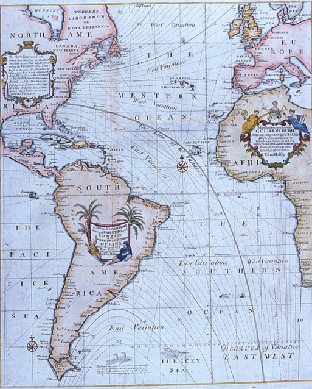]


---

## The first known instance of a choropleth

.left-code[In 1826, Charles Dupin published a thematic map of France showing illiteracy levels using shadings from white to black.]

.right-plot[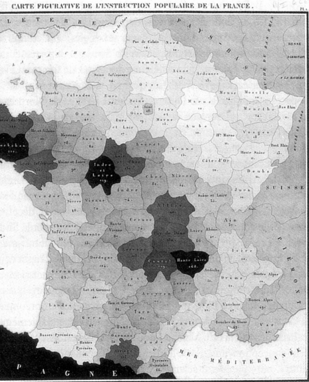]

---

## A really _interesting_ map

--

.center[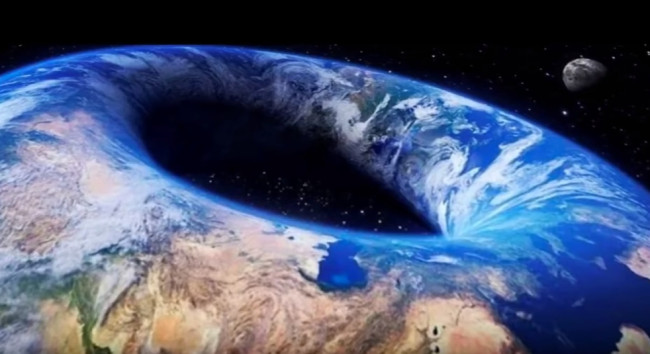]

---

class: middle, inverse, center

# Spatial Data

---

## Spatial Data

Spatial data, also known as _geospatial data_, is information about a physical object that can be represented by numerical values in a _geographic coordinate system_.

.pull-left[
**Spatial data represents:**

- location, size and shape of an object on planet Earth such as a building, lake, mountain or township
- Spatial data may also include attributes that provide more information about the entity that is being represented 
- Geographic Information Systems (GIS) or other specialized software applications can be used to access, visualize, manipulate and analyze geospatial data
- Can be another attribute in a standard tabular dataset
]


.pull-right[
**Latitude and longitude are not enough!**

- Coordinate pairs are pairs, and lose much of their meaning when treated independently
- In addition to having point locations, observations may often be associated with spatial lines, areas, or grid cells
- spatial distances between observations are often not well represented by straight-line distances, but by great-circle distances, distances through networks, or by measuring the effort it takes in getting from A to B
]
---

class: middle, inverse, center

# Types of Spatial Data

---

## Vector Data

The geographic vector model is based on points located within a coordinate reference system (CRS). Points can represent self-standing features (e.g., the location of a bus stop) or they can be linked together to form more complex geometries such as lines and polygons. Most point geometries contain only two dimensions.

.pull-left[
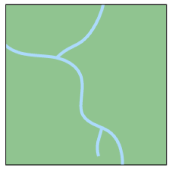
]

.pull-right[
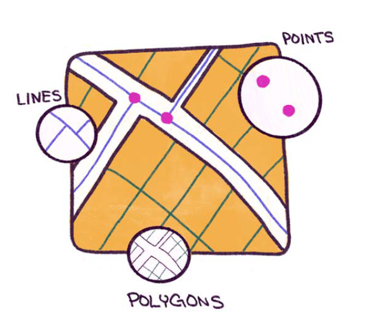
]


???

Advantages : Data can be represented at its original resolution and form without generalization. Graphic output is usually more aesthetically pleasing (traditional cartographic representation); Since most data, e.g. hard copy maps, is in vector form no data conversion is required. Accurate geographic location of data is maintained. Allows for efficient encoding of topology, and as a result more efficient operations that require topological information, e.g. proximity, network analysis.

Disadvantages: The location of each vertex needs to be stored explicitly. For effective analysis, vector data must be converted into a topological structure. This is often processing intensive and usually requires extensive data cleaning. As well, topology is static, and any updating or editing of the vector data requires re-building of the topology. Algorithms for manipulative and analysis functions are complex and may be processing intensive. Often, this inherently limits the functionality for large data sets, e.g. a large number of features. Continuous data, such as elevation data, is not effectively represented in vector form. Usually substantial data generalization or interpolation is required for these data layers. Spatial analysis and filtering within polygons is impossible


---

## Raster Data

The geographic raster data model usually consists of a raster header and a matrix (with rows and columns) representing equally spaced cells (often called pixels).

.pull-left[
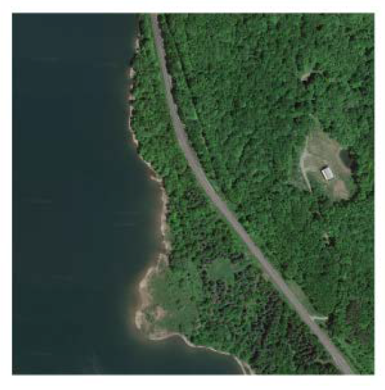
]

.pull-right[
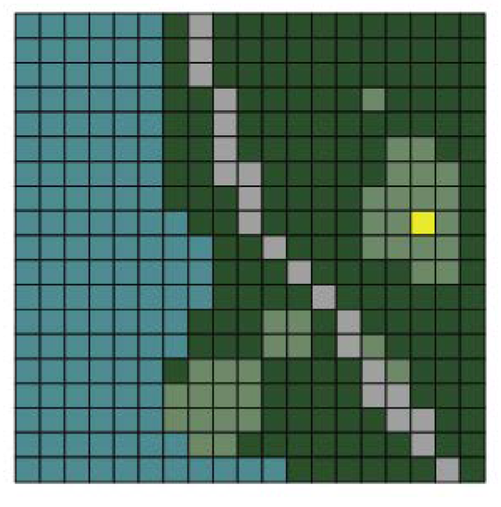
]


???

Advantages : The geographic location of each cell is implied by its position in the cell matrix. Accordingly, other than an origin point, e.g. bottom left corner, no geographic coordinates are stored. Due to the nature of the data storage technique data analysis is usually easy to program and quick to perform. The inherent nature of raster maps, e.g. one attribute maps, is ideally suited for mathematical modeling and quantitative analysis. Discrete data, e.g. forestry stands, is accommodated equally well as continuous data, e.g. elevation data, and facilitates the integrating of the two data types. Grid-cell systems are very compatible with raster-based output devices, e.g. electrostatic plotters, graphic terminals.

Disadvantages: The cell size determines the resolution at which the data is represented.; It is especially difficult to adequately represent linear features depending on the cell resolution. Accordingly, network linkages are difficult to establish. Processing of associated attribute data may be cumbersome if large amounts of data exists. Raster maps inherently reflect only one attribute or characteristic for an area. Since most input data is in vector form, data must undergo vector-to-raster conversion. Besides increased processing requirements this may introduce data integrity concerns due to generalization and choice of inappropriate cell size. Most output maps from grid-cell systems do not conform to high-quality cartographic needs.

---

## Multi-layer Raster

LiDAR

In addition to raster and vector data, there is also LiDAR data (also known as point clouds) and 3D data. LiDAR data is data that is collected via satellites, drones, or other aerial devices. 3D data is data that extends the typical latitude and longitude 2-D coordinates and incorporates elevation and or depth into the data. While complex, this data is rich with information and can be used to solve a variety of problems pertaining to the Earth’s surface.


---

## What is Spatial Analysis?

Spatial analysis is something we all do, whether we’re aware of it or not. It’s how we understand our world — knowing where things are, learning how places relate and interact, figuring out what it all means, and what decisions to make or actions to take.  

Spatial analysis lets us ask, and find answers to, a wide range of questions that fall into six broad categories:

* Understanding where things are or where events occur
* Measuring sizes, shapes, and distributions of things or measurements
* Analyzing relationships and interactions between places
* Optimizing locations for facilities, or routes for transportation
* Detecting and quantifying patterns and relationships between things or measurements
* Making predictions based on existing or theoretical patterns and relationships

**For today's purposes, it's about visualizing data with a geographical/spatial component.**

---

class: inverse, middle, center

# Popular types of spatial visualizations

---

## Choropleth

.left-code[
  A __choropleth map__ displays divided geographical areas or regions that are coloured in relation to a numeric variable.
  ]
  
.right-plot[

]


---

## A more detailed choropleth

.center[]

.tiny[This was created in R!, [click here for source](https://timogrossenbacher.ch/2019/04/bivariate-maps-with-ggplot2-and-sf/)]

---

## Cartogram

.left-code[
A __cartogram__ is a map in which the geometry of regions is distorted in order to convey the information of an alternate variable. The region area will be inflated or deflated according to its numeric value.

1. Start with a basic plot
]
  
.right-plot[

]


---

## Cartogram

.left-code[
A __cartogram__ is a map in which the geometry of regions is distorted in order to convey the information of an alternate variable. The region area will be inflated or deflated according to its numeric value.

1. Start with a basic plot
2. Distort the geography based on the variable being displayed
]
  
.right-plot[

]

---

## Cartogram

.left-code[
A __cartogram__ is a map in which the geometry of regions is distorted in order to convey the information of an alternate variable. The region area will be inflated or deflated according to its numeric value.

1. Start with a basic plot
2. Distort the geography based on the variable being displayed
3. Add color and now you have both a __choropleth__ and a __cartogram__
]
  
.right-plot[

]

---


## Heat maps

.left-code[__Heat maps__ are useful when you have to represent large sets of continuous data on a map using a color spectrum. A __heat map__ is different from a chloropleth map in that the colors in a heat map do not correspond to geographical boundaries.

This map of India shows the average annual rainfall using different shades of blue. The darker the shade of blue, the higher the rainfall.]

.right-plot[]

---

## Dot map

.left-code[A dot map (also called dot distribution map or dot density map) uses a dot to indicate the presence of a variable. Dot maps are essentially scatterplots on a map and are useful for showing spatial patterns.

This is a dot map of the world showing nearly 700,000 geotagged Wikipedia articles, each represented by a yellow dot, in 2011.]

.right-plot[]

---

The same dataset, in 2018. More articles, different projections. Would you change anything?

.center[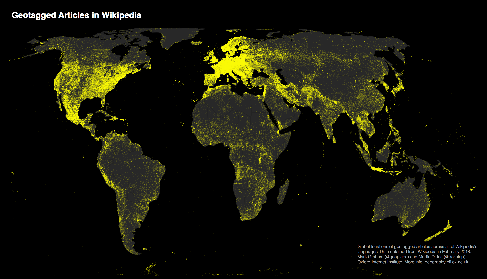]

---

## Use dot maps carefully. This is a _dot density_ plot.

.left-code[Dots are often used in graphs, charts, and maps to accurately locate individual observations and phenomena, but that's _not_ the case here. If you read a dot density map that way, it'll look like there were fatalities everywhere in Florida, and that lightning strikes become much less deadly as soon as you cross the border with Georgia or Alabama.

In a dot density map, though, each dot represents one observation, but dots aren't located where those observations were made; instead, dots are distributed to maximize coverage and, if the placement algorithm is well designed and manually tweaked, it'll avoid absurd placement —such as dots over lakes, rivers, or unpopulated regions.]

.right-plot[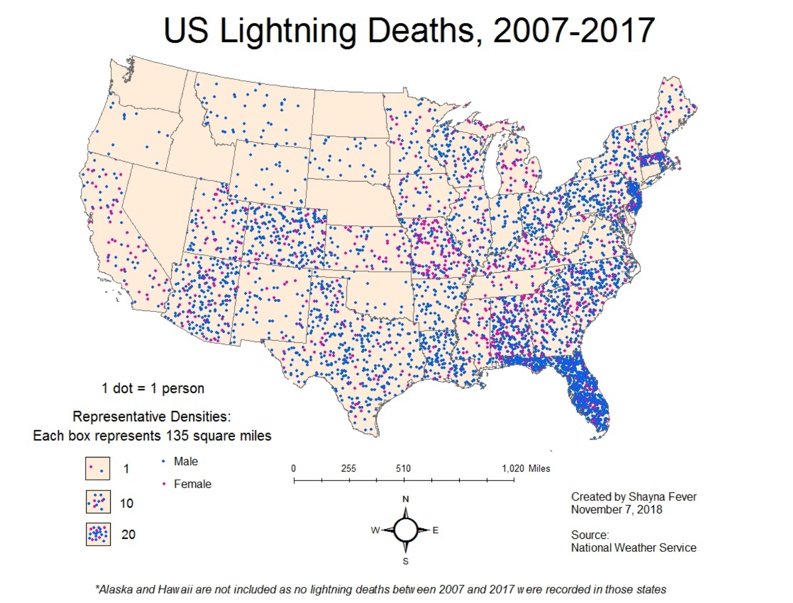]

---

## Bubble map

European country GDP.

.center[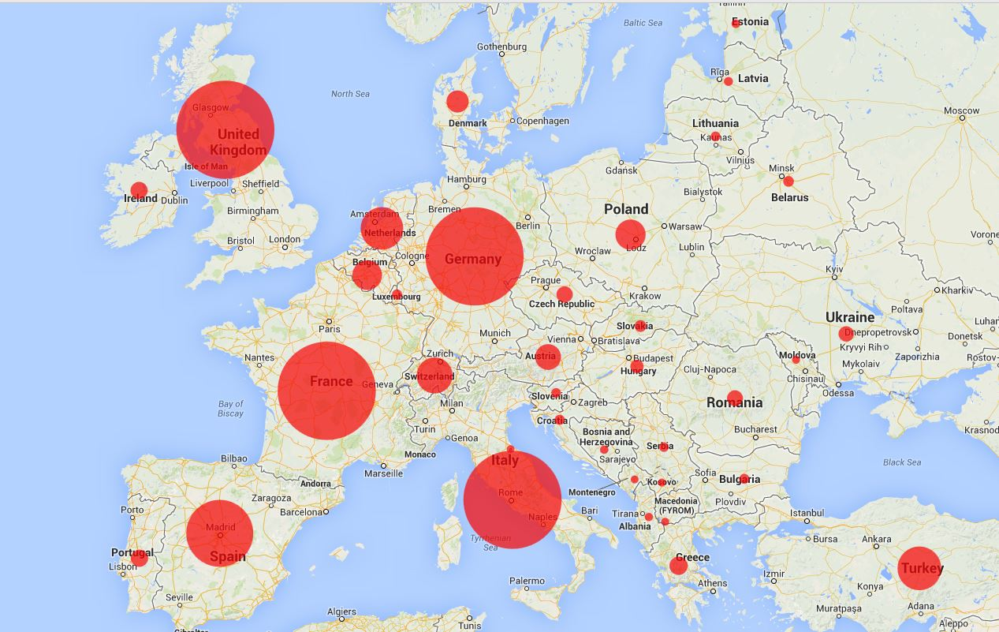]

---

## Hex map

.left-code[This map represents the changes that took place in individual constituencies between 2005-2010 for the United Kingdom's general election. Each constituency represented by a hexagon.]

.right-plot[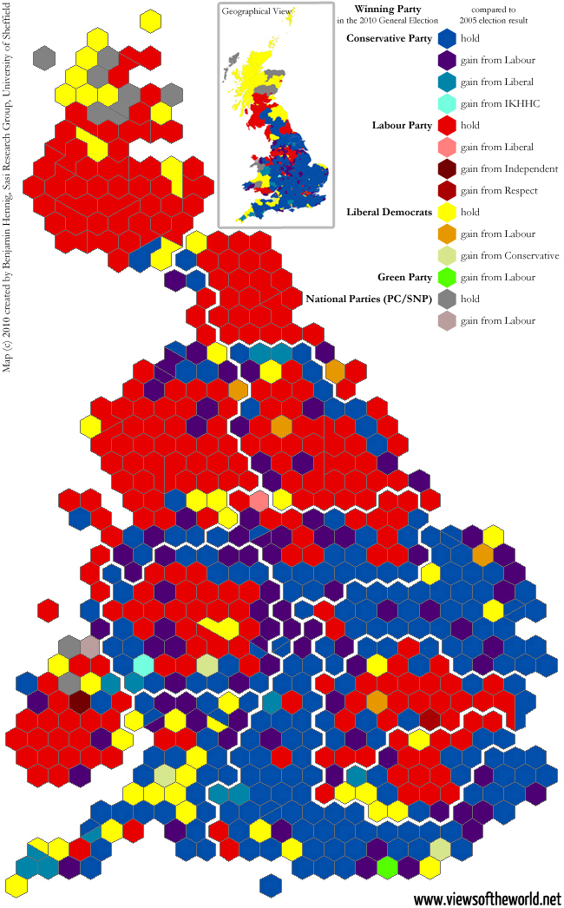]


---

class: inverse, center, middle

# The 2016 US Presidential Election Results

.tiny[http://www-personal.umich.edu/~mejn/election/2016/]

---

## Results by state (choropleth)

.center[]


---

## Results adjusted for state population (cartogram)

.center[]
---

## Results adjusted for electoral votes (cartogram)

.center[]


---

## Results by county (choropleth)

.center[]

---

## Results by county adjusted by population (cartogram)

.center[]

---

## Results by county using a linear sliding color scale (choropleth)

.center[]

---

## Results by county using a linear sliding color scale (cartogram)


.center[]

---

## Results by county using a non-linear color scale (choropleth)

.center[]

---

## Results by county using a non-linear sliding color scale (cartogram)

.center[]

---

## The changing colors of America 1960-2016 (animated choropleth)

.center[]

---

class: inverse, middle, center

# Representing the true 3D world in 2D: coordinate systems, projections, and distance calculations 

---

## Some immediate gotcha's when working with geospatial data and trying to create visualizations

.left-code[
* Layers won't match up
* Points will not show up on the righ location on the grid
* Distances won't be correct
* Circles turn to ellipses for no apparent reason
* Geographic elements look weird
]

.right-plot[

]

---

## The culprit: the earth is not a perfect sphere. It's a spheroid/ellipsoid!

.center[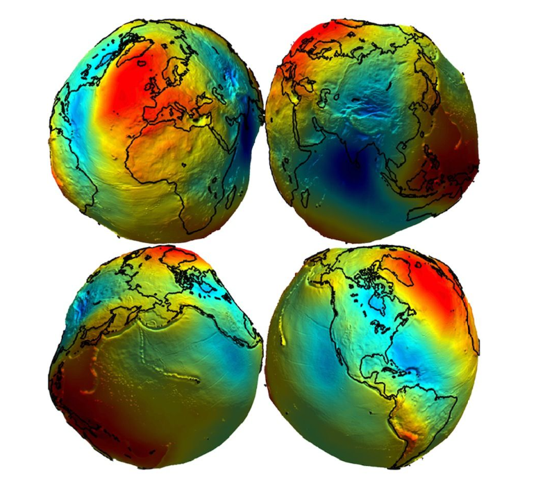]

---

## Converting from 3D to a 2D map is not so straightforward

.center[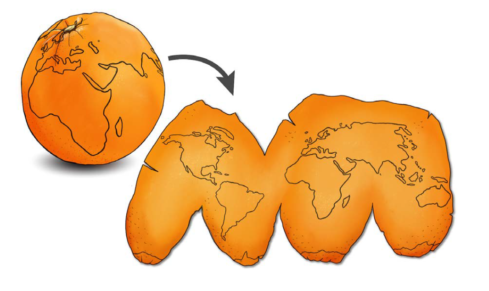]

---


# Distance


---

class: middle, center, inverse

# Structure of geospatial data

---

## Plain ol' CSV

Typical delimited text file with latitude and longitude:

```
id,name,amount,city,lon,lat
1,Kevin,2.1,Rapperswil,8.8249,47.2274
2,Eva,2.2,Zürich,8.5435,47.3768
3,"Jimmy,Muff",2.3,,7.4397,46.9487
```

Another CSV with a `POINT` definition (we'll talk about this shortly)

```
id,name,amount,city,geom
1,Kevin,2.1,Rapperswil,POINT(8.8249 47.2274)
2,Eva,2.2,Zürich,POINT(8.5435 47.3768)
3,"Jimmy,Muff",2.3,,POINT(7.4397 46.9487)
```
---

## Shapefiles

.pull-left[
The shapefile format is a __digital vector__ storage format for storing geometric location and associated attribute information. It has existed since the early 90's. It is possible to read and write geographical datasets using the shapefile format with a wide variety of software.

The term "shapefile" is quite common, but the format consists of a collection of files with a common filename prefix, **stored in the same directory.**
]

.pull-right[
**Mandatory files**
* `shp` — Main file: a direct access, variable-record-length file in which each record describes a shape with a list of its vertices.
* `shx` — Index file: each record contains the offset of the corresponding main file record from the beginning of the main file. The index file (.shx) contains a 100-byte header followed by 8-byte, fixed-length records.
* `dbf` — dBASE Table file: a constrained form of DBF that contains feature attributes with one record per feature. The one-to-one relationship between geometry and attributes is based on record number. Attribute records in the dBASE file must be in the same order as records in the main file.
]


---

## GeoJSON

.pull-left[
GeoJSON consists of the following different parts:

* Geometry object: This is either the point, line, or polygon described earlier. Basically the location information.
* Feature object: This is the geometry object and the associated random ad hoq data. Remember, GeoJSON doesn’t care what data you associate with the location information.
* FeatureCollection: Basically just a list of feature objects.
So typically one GeoJSON file (or dataset) will consist of a FeatureCollection containing a list of your data.
]

.pull-right[
.small[
```
{
  "type": "FeatureCollection",
  "features": [
    {
      "type": "Feature",
      "geometry": {
        "type": "Point",
        "coordinates": [ -90.0715, 29.9510 ]
      },
      "properties": {
        "name": "Fred",
   		"gender": "Male"
      }
    },
    {
      "type": "Feature",
      "geometry": {
        "type": "Point",
        "coordinates": [ -92.7298, 30.7373 ]
      },
      "properties": {
        "name": "Martha",
   		"gender": "Female"
      }
    },
    {
      "type": "Feature",
      "geometry": {
        "type": "Point",
        "coordinates": [ -91.1473, 30.4711 ]
      },
      "properties": {
        "name": "Zelda",
	    "gender": "Female"
      }
    }
  ]
}
```
]
]


---

# What about time?

Spacio temporal


---

class: inverse, middle, center

# OK, so what?

--

## Well, we now begin to show you how to work with this type of data

---

## Meet GDAL: Geospatial Data Abstraction Library

.left-code[
* GDAL is is a library for reading and writing raster and vector geospatial data formats
* Released under the permissive X/MIT style free software license by the Open Source Geospatial Foundation
* It presents a single abstract data model to the calling application for all supported formats. It may also be built with a variety of useful command line interface utilities for data translation and processing.
* Projections and transformations are supported by the PROJ library.

**You need to install GDAL separately for many of the packages that depend on it to work**
]

.right-plot[]


---

## Augmenting/Wrangling your data

### Geocoding and reverse geocoding

Geocoding is a process of converting an address or a name of a place into its coordinates. Reverse geocoding performs just an opposite task: returns an address or a description of a place based on its coordinates.


### Spatial joins

Joins attributes from one feature to another based on the spatial relationship. The target features and the joined attributes from the join features are written to the output feature class.

---

```{r child='abhijit.Rmd'}
```

---

## References and Tutorials

* https://keen-swartz-3146c4.netlify.app/
* https://bookdown.org/robinlovelace/geocompr/
* https://www.paulamoraga.com/book-geospatial/sec-spatialdataandCRS.html
* https://spatialanalysis.github.io/tutorials/
* https://www.jessesadler.com/post/geocoding-with-r/
* https://www.r-graph-gallery.com/index.html
* https://community.rstudio.com/t/modern-geospatial-data-analysis-with-r-workshop-rstudio-conf-2020/49098

---

```{r, child='slides_08_python.Rmd'}

```

