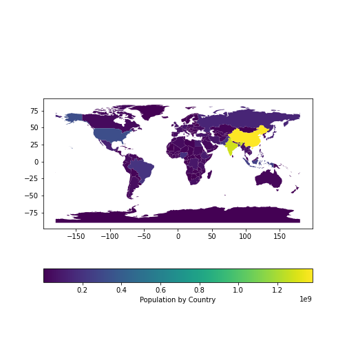

```{r, include=FALSE}
library(reticulate)
reticulate::use_condaenv('ds', required=T)
```

---
class: center, middle

# Spatial data in Python

---

## Toolsets

- The traditional toolset for doing maps in Python was the [`Basemap`](https://matplotlib.org/basemap/index.html) matplotlib toolkit 
- This has now been deprecated in favor of [`cartopy`](https://scitools.org.uk/cartopy/docs/latest/index.html)

Both these toolsets basically provide transformations to make your data fit 
various map projections and leave the actual graphing to `matplotlib`

--

The more useful way to map geospatial data in Python is [`geopandas`](https://geopandas.org/index.html). 

- This works very similarly to the `sf` package in R
    + All the data in one `pandas.DataFrame`-like object
    + One column for the _simple features_ geometry specification (called `geometry`)
    + Other columns for data about each geometry, that you can then represent within a map

---

## geopandas

Let's use some inbuilt data to do some maps

```{python}
import pandas as pd
import matplotlib.pyplot as plt
import geopandas as gp
world = gp.read_file(gp.datasets.get_path('naturalearth_lowres'))
world.head()
world.columns
```

---

## geopandas

```{python, eval=FALSE}
world['gdp_per_cap'] = world.gdp_md_est / world.pop_est

fig, ax = plt.subplots(1,1)
world.plot(column = 'pop_est', 
  ax=ax, legend=True,
  legend_kwds={'label': 'Population by Country',
               'orientation': 'horizontal'})
plt.show()
```



---

## geopandas

### Changing projections


```{python}
world.crs
```

---

## geopandas

### Changing projections

```{python, eval=FALSE}
world1 = world.to_crs('EPSG:3395')
fig, ax = plt.subplots(1,1)
world1.plot(column = 'pop_est', 
  ax=ax, legend=True,
  legend_kwds={'label': 'Population by Country',
               'orientation': 'horizontal'})
plt.show()
```
]

---

## Geocoding with geopandas

`geopandas` can geocode using the functionality of the `geopy` package.

```{python}
boros = gp.read_file(gp.datasets.get_path('nybb'))
boros.BoroName
```

---

## Geocoding with geopandas

```{python}
import geopy
from geopy.extra.rate_limiter import RateLimiter
locator = geopy.Nominatim(user_agent = 'MyGeocoder')
geocode = RateLimiter(locator.geocode, min_delay_seconds=1)

boros['location'] = boros['BoroName'].apply(geocode)
boros.location[0]
```

