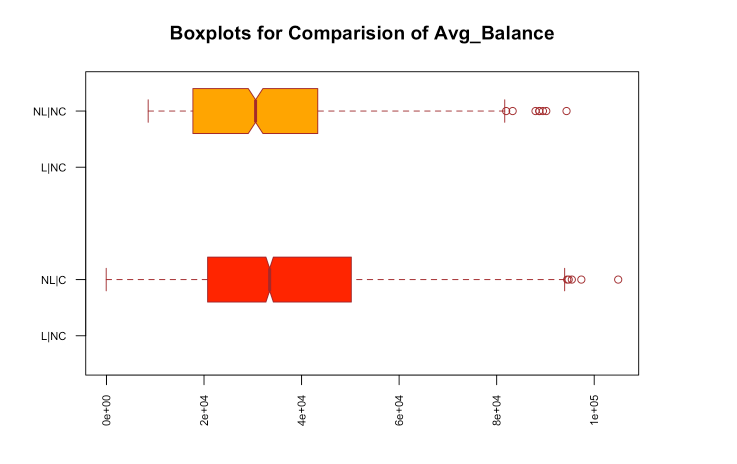
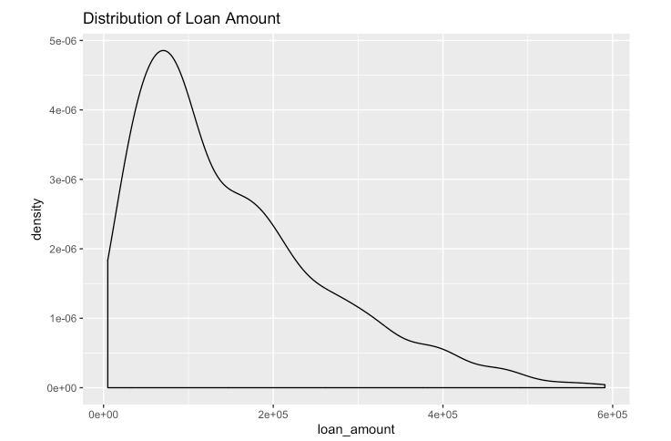
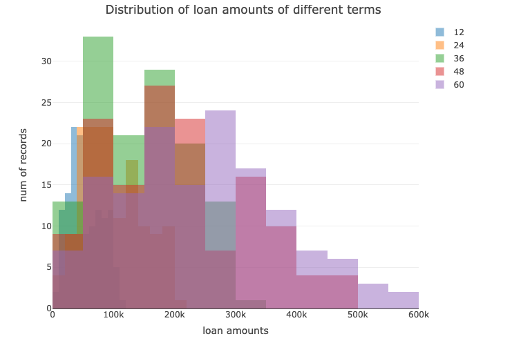
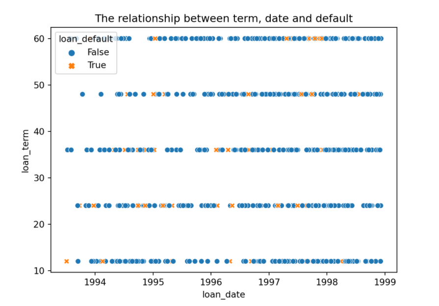
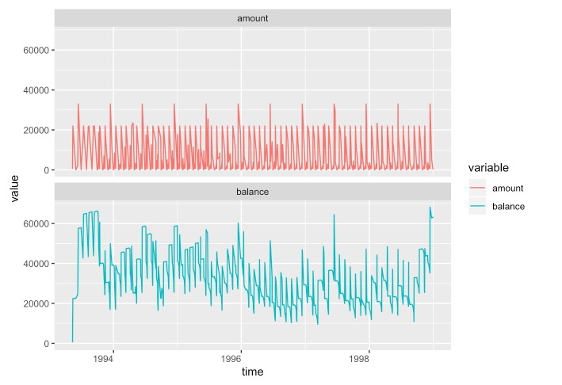
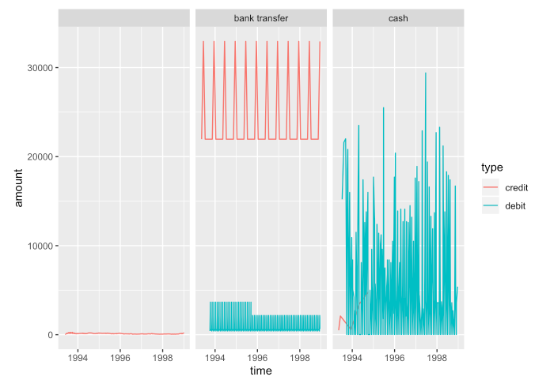
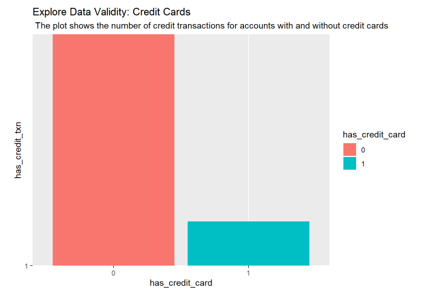

---

---

---

---

---

---

---

# Two broad things you **MUST** care about:

.pull-left[

]

.pull-right[
* How your chart looks for your own use
* How your chart will work for your audience
]

---

# Improve readability

Charts should read like text. At the most basic level, it should be obvious what the chart is about and how to interpret it.

---
## Tufte's Principles of Graphical Integrity

1. Show data variation, not design variation
1. Do not use graphics to quote data out of context
1. Use clear, detailed, thorough labelling. 
1. Representation of numbers should be directly proportional to numerical quantities
1. Don't use more dimensions than the data require

---

# Nathan Yau's Seven Basic Rules for Making Charts and Graphs

1. Check the data
1. Explain encodings
1. Label axes
1. Include units
1. Keep your geometry in check
1. Include your sources
1. Consider your audience

---

.pull-left[
### 1) Check the data

* This should be obvious
* If your data is weak, your chart is weak
* Start with simple graphs to see if there are any outliers
]

--

.pull-right[
### 2) Explain encodings

* Don't assume the reader knows what everything means
* Provide a legend
* Label shapes
* Explain color scales
]

---

.pull-left[
### 3) Label axes

* Axes without labels or explanation are just decoration
* Describe the scale (incremental, exponential, logarithmic?)
* Have axes values start at zero
]

--

.pull-right[
### 4) Include units

* Numbers without units are meaningless
* Remove the guesswork
]

---

.pull-left[
### 5) Keep your geometry in check

* This is something that is immediately noticeable
* Don't use area to compare two units unless they are an area. An increase in a unit squares the area.
* Tip: size circles and other 2D shapes by area, unless it's a bar chart
]

--

.pull-left[
### 6) Include your sources

* This is another obvious one
* Always include the source of your data
* Makes your graphic more reputable
* Allows for others to dig deeper
]

---

.pull-left[
### 7) Consider your audience

* What purpose do your charts have and who are they for?
* Avoid quirky fonts
* Make good design choices
]

---

# Visualization critiques: what is wrong with this picture?

* What is the first thing you notice about this visualization?
* What point is the visualization trying to make?
* Who is the intended audience?
* What is the visualization doing well?
* What problems do you see with the visualization design?

---
class: middle, center

## When you make a chart using _default settings_, you usually get a flat graphic where everything — from the tick marks, to the encoded data, to the title — gets the same amount of importance visually

---
class: middle,center,inverse

# Moving forward

---

## We have high expectations!!

1. We expect you to be happy and proud of what you submit, so don't just mail it in
1. We don't expect brilliance, but we do expect solid, professional work. Surprise us with your brilliance.

--

To wit,

1. All labels should be in appropriate units
1. All axes, legends should be labelled
1. Every chart has a title that tells us what it's about
1. Plot types, axis scales are appropriate for the chart's story
1. The story from the visualization should be "obvious", i.e. it should hit the reader between the eyes
1. The graphical style has to be your own. **No more defaults!!!**

---

## Creating your own graphics style

You have to create your own distinctive graphics style to use
in your homework and projects. We don't want to see any more default styles.

### Python

You can create a style template in `matplotlib` [link](https://towardsdatascience.com/a-guide-to-creating-and-using-your-own-matplotlib-style-30de6c60bac0)

### R

You can create your own theme in `ggplot2` [link](https://emanuelaf.github.io/own-ggplot-theme.html)
