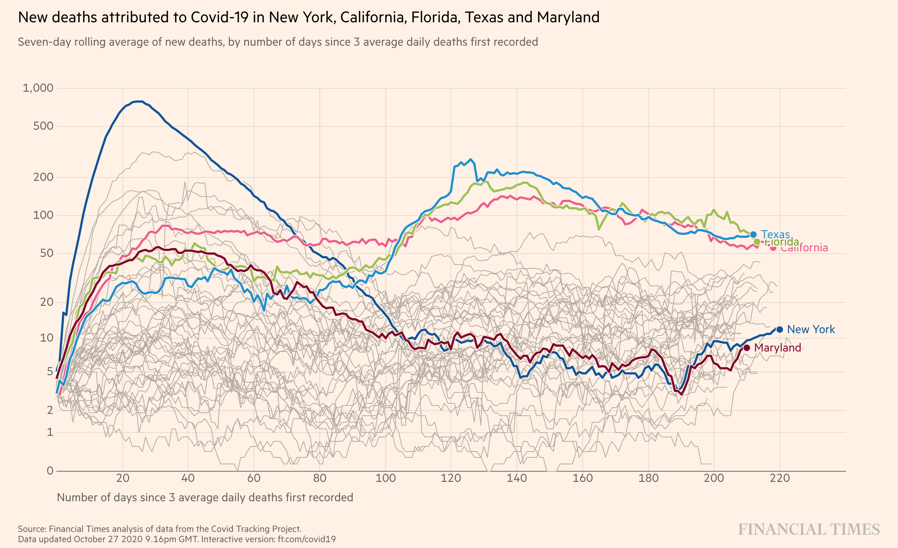

```{r setup, include=FALSE, message=FALSE, warning=FALSE}
library(pacman)
p_load(char = c('tidyverse','knitr', 'htmlwidgets', 'kableExtra', 
                'here', 'reticulate', 'icon', 'xts', 'quantmod'))

opts_chunk$set(echo=FALSE, message=FALSE, warning=FALSE, comment="", 
               cache=FALSE, fig.retina=2)

# source(here('lib/R/update_header.R'))
```

```{r xaringan-themer, include=FALSE}
library(xaringanthemer)
style_duo_accent(
  primary_color = "#035AA6", 
  secondary_color = "#03A696",
  header_font_google = google_font("Josefin Sans"),
  text_font_google   = google_font("Montserrat"),
  code_font_google   = google_font("Fira Mono"),
  base_font_size = "20px"
)
xaringanExtra::use_tachyons()
xaringanExtra::use_extra_styles(hover_code_line=TRUE, 
                                mute_unhighlighted_code = TRUE)
theme_set(theme_classic()+
            theme(axis.title=element_text(size=16),
                  axis.text = element_text(size=14),
                  title = element_text(size=18),
                  plot.margin = unit(c(0.05,0.05,0.05,0.05), 'npc')))
```

---
background-image: url(img/screams.png)
background-size: contain

---

```{r, child='10-reminders.Rmd'}

```


---
class: middle,center,inverse

# Time Series

---

## What are time series?

### A **time series** is a series of data that is indexed by time. 

Most commonly, time series are 

+ Data collected on a particular subject (observational unit)
+ at regular time intervals

--

### Examples

+ The NYSE ticker for particular stocks
+ Temperature of an industrial turbine
+ Daily cases and deaths from Sars-COV-2

---
background-image: url(img/FT_covid1.png)
background-size: contain

---

## Repeated measures data

Repeated measures data are a generalization of time series data

+ Data collected on a subject
+ over time, but not necessarily at regular intervals

Also called **longitudinal data**

--

### Examples

+ Blood draws in a clinical trial of a chemotherapy
+ Marital status of a person over time
+ State of residence of a person over time

---
class: middle,center,inverse

# Visualizing repeated measures data

---

## Time is paramount

### The defining characteristic of repeated measures data is its relationship with time

Typically the time scale is placed on the x-axis, and the repeated observations are plotted on the y-axis

The successive data values **are joined** to give the visual impression that 
they are connected by the common subject

The basic idea is to have a sense of continuity over time

---

## Line plots

```{r ticker, include=FALSE}
library(quantmod)
getSymbols(c('GD','MSFT'), src='yahoo', from=as.Date('2020-01-01'), to = as.Date('2020-09-30'))
d <- cbind(GD, MSFT) %>% as.data.frame() %>% rownames_to_column('date') %>% 
  select(date, ends_with('Open')) %>% 
  mutate(date =as.Date(date)) %>% 
  pivot_longer(cols = c(-date), names_to='company', values_to='price') %>% 
  mutate(company = str_remove(company, '.Open'))
```

.pull-left[
```{r, echo=FALSE, fig.height=4}
ggplot(d, aes(date, price, color=company))+
  geom_point()+
  scale_x_date(name = '', labels = scales::label_date(format='%b, %Y'))+
  scale_y_continuous(labels = scales::label_dollar())+
  labs(color='')+
  guides(color = guide_legend(title=NULL, nrow=1))+
  theme(legend.position=c(0.2, 0.9),
        legend.background=element_rect(color='lightblue'))
```
]
.pull-right[
```{r, echo=F, fig.height=4}
ggplot(d, aes(date, price, color=company))+
  geom_line(size=2)+
  scale_x_date(name = '', labels = scales::label_date(format='%b, %Y'))+
  scale_y_continuous(labels = scales::label_dollar())+
  guides(color = guide_legend(title = NULL,nrow=1))+
  theme(legend.position=c(0.2, 0.9),
        legend.background=element_rect(color='lightblue'))
```
]

-----

`r icon::fa('r-project', size=2, color='blue')` You can format axes with dates and times using `scales::label_date` or `scales::label_time`

```{r, echo=TRUE,eval=FALSE}
... + scales_x_date(labels = scales::label_date(format='%b, %Y'))
```

`r icon::fa('python', size=2, color='blue')` Code for all the plots is available in `slides_plots.py`

---

## Line plots

If the patterns are too _noisy_, you can smooth the lines using a _loess_ or 
_polynomial_ smoother

```{r, echo=T, fig.height=4}
ggplot(d, aes(date, price, color=company))+
  geom_point(size=2, alpha=0.5)+
  geom_smooth(method='loess', size=2, se=F, show.legend=F,
              span = 0.1)+
  scale_x_date(name = '', labels = scales::label_date(format='%b, %Y'))+
  scale_y_continuous(labels = scales::label_dollar())+
  guides(color = guide_legend(title = NULL,nrow=1))+
  theme(legend.position=c(0.2, 0.9),
        legend.background=element_rect(color='lightblue'))

```

---

## Line plots

You can adjust the level of smoothness using the `span` argument

```{r, echo=T, fig.height=4}
ggplot(d, aes(date, price, color=company))+
  geom_point(size=2, show.legend=F, alpha=0.5)+
  geom_smooth(method='loess', size=2, se=F, 
              span=0.3)+ #<<
  scale_x_date(name = '', labels = scales::label_date(format='%b, %Y'))+
  scale_y_continuous(labels = scales::label_dollar())+
  guides(color = guide_legend(title = NULL,nrow=1))+
  theme(legend.position=c(0.2, 0.9),
        legend.background=element_rect(color='lightblue'))

```

---

## Line plots

You can adjust the level of smoothness using the `span` argument

```{r, echo=T, fig.height=4}
ggplot(d, aes(date, price, color=company))+
  geom_point(size=2,  alpha=0.5, show.legend = F)+
  geom_smooth(method='loess', size=2, se=F, 
              span=0.75)+ #<<
  scale_x_date(name = '', labels = scales::label_date(format='%b, %Y'))+
  scale_y_continuous(labels = scales::label_dollar())+
  guides(color = guide_legend(title = NULL,nrow=1))+
  theme(legend.position=c(0.2, 0.9),
        legend.background=element_rect(color='lightblue'))

```


---
class: middle,center,inverse

# Using area

---
layout: true

## Area plots

The aim is to draw the eye to highlight changes in data over time

Using a filled-in area accentuates the height of the line

This technique is especially useful when we are looking at differences from a reference level, say 0

---

```{r, include=F}
knitr::opts_chunk$set(fig.height=5)
library(wbstats)
wbd <- wb_data('NY.GDP.MKTP.KD.ZG',start_date=2000, end_date = 2019)
jpn_data <- wbd %>% filter(iso3c=='JPN') %>% 
  select(date, NY.GDP.MKTP.KD.ZG)
mylabs <- labs(x='Year', 
       y = 'Annual percent growth in GDP',
       title='Japan',
       caption='Source: World Bank')
```

.pull-left[
```{r lp, eval = F, echo = T}
ggplot(jpn_data, 
       aes(x = date, y = NY.GDP.MKTP.KD.ZG))+
  geom_line()+
  geom_hline(yintercept = 0, linetype=2)+
  mylabs
  
```
]
.pull-right[
```{r, eval=T, echo = F, ref.label="lp"}
```
]

---


.pull-left[
```{r ap, eval = F, echo = T}
ggplot(jpn_data, 
       aes(x = date, y = NY.GDP.MKTP.KD.ZG))+
  geom_area()+
  mylabs
  

```
]
.pull-right[
```{r, eval=T, echo = F, ref.label="ap"}
```
]

---

```{r, include=F}
find_crossings <- function(d){
  d <- d %>% set_names('x', 'y')
  out = numeric(0L)
  for(i in 1:(nrow(d)-1)){
    if(sign(d$y[i]*d$y[i+1])<0){
      m <- lm(y~x, data=d[i:(i+1),])$coef
      out <- c(out, -m[1]/m[2])
    }
  }
  return(out)
}

x <- find_crossings(jpn_data %>% select(date, NY.GDP.MKTP.KD.ZG))
jpn_data <- jpn_data %>% 
  rbind(data.frame(date=x, NY.GDP.MKTP.KD.ZG=0))
```

.pull-left[
```{r ap2, eval = F, echo = T}
ggplot(jpn_data, 
       aes(x = date, y = NY.GDP.MKTP.KD.ZG))+
  geom_area(data=filter(jpn_data, NY.GDP.MKTP.KD.ZG >=0),
            fill='black')+
  geom_area(data=filter(jpn_data, NY.GDP.MKTP.KD.ZG <=0),
            fill='red')+
  mylabs

```

> This required some interpolation to find when the curve crossed 0. See the source file.
]
.pull-right[
```{r, eval=T, echo = F, ref.label="ap2"}
```
]

---
class: middle,center,inverse
layout: false

# Other ways to contrast differences

---

## Bar charts

```{r, include=F}
jpn_data <- jpn_data %>% filter(NY.GDP.MKTP.KD.ZG!=0)
```

.pull-left[
```{r bp, eval = F, echo = T}
ggplot(jpn_data, 
       aes(x = date, y = NY.GDP.MKTP.KD.ZG))+
  geom_bar(stat='identity', color='black')+
  geom_hline(yintercept = 0)+
  mylabs

```
]
.pull-right[
```{r, eval=T, echo = F, ref.label="bp"}
```
]


---

## Lollipop charts

.pull-left[
```{r lolli, eval = F, echo = T}
ggplot(jpn_data, 
       aes(x = date, y = NY.GDP.MKTP.KD.ZG))+
  geom_segment(aes(xend=date, yend=0))+
  geom_point(size=2)+
  geom_hline(yintercept=0, linetype=2)+
  mylabs

```
]
.pull-right[
```{r, eval=T, echo = F, ref.label="lolli"}
```
]

---
class: middle,center,inverse

# Comparing multiple time series

---

## Spaghetti plots

_Spaghetti_ plots are multiple line plots drawn on the same axes, which 
gives an appearance of spaghetti

.pull-left[
The main purpose of the spaghetti plot is to give a sense of variability
of the time series patterns across multiple observation units

However, it is almost impossible to identify any particular series without highlighting

Spaghetti plots can come to the fore when using dynamic plots, where we 
can add highlights and meta-data to each series

Typically the individual series are plotted using a lighter color or
transparency so that the highlighted series can pop

]
.pull-right[

]

---

## Spaghetti plots


```{r, echo=TRUE, fig.height=5, fig.asp=0.5, message=F, warning=FALSE}
covid <- COVID19::covid19(verbose=FALSE) %>% ungroup() %>% select(id, date, deaths) %>% 
  mutate(highlight = (id %in% c('USA','GBR','FRA','JPN','KOR','SWE')))
ggplot(covid, aes(x=date, y=deaths, group = id, color = highlight))+ #<<
  geom_line(show.legend=FALSE) + 
  scale_y_log10('Deaths', labels=scales::label_number_si())+
  scale_x_date('', labels = scales::label_date('%b, %Y'))+
  scale_color_manual(values = c('lightgrey', 'orange'))+
  labs(title='Cumulative deaths from COVID-19 globally',
       caption='Source: COVID-19 Data Hub')
```

---

## Stacked area plots

.pull-left[
```{r sap, echo=T, eval=F}
covid <- read_csv('data/covid_plot_data.csv') %>% 
  select(-highlight) %>% 
  group_by(id) %>% 
  mutate(daily = deaths-lag(deaths)) %>% # Daily deaths
  mutate(daily7 = zoo::rollmean(daily, k = 7, na.pad=T)) # Rolling mean
ggplot(covid, aes(x=date, y = daily7, 
                  fill = id))+
  geom_area(position='stack', show.legend=F)+
  labs(x='', y = 'Count', 
       title='Daily COVID-19 deaths by country')  
```
]
.pull-right[
```{r, eval=T, echo=F, ref.label='sap', fig.height=5}

```
]

The issue with stacked area plots (as well as stacked bar plots) is that you have a good handle on what is going on in the bottom-most layer, and overall by looking at the top, but you can't really tell what's going on in the middle

---
background-image: url(img/covid_stream.png)
background-size: contain
layout: false

---

## Stream graphs

A streamgraph, or stream graph, is a type of stacked area graph which is displaced around a central axis, resulting in a flowing, organic shape. Unlike a traditional stacked area graph in which the layers are stacked on top of an axis, in a streamgraph the layers are positioned to minimize their "wiggle" (Wikipedia)

The basic idea is to show relative prevalence of different categories at each point in time, with some smoothing implemented to make the graph "flow" around a centra axis rather than the x-axis.

A stream graph can be more interpretable than a stacked area chart

---

## Stream graphs

```{r, echo=T, }
library(zoo)
library(streamgraph)
covid <- read_csv('data/covid_plot_data.csv') %>% 
  select(-highlight) %>% 
  group_by(id) %>% 
  mutate(daily = deaths-lag(deaths)) %>% # Daily deaths
  mutate(daily7 = rollmean(daily, k = 7, na.pad=T)) # Rolling mean
streamgraph(covid, key='id', date='date',value='daily7', 
            interactive=FALSE, height=300, width=800)
```

---
class: middle,center,inverse

# The case for facets

---

```{r, include=F}
covid_daily <- read_csv('data/covid_plot_data.csv') %>% 
  select(-highlight) %>% 
  group_by(id) %>% 
  mutate(daily = deaths-lag(deaths))
knitr::opts_chunk$set(fig.height=7)
```

.pull-left[
```{r}
covid_daily %>% 
  filter(id %in% c('USA','GBR','AUS','JPN','IND')) %>% 
  ggplot(aes(x=date, y=daily, color=id))+
  geom_line()+
  theme(legend.position='top')+
  labs(color='', x='', y='Daily deaths from COVID-19')
```

]
.pull-right[
```{r}
covid_daily %>% 
  filter(id %in% c('USA','GBR','AUS','JPN','IND')) %>% 
  ggplot(aes(x=date, y=daily))+
  geom_line()+
  facet_grid(id~., scales = 'free_y')+
  labs(x='', y='Daily deaths from COVID-19')+
  scale_y_continuous(labels=scales::label_number_si())
```

]

--

The stories these charts tell are different

???

Bounciness of graphs is due to deaths over the weekend being reported on Monday. We're really plotting date of death report, not date of death. 
---

.pull-left[
```{r}
covid_daily %>% 
  filter(id %in% c('USA','GBR','AUS','JPN','IND')) %>% 
  ggplot(aes(x=date, y=daily, color=id))+
  geom_smooth(span=0.05, se=F)+
  theme(legend.position='top')+
  labs(color='', x='', y='Daily deaths from COVID-19')
```

]
.pull-right[
```{r}
covid_daily %>% 
  filter(id %in% c('USA','GBR','AUS','JPN','IND')) %>% 
  ggplot(aes(x=date, y=daily))+
  geom_smooth(span=.05, se=F)+
  facet_grid(id~., scales = 'free_y')+
  labs(x='', y='Daily deaths from COVID-19')+
  scale_y_continuous(labels=scales::label_number_si())
```

]

Smoothing helps

---
layout: true

## Moving (rolling) averages

Moving averages are often employed to remove noise from signal. You have to
specify a window (number of consecutive observations to average over)

---
.pull-left[
```{r ma1, eval = F, echo = T}
library(zoo)
covid_daily %>% 
  group_by(id) %>% 
  mutate(ma = rollmean(daily, k = 7, 
                       na.pad=TRUE)) %>% 
  ungroup() %>% 
  filter(id %in% c('USA','GBR','FRA',
                   'JPN','KOR')) %>% 
  ggplot(aes(x=date, y = daily))+
  geom_line(aes(color=id))+
  labs(x='', y = 'Count', color='',
       title = 'Daily deaths from COVID-19')
```
]
.pull-right[
```{r, eval=T, echo = F, ref.label="ma1", fig.height=5}
```
]
---

.pull-left[
```{r ma2, eval = F, echo = T}
library(zoo)
covid_daily %>% 
  group_by(id) %>% 
  mutate(ma = rollmean(daily, k = 7, 
                       na.pad=TRUE)) %>% 
  ungroup() %>% 
  filter(id %in% c('USA','GBR','FRA',
                   'JPN','KOR')) %>% 
  ggplot(aes(x=date, y = ma))+
  geom_line(aes(color=id))+
  labs(x='', y = 'Count', color='',
       title = 'Deaths (7-day average)')
```
]
.pull-right[
```{r, eval=T, echo = F, ref.label="ma2", fig.height=5}
```
]


---

.pull-left[
```{r ma3, eval = F, echo = T}
library(zoo)
covid_daily %>% 
  group_by(id) %>% 
  mutate(ma = rollmean(daily, k = 14, 
                       na.pad=TRUE)) %>% 
  ungroup() %>% 
  filter(id %in% c('USA','GBR','FRA',
                   'JPN','KOR')) %>% 
  ggplot(aes(x=date, y = ma))+
  geom_line(aes(color=id))+
  labs(x='', y = 'Count', color='',
       title = 'Deaths (14-day average)')
```
]
.pull-right[
```{r, eval=T, echo = F, ref.label="ma3", fig.height=5}
```
]

A longer window creates smoother graphs, but might remove details

---
class: middle,center,inverse
layout: false

# Textual data

---

```{r, child='slide_10_text.Rmd'}

```

