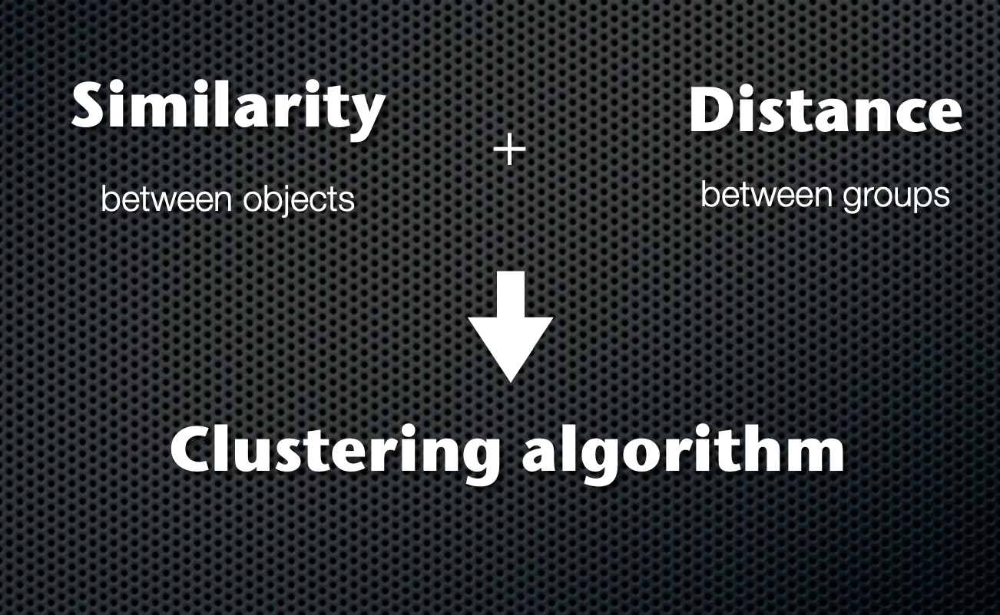
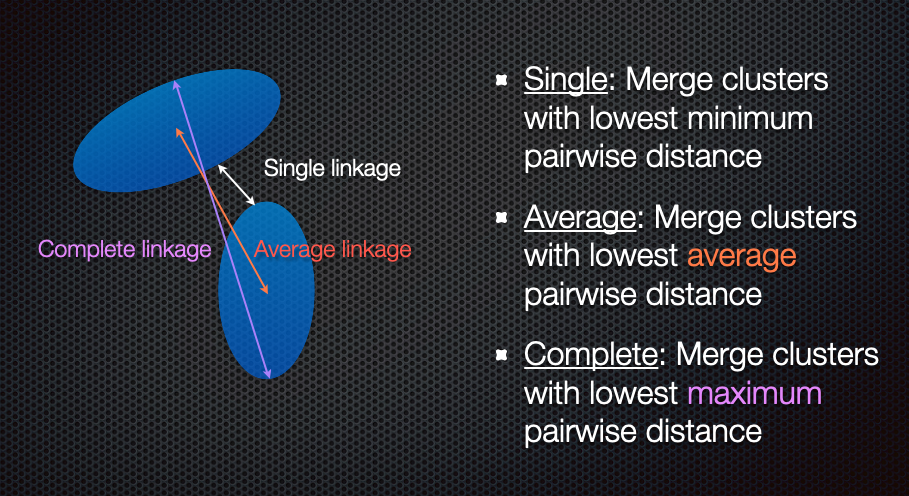
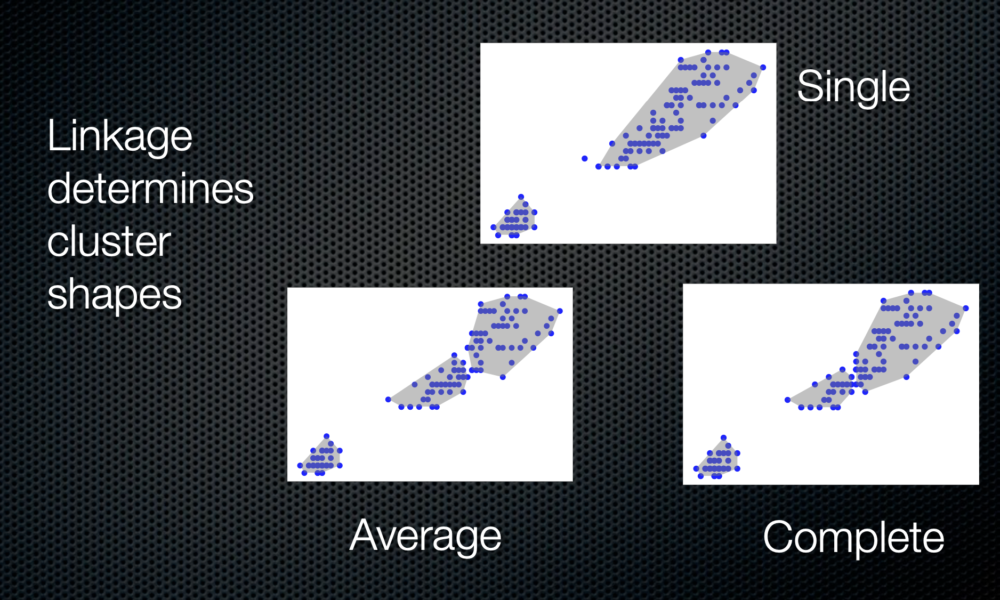
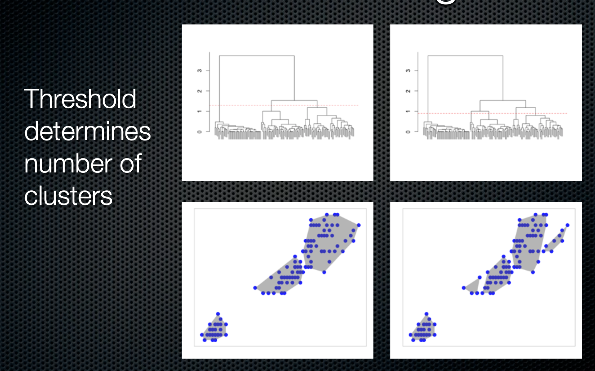

```{r setup, include=FALSE, message=FALSE, warning=FALSE}
library(pacman)
p_load(char = c('tidyverse','knitr', 'htmlwidgets', 'kableExtra', 
                'here', 'reticulate'))
opts_chunk$set(echo=TRUE, message=FALSE, warning=FALSE, comment="", 
               cache=F)

reticulate::use_condaenv('ds', required=TRUE)

```

```{r xaringan-themer, include=FALSE}
library(xaringanthemer)
style_duo_accent(
  primary_color = "#035AA6", 
  secondary_color = "#03A696",
  header_font_google = google_font("Josefin Sans"),
  text_font_google   = google_font("Montserrat"),
  code_font_google   = google_font("Fira Mono"),
  base_font_size = "20px"
)
xaringanExtra::use_tachyons()
xaringanExtra::use_panelset()
xaringanExtra::use_extra_styles(hover_code_line=TRUE, mute_unhighlighted_code = TRUE)
theme_set(theme_classic()+
            theme(axis.title=element_text(size=16),
                  axis.text = element_text(size=14),
                  title = element_text(size=18),
                  plot.margin = unit(c(0.05,0.05,0.05,0.05), 'npc')))
```


---
layout: true

# Visualizing the results of models

---
class: middle,center,inverse

---


We've talked a lot about exploratory and descriptive visualizations to understand 
the unprocessed data

Modeling is part of most insight strategies to understand patterns in the data. These are often the "end results" of a data science project and the "punch line" of what you're presenting

+ Visualizing results rather than a tabular presentation can be more impactful
+ Take advantage of receivers' innate pattern recognition capabilities
+ Ability to highlight main stories out of the models

<p>

+ Easier to not only show results but also highlight weaknesses
    + Fitting a straight line to a curvilinear relationship `r icon::fa('grin', color = 'blue', size=1.5)`
+ Easy to put too much on a graphic
    + Need restraint

.fl.w-40[
```{r, fig.width=5, fig.height=3, echo=F}
set.seed(4)
library(survival)
library(rpart)
dat = data.frame(X1 = sample(x = c(1,2,3,4,5), size = 1000, replace=T))
dat$t = rexp(1000, rate=dat$X1)
dat$t = dat$t / max(dat$t)
dat$e = rbinom(n = 1000, size = 1, prob = 1-dat$t )

# Tree Fit:
tfit = rpart(formula = Surv(t, event = e) ~ X1 , data = dat, control=rpart.control(minsplit=30, cp=0.01))

library(partykit)
tfit2 <- as.party(tfit)
plot(tfit2)
```

]
.fl.w-30[
```{r, echo=FALSE, fig.height=5}
data <- as.matrix(mtcars)
library(RColorBrewer)
heatmap(data, scale='column', cexRow=1, col=colorRampPalette(brewer.pal(8,'Blues'))(25))
```

]
.fl.w-30[
```{r, echo=F, fig.width=3, fig.height=3}
x = seq(0, 1, length.out = 100)
y = 3 + 2*x^2 + rnorm(100, sd=.1)
ggplot2::qplot(x, y)+
  geom_smooth(method='lm', color='red')+
  theme_minimal()+
  theme(axis.text=element_blank(),axis.title=element_blank())
```

]


---

## Toolboxes

.pull-left[
### R

+ **ggplot2** and family
+ **ggeffects**

<p>

+ **base** (unsupervised learning, regression)
+ **broom** (tidy-fying results)
+ **caret**/**parsnip** (supervised learning)
+ **party**/**partykit** (decision trees)
]
.pull-right[
### Python

+ **matplotlib**
+ **yellowbrick**

<p>

+ **statsmodels** (statistical mdoels)
+ **scikit-learn** (machine learning)
]

---
layout: true

# Unsupervised learning models

---
class: middle, center, inverse

---

Unsupervised learning are machine learning models where we're looking to discover patterns within *unlabeled* data.

This can be considered a form of *clustering* or *pattern recognition*

Unsupervised learning can be used 

- to find groups in data where 
    + members within a group are more similar to each other
    + than with members of another group
- to detect anomalies/outliers

---

Unsupervised learning can be used to 

- detect subgroups of cancer patients based on biology and biomarkers
- detect abnormal packets on the internet
- characterize different customer profiles
- identify subtle problems on x-rays and medical images
- characterize different kinds of galaxies

---

Some common methods in unsupervised learning

- Cluster analysis
  + Hierarchical clustering
  + k-means clustering
  + Density estimation / mixture models
  + Self-organizing maps
  + Voronoi diagrams

<p>

- Data transformations for pattern recognition
  + PCA
  + tSNE
  + UMAP


---

## Correlograms

.pull-left[
```{r, echo=FALSE, fig.height=4}
library(ggcorrplot)
library(mlbench)
data("PimaIndiansDiabetes2")
d <- PimaIndiansDiabetes2 %>% 
  select(glucose:triceps, mass:age)
cormat <- cor(d, use='pair')
ggcorrplot(cormat, method='circle')
```

]

.pull-right[
```{r, echo=FALSE, fig.height=4}
library(corrgram)
corrgram(d, order=TRUE, 
lower.panel=panel.shade,
upper.panel=panel.ellipse,
text.panel=panel.txt)
```
]

.footnote[Using Pima diabetes data]

---

## Correlograms

.pull-left[
```{r, echo=FALSE, fig.height=5}
library(ellipse)
library(RColorBrewer)
my_colors <- brewer.pal(5, "Spectral")
my_colors <- colorRampPalette(my_colors)(100)

ord <- order(cormat[1,])
d_ord <- cormat[ord,ord]
plotcorr(d_ord, mar=c(1,1,1,1), col=my_colors[d_ord*50+50])
```

]

.footnote[Using Pima diabetes data]

---

## Hierarchical clustering

### Agglomerative clustering

.pull-left[
1. Start with each member in its own cluster
1. Join clusters based on distance between (linkage)
1. Visualize using trees
]
.pull-right[


]


---

## Hierarchical clustering

### Agglomerative clustering

.pull-left[
1. Start with each member in its own cluster
1. Join clusters based on distance between (linkage)
1. Visualize using trees

-----

+ Euclidean distance (root mean square distance)
+ Correlation distance (1 - correlation)
+ Many other choices
]
.pull-right[


]


---

## Hierarchical clustering

### Agglomerative clustering

.pull-left[
1. Start with each member in its own cluster
1. Join clusters based on distance between (linkage)
1. Visualize using trees


]
.pull-right[


]


---

## Hierarchical clustering

### Agglomerative clustering


.pull-left[
1. Start with each member in its own cluster
1. Join clusters based on distance between (linkage)
1. Visualize using trees
]
.pull-right[


]


.footnote[More details [here](https://www.dropbox.com/s/okp3t58zu9vfs49/ClusteringDSDC.pdf?dl=0)]


---
## Hierarchical clustering (R)

.pull-left[
```{r, echo=F, fig.height=5}
iris %>% janitor::clean_names() %>% 
  select(-species) %>% 
  dist() %>% 
  hclust(method='complete') -> iris_cl
  as.dendrogram(iris_cl) -> dend
plot(dend)
```
]
.pull-right[
```{r, echo=F, fig.height=5}
library(dendextend)
dend %>% 
  set('branches_col', 'grey') %>% 
  set('branches_lwd', 3) %>% 
  set('labels_col','orange') %>% 
  set('labels_cex', 0.8) %>% 
  plot()
```
]

---

## Hierarchical clustering (R)

.pull-left[
```{r, echo=FALSE, fig.height=5}
dend %>%
  set("labels_col", value = c("skyblue", "orange", "grey"), k=3) %>%
  set("branches_k_color", value = c("skyblue", "orange", "grey"), k = 3) %>%
  plot(axes=FALSE)
rect.dendrogram( dend, k=3, lty = 5, lwd = 0, x=1, col=rgb(0.1, 0.2, 0.4, 0.1) ) 
```

]
.pull-right[
```{r, echo=FALSE, fig.height=6}
dend %>%
  set("labels_col", value = c("skyblue", "orange", "grey"), k=3) %>%
  set("branches_k_color", value = c("skyblue", "orange", "grey"), k = 3) %>%
  plot(horiz=TRUE, axes=FALSE)
abline(v = 350, lty = 2)
```

]
---

## Hierarchical clustering (Python)

.pull-left[
```{python, echo=FALSE,  fig.height=5}
import pandas as pd
from matplotlib import pyplot as plt
from scipy.cluster import hierarchy
import numpy as np
import seaborn as sns
 
# Data set
iris = sns.load_dataset('iris')


df = iris.iloc[:,:4]

# Calculate the distance between each sample
Z = hierarchy.linkage(df, 'average')
ind = hierarchy.cut_tree(Z,3)
 
# Plot with Custom leaves
hierarchy.set_link_color_palette(['m','b','g'])
hierarchy.dendrogram(Z, leaf_rotation=90, leaf_font_size=8, color_threshold=1.8, above_threshold_color='grey');
plt.show()
# plt.savefig('img/dendro1.png')
```

]

.pull-right[
```{python, echo=FALSE, fig.height=5, eval=T}
hierarchy.set_link_color_palette(['m','b','g'])
hierarchy.dendrogram(Z, orientation="left", color_threshold=1.8, above_threshold_color='grey' );
plt.show()
```

]

---

## Comparing linkages

```{r, echo=F, fig.height=5}
d = iris %>% janitor::clean_names() %>% select(-species) %>% dist()
cl1 <- hclust(d, method='single')
cl2 = hclust(d, method='average')
cl3 = hclust(d, method='complete')

iris1 <- iris %>% janitor::clean_names() %>% mutate(ind1=factor(cutree(cl1, 3)), ind2=factor(cutree(cl2,3)),
                         ind3=factor(cutree(cl3,3)))
plt1 <- ggplot(iris1, aes(x=sepal_length,y=sepal_width, color=ind1))+geom_point()+
  stat_ellipse() + labs(x = 'sepal length',y='sepal width', title='Linkage: single')+
  theme(legend.position='none')
plt2 <- ggplot(iris1, aes(x=sepal_length,y=sepal_width, color=ind2))+geom_point()+
  stat_ellipse()+ labs(x = 'sepal length',y='sepal width', title='Linkage: average')+
  theme(legend.position='none')
plt3 <- ggplot(iris1, aes(x=sepal_length,y=sepal_width, color=ind3))+geom_point()+
  stat_ellipse()+ labs(x = 'sepal length',y='sepal width', title='Linkage: complete')+
  theme(legend.position='none')
library(cowplot)
plot_grid(plt1, plt2, plt3, ncol=2)
```

---

## k-means clustering

+ Choose number of clusters **first**
+ Optimize clusters so that
    - Within cluster variability is minimized
    - Between cluster variability is maximized
    
Typically k-means clustering looks at spherical clusters

.pull-left[
```{r, echo=FALSE, fig.height=3}
iris %>% janitor::clean_names() %>% 
  select(-species) %>% 
  as.matrix() %>% 
  kmeans(centers=3)-> cl
iris %>% janitor::clean_names() %>% 
  select(-species) %>% 
  mutate(cl = as.factor(cl$cluster)) %>% 
  ggplot(aes(sepal_length, sepal_width, color=cl))+
    geom_point() + 
    stat_ellipse() +
    labs(x = 'Sepal length', y = 'Sepal Width')+
    theme(legend.position='none')
```

]

---
## Heatmaps

```{r, echo=F, fig.height=5}
data <- as.matrix(mtcars)
library(RColorBrewer)
heatmap(data, scale='column', cexRow=1, col=colorRampPalette(brewer.pal(8,'Blues'))(25))

```

---
## Heatmaps

.pull-left[
Using a complex heatmap to understand the prevalence of measles in the US over time and the effect of introducing the vaccine.
]
.pull-right[
```{r, echo=FALSE, fig.height=6}
source('complexhm.R')
```
]
.footnote[Available in complexhm.R]


---

## PCA 

PCA (principal components analysis) is a 
method to "rotate" the data based on variability of the data cloud, resulting in fewer variables that capture the information in the data cloud. It's a popular method of **dimension 
reduction**

.pull-left[
PCA first finds the direction in which there is maximum variance

Then finds the directional orthogonal (uncorrelated) to the first direction with the most variance

And so on

In this case, these two new variables capture 99.7% of the variability in the iris measurements

It's not uncommon that PCA separates groups along one of the axes
]
.pull-right[
```{r, echo=FALSE, fig.height=4}
iris <- iris %>% janitor::clean_names()
iris = iris[!duplicated(iris),]
df <- iris %>% select(-species) %>% t()
pr = prcomp(df)
d <- as.data.frame(pr$rotation) %>% mutate(species = iris$species)
ggplot(d, aes(PC1, PC2, color=species))+geom_point(size=5)
```


]

---

## tSNE

tSNE (t-distributed stochastic neighbor embedding) is a machine learning algorithm to visualize high-dimensional data. 

.pull-left[
It is a **non-linear** dimension reduction technique, as opposed to PCA, which is a **linear** technique

tSNE is also probabilistic, so unless you fix the seed of the random number generator,
you will get different results on different runs
]
.pull-right[
```{r, echo=F, fig.height=4, eval=T}
set.seed(3457)
d <- as.data.frame(Rtsne::Rtsne(t(df), perplex=3)$Y) %>% 
  mutate(species = iris$species)
ggplot(d, aes(V1, V2, color=species))+geom_point(size=5)
```
]

.footnote[Using iris]
---

## UMAP

UMAP (uniform manifold approximation and projection) is another non-linear dimension-reduction technique that is increasingly used in bioinformatics to cluster high-dimensional data.


```{r, echo=F, fig.height=4, eval=T}
bl <- umap::umap(t(df))
out <- as.data.frame(bl$layout) %>% mutate(species=iris$species)
ggplot(out, aes(x = V1, y=V2, color=species))+geom_point()
```

.footnote[Using iris]

---

### in Python

```{python, echo=F, fig.height=5, fig.width=10}
from sklearn.decomposition import PCA
pca = PCA()

prcomp = pca.fit_transform(df)

out = pd.DataFrame(prcomp, columns = ['PCA1','PCA2','PCA3','PCA4'])
out = pd.concat((out, iris.species), axis=1)

fig,ax = plt.subplots(1,3, sharex=False, sharey=False)
sns.scatterplot(data=out, x='PCA1',y='PCA2', hue='species', ax=ax[0])
ax[0].set_ylabel('')
ax[0].set_xlabel('')
ax[0].set_title('PCA')

from sklearn.manifold import TSNE

tsne = TSNE(n_components=2, perplexity=5, n_iter=300)
out = pd.DataFrame(tsne.fit_transform(df), columns = ['TSNE1','TSNE2'])
out = pd.concat((out, iris.species), axis=1)

sns.scatterplot(data = out, x = 'TSNE1', y = 'TSNE2', hue='species', ax=ax[1])
ax[1].set_ylabel('')
ax[1].set_xlabel('')
ax[1].set_title('t-SNE')

from umap import UMAP
u = UMAP()
embedding = pd.DataFrame(u.fit_transform(df), columns = ['UMAP1','UMAP2'])
embedding = pd.concat((embedding, iris.species), axis=1)
sns.scatterplot(data=embedding, x='UMAP1', y='UMAP2', hue='species', ax=ax[2])
ax[2].set_ylabel('')
ax[2].set_xlabel('')
ax[2].set_title('UMAP')

plt.show()

```

---

## Voronoi diagrams

.pull-left[
A Voronoi diagram splits up a plane based on a set of original points. Each polygon, or Voronoi cell, contains an original point and all areas that are closer to that point than any other.

This can be used in different contexts, but especially with geospatial data

Here, we're plotting the locations of airports in the USA
]
.pull-right[
```{r, echo=F}
airports <- read.csv("data/airport-locations.tsv", sep="\t", stringsAsFactors=FALSE)
source("latlong2state.R")
airports$state <- latlong2state(airports[,c("longitude", "latitude")])
airports_contig <- na.omit(airports)
# Projection
library(mapproj)
airports_projected <- mapproject(airports_contig$longitude, airports_contig$latitude, "albers", param=c(39,45))
par(mar=c(0,0,0,0))
plot(airports_projected, asp=1, type="n", bty="n", xlab="", ylab="", axes=FALSE)
points(airports_projected, pch=20, cex=0.1, col="red")
```

]

---

## Voronoi diagrams

.pull-left[
A Voronoi diagram splits up a plane based on a set of original points. Each polygon, or Voronoi cell, contains an original point and all areas that are closer to that point than any other.

This can be used in different contexts, but especially with geospatial data
]
.pull-right[
```{r, echo=F}
library(deldir)
par(mar=c(0,0,0,0))
plot(airports_projected, asp=1, type="n", bty="n", xlab="", ylab="", axes=FALSE)
points(airports_projected, pch=20, cex=0.1, col="red")
vtess <- deldir(airports_projected$x, airports_projected$y)
plot(vtess, wlines="tess", wpoints="none", number=FALSE, add=TRUE, lty=1)

```

]

.footnote[Credit: Nathan Yau]
---
layout: true

# Regression models

---
class: middle,center,inverse

---

We will use the diamonds dataset for the supervised learning section. This
data is available in R by `library(ggplot2); data(diamonds)` and in Python by 
`import seaborn as sns; diamonds = sns.load_dataset("diamonds")`.

Our initial regression model will look at price as a function of carat, cut, color, clarity and depth. 

.pull-left[
### R

```{r}
diamonds <- diamonds %>% 
  mutate(across(c(cut, color, clarity), ~factor(., ordered=F)))
model <- lm(log(price) ~ log(carat) + cut + color + clarity + depth,
            data=diamonds)
```

]
.pull-right[
### Python

```{python}
import statsmodels.api as sm
import statsmodels.formula.api as smf
import seaborn as sns
import numpy as np
diamonds = sns.load_dataset('diamonds')
model = smf.ols('np.log(price) ~ np.log(carat)+ C(cut, Treatment("Fair")) + C(color, Treatment("D")) + C(clarity, Treatment("I1")) + depth', data=diamonds)
result = model.fit()

```

]


---
class: middle, center

## Model results

---

```{r, echo=FALSE}
library(gtsummary)
theme_gtsummary_compact()
gtsummary::tbl_regression(model) %>% as_gt()
```

---

This is a large model, so it would be nice to make the representation a bit more
compact using graphics. 

We'll use a tidy representation of the results using **broom** in R

```{r}
mod_tidy <- broom::tidy(model)
mod_aug <- broom::augment(model)
```

```{r, echo=F}
library(extrafont)
theme_set(theme_classic()+
            theme(axis.title=element_text(size=18, family = 'Avenir'),
                  axis.text = element_text(size=16, family='Avenir'),
                  title = element_text(size=24, family='Avenir'),
                  plot.margin = unit(c(0.05,0.05,0.05,0.05), 'npc')))
```

---

## Coefficient plots

.pull-left[
```{r a2, eval = F, echo = F, tidy=TRUE}
library(coefplot)
coefplot::coefplot.lm(model) + 
  labs(x='Coefficient', y = 'Predictor')
```

**coefplot** produces a **ggplot2** graphic, so we could add to this using what we know about ggplot
]
.pull-right[
```{r, eval=T, echo = F, ref.label="a2", fig.height=5}
```
]

---

## Coefficient plots

.pull-left[
```{r a3, eval = F, echo = F}
ggplot(mod_tidy %>% filter(term != '(Intercept)'), 
       aes(x = term, y = estimate,
           ymin = estimate - 2*std.error,
           ymax = estimate + 2*std.error))+
  geom_pointrange(color='blue')+
  labs(x = 'Predictor', y = 'Coefficient', 
       title='Coefficient Plot')+
  geom_hline(yintercept=0, linetype=2)+
  coord_flip()
```

There is actually a confidence interval being drawn, but it's too small to see compared to the dot representing the estimate
]
.pull-right[
```{r, eval=T, echo = F, ref.label="a3", fig.height=5}
```
]
---

## Coefficient plots

.pull-left[
```{r a5, eval = F, echo = F}
set.seed(2405)
diamonds2 <- slice_sample(diamonds, prop=0.01) #<<
model2 <- lm(log(price) ~ log(carat) + cut + color + clarity + depth,
            data=diamonds2)
model2_tidy <- broom::tidy(model2)
ggplot(model2_tidy %>% filter(term!= '(Intercept)'),
       aes(x =term, y = estimate,
           ymin = estimate - 2*std.error,
           ymax = estimate + 2*std.error))+
  geom_pointrange(color='blue')+
  labs(x = 'Predictor', y = 'Coefficient',
       title = 'Coefficient Plot')+
  geom_hline(yintercept = 0, linetype=2)+
  coord_flip()
```

Here, I'm taking a 1% sample of the diamonds data for modeling. This increases the magnitude of the standard errors of the coefficients
]
.pull-right[
```{r, eval=T, echo = F, ref.label="a5", fig.height=5}
```
]

---

## Marginal effects plots

.pull-left[
```{r b1, eval = F, echo = F}
library(ggeffects)
pr <- ggpredict(model, 'carat', condition = c(color = 'F'))
ggplot(as.data.frame(pr),
       aes(x = x, y = predicted))+
  geom_line()+
  geom_ribbon(aes(ymin = conf.low,
                  ymax = conf.high))+
  scale_y_continuous('Predicted price',
                     labels = scales::label_dollar())+
  labs(x='Carat')

```

The other variables are held at the following values:


```{r, echo=F}
library(ggeffects)
pr <- ggpredict(model, 'carat')
knitr::kable(as.data.frame(attr(pr, 'constant.values')))
```

]
.pull-right[
```{r, eval=T, echo = F, message=TRUE, ref.label="b1", fig.height=5, message=F}
```


]

---

## Marginal effect plots

.pull-left[
```{r b2, eval = F, echo = F}
pr <- ggpredict(model, 'cut')
ggplot(as.data.frame(pr),
       aes(x = x, y = predicted,
           ymin=conf.low,ymax=conf.high))+
  geom_point()+
  geom_errorbar(width=.2)+
  scale_y_continuous('Predicted price', 
                     labels = scales::label_dollar())+
  labs(x='Cut')
```

You can also draw marginal effects for categorical predictors
]
.pull-right[
```{r, eval=T, echo = F, ref.label="b2", fig.height=5}
```
]

---

## Marginal effect plots

.pull-left[
```{r b3, eval = F, echo = F}
pr <- ggpredict(model, c('carat','color'))
ggplot(as.data.frame(pr),
       aes(x=x, y =predicted,
           ymin=conf.low, ymax=conf.high))+
  geom_line(aes(color = group))+
  scale_x_continuous('Carat')+
  scale_y_continuous('Predicted price',
                     labels = scales::label_dollar())+
  scale_color_viridis_d('Color')

```

You can also look at marginal effects for one variable conditional on one or more other variables
]
.pull-right[
```{r, eval=T, echo = F, ref.label="b3", fig.height=5}
```
]
---
class: middle, center

# Model diagnostics

---

## Residual plots

.pull-left[
```{r c1, eval = F, echo = F}
ggplot(mod_aug, 
       aes(x=.fitted, y = .std.resid))+
  geom_point()+
  geom_hline(yintercept=0, 
             linetype=2,
             color='blue')+
  geom_smooth(color='red')+
  labs(x='Predicted values', 
       y = 'Standardized residuals')
```

We expect, in well-fitting models, that the residuals are on average 0, and that they have no pattern with the predicted/fitted values
]
.pull-right[
```{r, eval=T, echo = F, ref.label="c1", fig.height=5}
```
]
---

## Q-Q plots for residuals

.pull-left[
An assumption of linear (OLS) regression is that the errors are distributed as 
a Gaussian (normal) distribution. 

This can be visually checked using a quantile-quantile (Q-Q) plot. 

If the residuals follow a Gaussian distribution, this plot should be close to the diagonal line
]
.pull-right[
```{r, echo=F, fig.height=5}
ggplot(mod_aug, aes(sample=.std.resid))+stat_qq()+
  geom_abline(linetype=2)+
  labs(title = 'Residual Q-Q plot', y = 'Standardized residuals')
```

]

---

## Cook's distance

.pull-left[
**Cook's distance** or Cook's D is a commonly used estimate of the influence of a data point when performing a least-squares regression analysis

Cook's distance measures the effect of deleting a given observation. Points with a large Cook's distance are considered to merit closer examination in the analysis.
]
.pull-right[
```{r, echo=F, fig.height=5}
ggplot(mod_aug, aes(x = seq_along(.cooksd), .cooksd))+
  geom_col(fill = 'red') +
  labs(x='Obs number', y = "Cook's distance")
```

]

---

## Leverage

.pull-left[
Leverage is a measure of how far away the independent variable values of an observation are from those of the other observations.

High-leverage points are those observations, if any, made at extreme or outlying values of the independent variables such that the lack of neighboring observations means that the fitted regression model will pass close to that particular observation.[
]
.pull-right[
```{r, echo=F,fig.height=5}
ggplot(mod_aug, aes(.hat, .std.resid))+
  geom_point(aes(size=.cooksd))+
  geom_smooth(se=F) +
  labs(x = 'Leverage', y = 'Residuals', size="Cook's D")
```

]
---
layout: true

# Machine learning models

---
class: middle,center,inverse

---

In this section, we will consider a classification machine learning model to predict
breast cancer from various pathological variables, which is available as `BreastCancer` in the **mlbench** package in R

We will fit a Random Forest model to this data

```{python, echo=FALSE, message=F, warnings=F}
import pandas as pd
import numpy as np
import matplotlib.pyplot as plt
import seaborn as sns
from sklearn.ensemble import RandomForestClassifier
from sklearn.model_selection import train_test_split
from sklearn.metrics import plot_confusion_matrix, plot_precision_recall_curve, plot_roc_curve
from sklearn.inspection import plot_partial_dependence
from sklearn.calibration import calibration_curve
from yellowbrick.model_selection import FeatureImportances

brca = pd.read_csv('data/brca.csv').dropna()
y = brca.pop('Class').astype('category').cat.codes.values
X = brca.values

rfc = RandomForestClassifier();
X_train, X_test, y_train, y_test = train_test_split(X, y, test_size=0.3, random_state=44)
rfc.fit(X_train, y_train);

```

---
class: middle, center

## Model description

---

## Decision trees

```{r, echo=F, fig.height=5}
library(partykit)
library(mlbench)
data("BreastCancer")
BreastCancer %>% select(-Id) %>% 
  rpart(Class~., data=.) %>% partykit::as.party()->bl
plot(bl)

```

---
class: middle, center

# Model introspection

---

## Feature importances

.pull-left[
Feature importances are typically a measure of how much a predictive performance metric is reduced when the values of the a variable is scrambled (permuted). They represent the 
predictive power of a variable

Feature importances and p-values aren't necessarily related; a variable can be predictive and not statistically significant and vice versa. The former depends on the size of the effect, and the latter depends on the signal-to-noise ratio
]
.pull-right[
```{python, fig.height=5, echo=FALSE}
fi = pd.DataFrame({'features': brca.columns, 'importance': rfc.feature_importances_})
sns.barplot(data = fi, x = 'importance', y = 'features', color='blue')
plt.show()
```
]

---

## Feature importances
.pull-left[
Feature importances are typically a measure of how much a predictive performance metric is reduced when the values of the a variable is scrambled (permuted). They represent the 
predictive power of a variable

Feature importances and p-values aren't necessarily related; a variable can be predictive and not statistically significant and vice versa. The former depends on the size of the effect, and the latter depends on the signal-to-noise ratio
]
.pull-right[
```{python, fig.height=5, echo=FALSE, message=F, warnings=F}
viz = FeatureImportances(RandomForestClassifier());
viz.fit(brca,y);
viz.show();
```

]

---

## Regularization (lasso/ridge/elastic net)

.pull-left[
Lasso regression fits a penalized regression with $L_1$ penalties on the coefficients. This 
model minimizes

$$
||y-X\beta||^2_2 + \lambda ||\beta||_1
$$
where $||x||_1 = \sum |x_i|/n$ and $||x||_2 = \sqrt{\sum x_i^2/n}$

This forces slope coefficients to 0 as the value of $\lambda$ changes. 

The plot shows the values of the slope coefficients for different values of $\log(\lambda)$
]
.pull-right[
```{r, echo=FALSE, fig.height=5}
library(mlbench)
library(glmnet)
data("BreastCancer")
X = BreastCancer %>% 
  filter(complete.cases(.)) %>% 
  select(-Id, -Class) %>% 
  mutate(across(everything(), ~as.numeric(as.character(.)))) %>% 
  as.matrix()
y <- BreastCancer %>% 
  filter(complete.cases(.)) %>% 
  pull(Class) %>% as.numeric()
fit <- glmnet(X, y, family='binomial')
plot(fit, 'lambda', main = 'Lasso regression', label = T)

```
]

---

## Regularization (lasso/ridge/elastic net)

.pull-left[
The elastic net regression (ELR) minimizes the penalized objective function

$$
||y-X\beta||^2_2 + \alpha\lambda ||\beta||_1 + \frac{(1-\alpha)\lambda}{2} ||\beta||_2^2
$$
Notice that in ELR, the coefficients move to 0 at a slower rate than for lasso regression

+ $\alpha=1$: Lasso regression
+ $\alpha=0$: Ridge regression

Regularized regression is typically used for variable selection in regression models, 
where $\lambda$ is estimated via cross-validation

Note that the actual coefficients are provably biased, so they are not interpreted.
]
.pull-right[
```{r, echo=FALSE, fig.height=5}
library(mlbench)
data("BreastCancer")
X = BreastCancer %>% 
  filter(complete.cases(.)) %>% 
  select(-Id, -Class) %>% 
  mutate(across(everything(), ~as.numeric(as.character(.)))) %>% 
  as.matrix()
y <- BreastCancer %>% 
  filter(complete.cases(.)) %>% 
  pull(Class) %>% as.numeric()
fit <- glmnet(X, y, family='binomial', alpha = 0.5)
plot(fit, 'lambda', main = 'ELR (alpha=0.5)', label = T)

```
]

---
class: middle, center

# Model prediction

---

## ROC curves

.pull-left[
A receiver operating characteristic (ROC) curve is a graphical plot that illustrates the diagnostic ability of a binary classifier system as its discrimination threshold is varied.

The ROC curve is created by plotting the true positive rate (TPR) against the false positive rate (FPR) at various threshold settings. The true-positive rate is also known as sensitivity, recall or probability of detection in machine learning. The false-positive rate is also known as probability of false alarm and can be calculated as (1 − specificity). 

A classifier no better than chance will have a ROC curve along the unit diagonal
]
.pull-right[
```{python, echo=F, fig.height=5}
plot_roc_curve(rfc, X_test, y_test);
plt.plot([0,1],[0,1], '--')
plt.show()
```

]
---

## Precision-recall curves

.pull-left[
+ Precision = positive predictive value = P(True + | prediction +)
+ Recall = sensitivity = P(prediction + | True +)

The precision-recall curve is used for evaluating the performance of binary classification algorithms. It is often used in situations where classes are heavily imbalanced.

A "good" classifier will have high precision and high recall throughout the graph, to be close to the upper right corner
]
.pull-right[
```{python, echo=F, fig.height=5}
plot_precision_recall_curve(rfc, X_test, y_test);
plt.show()
```
]
---


## Classification report

```{python, echo=F, message=F, warnings=F, fig.height=4}
from yellowbrick.classifier import ClassificationReport

classes = ['benign','malignant']
viz = ClassificationReport(RandomForestClassifier(), classes=classes, support=True);
viz.fit(X_train, y_train);
viz.score(X_test,y_test);
viz.show()

```

---

## Confusion matrix

```{python, echo=F, message=F, warnings=F, fig.height=4.5}
plot_confusion_matrix(rfc, X_test, y_test);
plt.show()

```


---

## Calibration curves

.pull-left[
We can predict the **probability** that an individual is a member of a class, rather than the predicted class. One property of the learning methods we can then assess is **calibration**. 

Calibration curves are used to evaluate how calibrated a classifier is i.e., how the probabilities of predicting each class label differ.  We bin the data, and for each bin we compute the average predicted probability (x-axis) and the proportion of positives (y-axis). 

We expect bins with low proportion of positives to also have low average probability of being in the positive class, and vice versa
]
.pull-right[
```{python, echo=F, fig.height=5}
from sklearn.calibration import calibration_curve
c1,c2 = calibration_curve(y_test, rfc.predict_proba(X_test)[:,1])
plt.plot(c1,c2, 's-')
plt.plot([0,1],[0,1],'--')
plt.xlabel('Mean predicted value')
plt.ylabel('Fraction of positives')
plt.show()
```
]
---

## Prediction vs actual

.pull-left[
This plot works well for continuous outcomes

We can see how well our predictions match the actual data
]
.pull-right[
```{r, echo=F, fig.height=5}
ggplot(mod_aug, aes(x = `log(price)`, y = .fitted))+
  geom_point(alpha=0.2)+
  geom_abline(color='blue', linetype=2)+
  geom_smooth(color='red')+
  labs(y = 'Predicted log(price)')
```

]
---
layout: true

# Survival/reliability models

---
class: middle,center,inverse


---


## Lifetime plots

.pull-left[
Survival analysis methods can be applied to a variety of domains:

+ Difference in death rate between two treatments
+ Failure rate of machines
+ Customer churn

Survival data is characterized by **censoring**, i.e. when an individual is lost to followup while still "alive", and is assumed to be independent of "failure" (violations of this assumption requires different methods)

This plot looks at how long we followed each individual and whether they failed (red) or were censored (white) the last time we saw them
]
```{r, echo=FALSE, fig.height=5}
library(survival)
pbc$status2 = factor(ifelse(pbc$status==2, 'Dead', 'Alive'))
pbc <- pbc %>% 
  mutate(id = factor(id)) %>% 
  mutate(id = fct_reorder(id, time))
ggplot(pbc, aes(x = time,y=id))+
  geom_point( aes(color=factor(status2)), size=2)+
  geom_segment(aes(x=time, xend=0, y=id, yend=id, color=factor(status2)))+
  scale_color_manual(values = c('white','red'))+
  labs(x = 'Time (days)', title = 'PBC study', color='Status')+
  theme(axis.text.y=element_blank(),
        axis.title.y=element_blank())
```

---

## Kaplan-Meier plots

.pull-left[
The Kaplan-Meier estimator is used to estimate the survival function $\Pr(T > t)$, where $T$ is the time to failure. 

The visual representation of this function is usually called the Kaplan-Meier curve, and it shows what the probability of failure is at a certain point of time. 

From the plot, at 1000 days, about 75% of patients are expected to survive. 
]
.pull-right[
```{r, echo=F, fig.height=5}
fit <- survfit(Surv(time, status==2)~trt, data=pbc)
survminer::ggsurvplot(
  fit,
  data=pbc,
  pval = T, 
  risk.table=T
)
```
]
